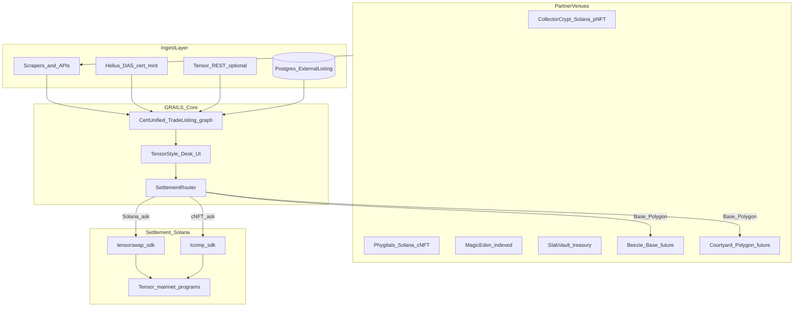
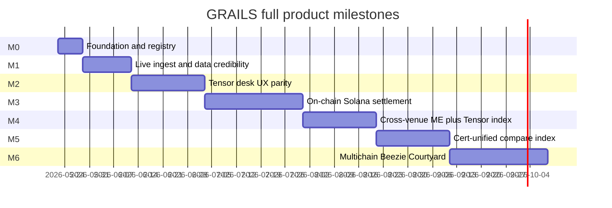
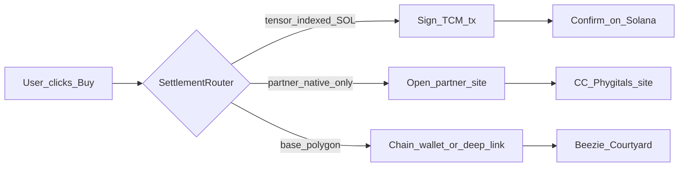

# GRAILS — Tensor for RWA Graded Cards (Full Product Plan)

## North star

**GRAILS** (by SlabVault Labs) is the **Tensor of RWA collectible cards** — not a browse-only index, not a deep-link directory, not a vault shop.

Collectors use one desk to:

- Browse **all major graded-card liquidity** (Collector Crypt, Phygitals, Magic Eden depth, SlabVault treasury, later Beezie and Courtyard)
- Filter by **slab traits** (grader, grade, set, cert #) not PFP rarity
- See **cross-venue best price** for the same asset
- **Buy, sell, bid, sweep, and list** wallet-native on Solana via Tensor on-chain programs (TCM / tensorswap / tcomp)
- Track **portfolio and activity** across venues
- Eventually operate **multichain** where partners live off Solana (Base, Polygon)

**SlabVault** (`/`, `/vault`, `/pulls`) remains the community vault story. **GRAILS** (`/trade`) is the product.

**Comp reference:** [Caggy](https://caggy.io/) proves the category; GRAILS wins on **Solana-native settlement**, **Tensor-grade desk UX**, and **SlabVault treasury + community** — then expands multichain.




---

## What we are NOT building


| Anti-goal                                | Why                                                                                              |
| ---------------------------------------- | ------------------------------------------------------------------------------------------------ |
| Permanent deep-link-only aggregator      | Product vision is **in-app settlement** like tensor.trade                                        |
| Solana-only forever                      | Roadmap explicitly includes **Beezie, Courtyard, multichain**                                    |
| Another custom shell rewrite             | Extend `[components/trade/tensor/](components/trade/tensor/)`* + UX audit                        |
| Dependence on Tensor REST for MVP reads  | **Partner ingest first**; Tensor API enriches cross-venue depth                                  |
| Unified checkout across all chains in v1 | Multichain v1 = **cert index + compare + outbound/bridge**; full cross-chain settlement is later |


---

## Current state (May 2026)


| Area               | Status                                                                                                                                                                                            |
| ------------------ | ------------------------------------------------------------------------------------------------------------------------------------------------------------------------------------------------- |
| Template port      | **Done** — `[components/trade/tensor/](components/trade/tensor/)`* (246+ tests pass)                                                                                                              |
| Routes             | `/trade`, `/trade/c/[slug]`, `/trade/slab/[certOrMint]`, `/trade/portfolio`                                                                                                                       |
| Partner ingest     | CC + Phygitals via `[lib/partner-listings.ts](lib/partner-listings.ts)` + JSON seed + optional DB                                                                                                 |
| On-chain writes    | BFF tx routes + SDK builders wired; `[TENSOR_TRADE_WRITE_ENABLED](lib/integrations/tensor.ts)` gate — **no verified staging fill yet**                                                            |
| UX vs tensor.trade | **~55% layout**, **~45% write-path code** — verified e2e pending staging checklist                                                                                                                |
| Multichain         | Beezie + Courtyard in `[lib/onchain/collections.ts](lib/onchain/collections.ts)` registry (preview); ingest in M6                                                                               |
| Docs               | M0 aligned — `[docs/STATUS.md](docs/STATUS.md)`, epics, `[grails-step-by-step-plan.md](docs/integrations/grails-step-by-step-plan.md)`                                                            |


**Vendor template reality:** `[vendor/marketplace-nextjs-template](vendor/marketplace-nextjs-template)` is a **tx/grid starter**, not tensor.trade. GRAILS UI must match `[tensor-tradesite-ux-audit.md](docs/integrations/tensor-tradesite-ux-audit.md)`; vendor supplies **BFF + signing patterns** only.

---

## Product pillars (full-fledged Tensor for RWA)

### 1. Unified listing graph (cert-first)

Every listing normalizes to `[TradeListing](lib/trade-listings.ts)`:

- **Identity:** cert # + grader (dedupe key across venues)
- **Venue tag:** `collector_crypt` | `phygitals` | `magic_eden` | `tensor` | `slabvault_treasury` | `beezie` | `courtyard`
- **Chain:** `solana` | `base` | `polygon`
- **Settlement path:** `on_chain_tensor` | `partner_site` | `vault_tcm`
- **Price:** ask/bid in native token (SOL, ETH, USDC as applicable)

### 2. Tensor-grade desk UX

From `[browser-gap-matrix.md](docs/redesign/browser-gap-matrix.md)`:

- Collection **index table** (floor, sell now, 24h vol, listed %)
- Collection **pro desk**: left BUY/SELL/SWEEP panel · trait filters · priced grid · live activity
- **Item page**: commerce stack, offers tab, activity, provenance
- **Portfolio**: owned + listed + bids across collections
- Lite/Pro modes, desk ticker (optional)

### 3. Wallet-native settlement (Solana)

Per `[onchain-trade-stack.md](docs/integrations/onchain-trade-stack.md)`:

- **CC pNFT:** `@tensor-oss/tensorswap-sdk`
- **Phygitals cNFT:** `@tensor-oss/tcomp-sdk`
- **Cross-venue asks:** Tensor index routes fill to ME or Tensor origin program
- **Vault slabs:** vault wallet lists on TCM → buyers fill on GRAILS

### 4. Multichain expansion

Per `[tensor-fork-feasibility.md](docs/integrations/tensor-fork-feasibility.md)` Phase 3:


| Partner             | Chain   | M6 approach                                                                  |
| ------------------- | ------- | ---------------------------------------------------------------------------- |
| **Beezie**          | Base    | Ingest when API/live; **compare + deep link** v1; wallet via Base adapter v2 |
| **Courtyard**       | Polygon | Same pattern; cert dedupe against Solana listings                            |
| **Solana partners** | Solana  | Full on-chain path (M3–M4)                                                   |


Registry: extend `[lib/onchain/collections.ts](lib/onchain/collections.ts)` with `beezie`, `courtyard` collection configs (preview status until ingest ships).

---

## Milestone map (delivery phases — NOT scope cuts)




---

## M0 — Foundation (1 week)

**Goal:** One architecture, one lane, no more parallel mess.

1. **Align docs** — Update `[docs/trade-architecture.md](docs/trade-architecture.md)` and `[docs/STATUS.md](docs/STATUS.md)` to state **full aggregator vision** (this plan supersedes browse-only framing).
2. **Dev hygiene** — Single `npm run dev:clean`; no parallel agents on `app/trade/`*.
3. **Collection registry** — Add Beezie + Courtyard preview entries to `[lib/onchain/collections.ts](lib/onchain/collections.ts)`; document chain + settlement mode per partner.
4. **Adapter contract** — Document `PartnerIngestAdapter` interface in `lib/partner-listings.ts`:
  - `fetchListings()`, `fetchStats()`, `fetchActivity()`, `resolveDeepLink()`, `settlementMode()`
5. **Epic reprioritization** — `[docs/tensor-clone-epics.md](docs/tensor-clone-epics.md)`: active queue = M1–M3 epics; M6 multichain epics labeled Phase 3.

**Exit:** Engineers can answer “what are we building?” in one sentence; registry lists all target partners.

---

## M1 — Live data credibility (2 weeks)

**Goal:** Desk looks **alive** — real floors, grids, activity — without requiring users to run Postgres locally.

### Ingest


| Partner             | Source                                          | Work                                                                                                              |
| ------------------- | ----------------------------------------------- | ----------------------------------------------------------------------------------------------------------------- |
| **Collector Crypt** | Scraper + optional live scrape                  | Harden `[lib/scrapers/collector-crypt-scraper.ts](lib/scrapers/collector-crypt-scraper.ts)`; cron `sync:discover` |
| **Phygitals**       | API/scrape when available; JSON seed until then | Partner adapter stub + manual seed                                                                                |
| **Magic Eden**      | Tensor index shortcut when keyed                | `[lib/trade/tensor-collection-depth.ts](lib/trade/tensor-collection-depth.ts)`                                    |
| **All**             | Postgres cache                                  | Wire `upsertExternalListings` from sync (epic P2-INT-D09)                                                         |


### Landing + collection pages

- `[lib/trade-landing.ts](lib/trade-landing.ts)`: `loadTradeLandingPartnerPreviews()` — **live** floor/count from `listPartnerTradeListings()`, not seed-only
- `[app/trade/c/[slug]/page.tsx](app/trade/c/[slug]/page.tsx)`: remove `EMPTY_ACTIVITY()` — listing-derived activity + Tensor tx history when keyed
- Aggregate stats ribbon across **all venues**, not treasury-only

### DB strategy (clarified)


| Mode             | Use                                                                   |
| ---------------- | --------------------------------------------------------------------- |
| **Local dev**    | JSON seed OK for browse                                               |
| **Staging/prod** | Postgres **required** for index freshness, cron sync, portfolio (M3+) |


**Exit:** `/trade/c/collector-crypt` shows priced grid + floor + activity; landing index table has real numbers.

---

## M2 — Tensor desk UX parity (3 weeks)

**Goal:** Side-by-side with [tensor.trade/trade/collector_crypt](https://www.tensor.trade/trade/collector_crypt) — structure and density, GRAILS skin.

Reference: `[tensor-tradesite-ux-audit.md](docs/integrations/tensor-tradesite-ux-audit.md)`, `[browser-gap-matrix.md](docs/redesign/browser-gap-matrix.md)`.


| Work                                                    | Epics          | Files                                                                                                                                                        |
| ------------------------------------------------------- | -------------- | ------------------------------------------------------------------------------------------------------------------------------------------------------------ |
| Pro layout: left trade column                           | TC-026         | `[tensor/trade-panel.tsx](components/trade/tensor/trade-panel.tsx)`, `[trade-collection-desk-client.tsx](components/trade/trade-collection-desk-client.tsx)` |
| Stats ribbon: buy now, sell now, listed/supply, 24h vol | TC-015         | `[collection-stats-ribbon.tsx](components/trade/collection-stats-ribbon.tsx)`                                                                                |
| Collection tabs: ITEMS · BIDS · ORDERS · TRAITS         | TC-023         | desk client                                                                                                                                                  |
| Slab trait filters + URL sync                           | TC-018, TC-019 | `[trade-trait-filters.tsx](components/trade/trade-trait-filters.tsx)`                                                                                        |
| Grid toolbar: sort, density, refresh                    | —              | `[trade-desk-toolbar.tsx](components/trade/trade-desk-toolbar.tsx)`                                                                                          |
| Venue badges on every tile                              | TC-024         | new `VenueBadge`                                                                                                                                             |
| Item page commerce stack                                | TC-028–TC-036  | `[trade-item-detail-client.tsx](components/trade/trade-item-detail-client.tsx)`                                                                              |
| Global search scaffold (cert, mint, collection)         | TC-012         | desk header                                                                                                                                                  |
| Footer ticker (SOL, 24h vol)                            | TC-011         | new footer component                                                                                                                                         |


**Exit:** UX audit gaps marked P0/P1 closed for CC collection; Phygitals reuses same desk.

---

## M3 — On-chain Solana settlement (4 weeks)

**Goal:** Buy, list, bid, delist **on GRAILS** for Solana listings — not partner redirect as primary path.

### Tx stack

- Port vendor **BFF tx pattern** from `[vendor/.../api/buyNFT](vendor/marketplace-nextjs-template/web/app/api/buyNFT/route.ts)` → `app/api/trade/tx/`*
- Wire `[buildFillTransaction](lib/onchain/clients/tensor-tcm-sdk.ts)`, list, delist
- `**TENSOR_TRADE_WRITE_ENABLED`** gate + devnet smoke tests
- Modals: `[buy-now-modal.tsx](components/trade/buy-now-modal.tsx)` signs tx when on-chain; deep link **fallback** when listing is partner-only

### Data / state

- Postgres: orders, reservations, idempotency (extend `Transaction` model)
- Portfolio: real listings + owned NFTs via DAS + wallet
- Activity: Tensor tx history + parsed chain events

### SDK paths


| Token standard | SDK            | Collection   |
| -------------- | -------------- | ------------ |
| pNFT           | tensorswap-sdk | CC, treasury |
| cNFT           | tcomp-sdk      | Phygitals    |


**Exit:** User connects wallet on CC collection, buys a Tensor-indexed listing without leaving GRAILS.

---

## M4 — Cross-venue aggregation (3 weeks)

**Goal:** GRAILS shows **best price across ME + Tensor + partner-native** like tensor.trade.

- Enable `TENSOR_API_KEY` in staging/prod for `[fetchCollectionStats](lib/trade/tensor-collection-depth.ts)`, tx history
- Merge Tensor index listings with partner ingest in normalized graph
- **Best-price sort** and venue badge on each ask
- Vault treasury: vault wallet lists on TCM (`[vault-to-trade-listings.md](docs/integrations/vault-to-trade-listings.md)`)
- Sweep panel: multi-fill tx batch (UI + tx builder)

**Exit:** Same cert can show ME ask vs CC-native ask; user fills cheapest route.

---

## M5 — Cert-unified index (3 weeks)

**Goal:** Beat Caggy on **cert-level comparison** within Solana (multichain compare in M6).

- Dedupe `[TradeListing](lib/trade-listings.ts)` by `(grader, certNumber)`
- **Compare view:** same card listed on CC vs Phygitals vs ME — side by side
- FMV band display (manual/comp table until pricing API)
- Provenance: vault pull, `vaultedUrl`, stream clip
- Search by cert # returns all venue listings

**Exit:** Search PSA cert → see all venues; one-click buy best price.

---

## M6 — Multichain partners (4 weeks)

**Goal:** Beezie + Courtyard in the index; honest settlement per chain.

### Beezie (Base)

- Ingest adapter when partner API/live (registry already has `beezie` partner id)
- Chain badge + Base wallet connect (experimental)
- v1: **compare + deep link** to Beezie
- v2: evaluate Base marketplace SDK / partner API for in-app fill

### Courtyard (Polygon)

- Same adapter pattern
- Cert dedupe across chain boundaries (same physical card, different tokenization)

### Desk UX

- Chain filter on landing index
- Collection rows grouped by partner + chain
- Clear copy when settlement is outbound vs on-chain

**Exit:** GRAILS index matches Caggy partner coverage with superior Solana desk; multichain partners visible and actionable.

---

## Architecture: settlement router




Every `[TradeListing](lib/trade-listings.ts)` carries `settlementMode` so UI never guesses.

---

## Immediate next slice (start here)

The full vision is large; **first shippable increment** after template port (done):

**M1 week 1 — “desk looks real”**

1. Live partner stats on landing (`[lib/trade-landing.ts](lib/trade-landing.ts)`)
2. CC collection: priced grid + stats ribbon + listing-derived activity
3. `npm run sync:discover` documented in README/runbook
4. Postgres cache upsert from sync (optional but recommended for prod)

This unblocks M2 UX work on real data — not a separate “browse MVP” product.

---

## What to stop doing

- Framing GRAILS as deep-link-only or “Phase 1 is the product”
- Parallel subagents editing the same trade files
- Rebuilding desk shells outside `[components/trade/tensor/*](components/trade/tensor/)`
- Treating Magic Eden as equal priority to CC/Phygitals before ingest works
- 132-epic orchestration without milestone gates

---

## Verification gates


| Milestone | Gate                                                                |
| --------- | ------------------------------------------------------------------- |
| M1        | CC grid ≥ seed count; floor/listed non-null on landing; tests green |
| M2        | Browser audit P0/P1 closed vs tensor.trade CC                       |
| M3        | Devnet buy tx e2e; portfolio shows owned asset                      |
| M4        | Two venues same collection; best-price tile correct                 |
| M5        | Cert search returns multi-venue rows                                |
| M6        | Beezie/Courtyard rows in index with chain badge                     |


```bash
npm run sync:discover
npm run test          # currently 207 pass
npm run dev:clean
# Manual: /trade, /trade/c/collector-crypt, /trade/c/phygitals, /trade/slab/<cert>
```

---

## Key documents (single source of truth)


| Doc                                                                            | Role                                        |
| ------------------------------------------------------------------------------ | ------------------------------------------- |
| [rwa-trading-platform.md](docs/integrations/rwa-trading-platform.md)           | Full product spec                           |
| [tensor-fork-feasibility.md](docs/integrations/tensor-fork-feasibility.md)     | Tensor + ME + multichain strategy           |
| [onchain-trade-stack.md](docs/integrations/onchain-trade-stack.md)             | Programs, PDAs, fees                        |
| [tensor-tradesite-ux-audit.md](docs/integrations/tensor-tradesite-ux-audit.md) | UX target                                   |
| [trade-architecture.md](docs/trade-architecture.md)                            | Runtime data paths (update for full vision) |
| [tensor-clone-epics.md](docs/tensor-clone-epics.md)                            | Ticket backlog mapped to M0–M6              |


---

## Summary

GRAILS is **Tensor for RWA graded cards** — a **full trading aggregator**, not a temporary browse shell. Solana partner ingest + Tensor on-chain settlement is the core; cross-venue depth and cert-unified index beat single-partner desks; Beezie and Courtyard extend the same desk multichain. The template port (done) was step one; **M1 live data → M2 UX → M3 settlement** is the path to the product you have been describing.