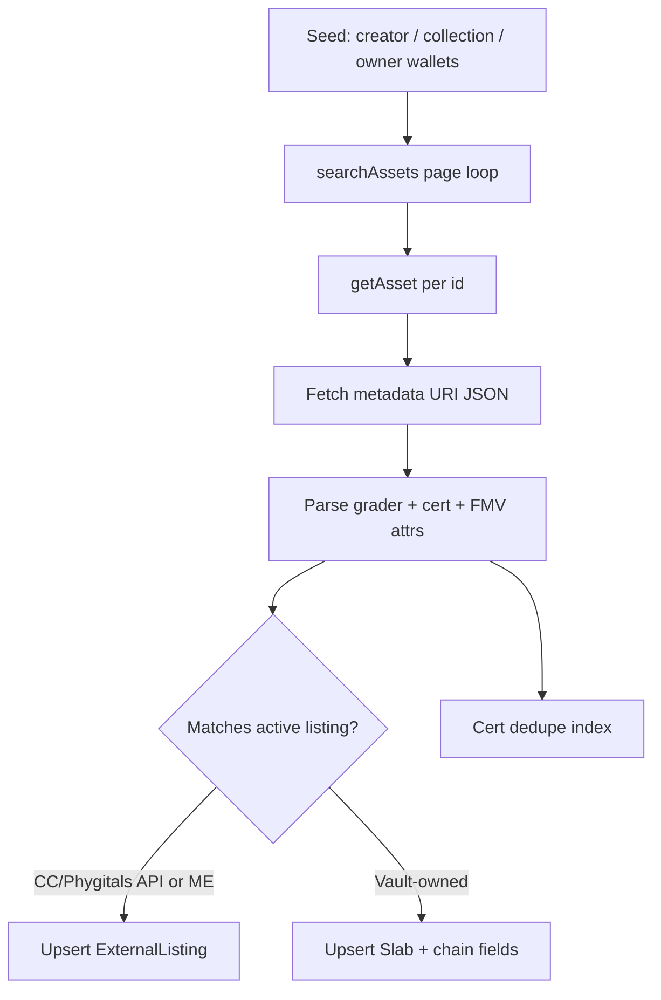

# Gacha Partner NFT Metadata — Research & SlabVault Mapping

**Status:** Research / planning (May 2026)  
**Scope:** Verify whether partner gacha cards are on-chain NFTs, map mint/metadata patterns to Prisma `Slab`, document on-chain listing index + cert↔mint linking, and assess Tensor marketplace compatibility / “fork Tensor” feasibility.

**Related:** [phygitals-collectorcrypt.md](./phygitals-collectorcrypt.md), [solana-marketplace-aggregator.md](./solana-marketplace-aggregator.md), [tensor-fork-feasibility.md](./tensor-fork-feasibility.md), [rwa-trading-platform.md](./rwa-trading-platform.md)

---

## Executive summary

| Platform | Cards are NFTs? | Token standard (verified) | Cert in metadata? | SlabVault ingest today |
|----------|-----------------|---------------------------|-------------------|------------------------|
| **Collector Crypt** | **Yes** — physical-backed digital tokens | **pNFT** (Metaplex Programmable NFT) per Magic Eden / CC FAQs | Expected in off-chain JSON (grader + cert); confirm per mint via DAS | Partial — account scrape / API pulls (`lib/scrapers/collector-crypt-scraper.ts`) |
| **Phygitals** | **Yes** — 1:1 cNFT per vaulted card | **cNFT** (Metaplex Bubblegum, Solana mainnet) | **Yes** — docs state cert # in immutable metadata | Link-only gacha; no listing ingest |
| **poke6900** | **No (for gacha slabs)** — not a phygitals-style RWA NFT gacha | **POKE6900** = fungible SPL memecoin; app/marketplace is off-chain TCG analytics | N/A for on-chain slab NFTs | N/A — borrow UX patterns only |

**User claim “gacha platform cards are NFTs”:** **True for Collector Crypt and Phygitals.** **Not supported for poke6900** as a physical-backed Solana NFT gacha (see [poke6900](#poke6900-not-a-slab-nft-gacha)).

**“Fork Tensor” for CC / Phygitals NFTs:** **Viable via fork-and-integrate** — use `tensor-foundation` open-source programs, SDKs, and Next.js template for `/trade/*`; Tensor aggregates **Magic Eden** listings in addition to Tensor-native asks. CC **pNFT** → `tensorswap-sdk`; Phygitals **cNFT** → `tcomp-sdk`. Full strategy: [tensor-fork-feasibility.md](./tensor-fork-feasibility.md).

---

## Collector Crypt (CC)

### Verification — cards are NFTs

- Magic Eden partnership docs describe each purchase as a **tangible card** represented by a **digital token / pNFT**, redeemable by **burning PNFTs** on collectorcrypt.com ([Magic Eden × Collector Crypt FAQ](https://help.magiceden.io/en/articles/8498560-exploring-magic-eden-x-collector-crypt)).
- Gacha machine (`gacha.collectorcrypt.com`) outputs randomized **physical-backed** assets; secondary liquidity on **Collector Crypt marketplace** and **Magic Eden** (`magiceden.io/marketplace/collector_crypt`, launchpad drops).
- Industry coverage (Solana Compass, CoinMarketCap AI summaries) describes **pNFTs** vaulted with partners such as PWCC — treat revenue/volume figures as **order-of-magnitude**, not audited by SlabVault.

### Mint / collection patterns (expected)

| Field | Typical pattern | Notes |
|-------|-----------------|-------|
| **Token standard** | Metaplex **ProgrammableNonFungible** (pNFT) | Frozen token account; transfers via Token Metadata program |
| **Mint address** | Per-card unique mint | Primary on-chain key for ownership |
| **Collection** | Verified Metaplex collection(s) on Magic Eden “Collector Crypt” | Use ME collection slug + on-chain `collection` / `grouping` from DAS |
| **Metadata URI** | HTTPS JSON (Arweave/IPFS/CDN) | Name, image, attributes: grader, grade, cert #, set, insured value |
| **Update authority** | CC / Metaplex update authority | pNFT rule sets may restrict marketplace transfers |
| **Burn / redeem** | Burn on CC site → physical ship | 2% vault withdrawal + shipping per ME FAQ |
| **Fungible token** | `CARDSccUMFKoPRZxt5vt3ksUbxEFEcnZ3H2pd3dKxYjp` | **$CARDS** platform token — **not** the slab NFT |

### Cert number ↔ mint linking

1. **Preferred:** Parse `attributes` from metadata JSON (`trait_type` variants: `Cert`, `Cert Number`, `Certification`, `Serial`).
2. **Fallback:** Regex cert from `name` / `description` (e.g. `PSA 12345678`).
3. **Dedupe key:** `(grader, certNumber)` when both present; else `(source, mint)`.
4. **Validate:** Cross-check PSA/BGS/CGC public cert lookup when displaying “vault proof” (out of band).

---

## Phygitals

### Verification — cards are NFTs

Official docs ([NFT & Digital Asset Terms](https://docs.phygitals.com/digital-assets-and-trading/nft-and-digital-asset-terms), [Technology Overview](https://docs.phygitals.com/phygitals/technology-overview)):

- Every digital card is a **compressed NFT (cNFT)** on **Solana mainnet-beta**.
- Protocol: **Metaplex Bubblegum**; SPL + Metaplex Token Metadata conventions.
- **1:1** binding to a graded physical card in PSA / Fanatics / Alt vaults.
- **Claim** burns the cNFT permanently; optional re-tokenization via Submit.

### Mint / collection patterns (documented)

| Field | Typical pattern | Notes |
|-------|-----------------|-------|
| **Token standard** | Bubblegum **compressed** NFT | Stored in concurrent Merkle tree; DAS `compression` object |
| **Asset ID** | DAS asset id (not always legacy mint pubkey) | Use Helius `getAsset` / `searchAssets` with `compressed: true` |
| **Tree / leaf** | `tree`, `leaf_index`, `data_hash` | Required for transfers and marketplace proofs |
| **Metadata** | Off-chain JSON + on-chain hash | Image, name, **grader**, **grade**, **certification number**, collection, category |
| **Currency** | USDC primary; USDT, SOL supported | Platform covers gas on withdrawal to external wallets |
| **Marketplace** | Phygitals integrated marketplace | Docs do **not** name Tensor; assume proprietary or third-party CPI — **do not assume Tensor** without partner confirmation |

### Cert number ↔ mint linking

Same attribute parsing as CC; Phygitals explicitly documents **cert # in immutable metadata** at mint. Index with DAS:

```json
{
  "jsonrpc": "2.0",
  "id": "svf-search",
  "method": "searchAssets",
  "params": {
    "ownerAddress": "<wallet>",
    "compressed": true,
    "limit": 1000
  }
}
```

Filter `content.metadata.attributes` for grader + cert; persist `assetId` + compression fields for any future cNFT transfer tooling.

---

## poke6900 — not a slab NFT gacha

### What poke6900 actually is

- **[poke6900.vip](https://poke6900.vip)** / **[poke6900.gg](https://poke6900.gg/)** — **Pokémon Memetic Index** + community product around the **POKE6900** Solana **memecoin** (PumpSwap / Raydium), **not** affiliated with The Pokémon Company.
- **iOS app** — analytics, AI scan, virtual binder, prediction markets; **not** documented as Bubblegum/pNFT 1:1 vaulted slab NFTs.
- **Gacha on poke6900.gg** — wallet login + token gacha tied to **POKE6900** economics, separate from CC/Phygitals RWA model ([solana-marketplace-aggregator.md](./solana-marketplace-aggregator.md) breakdown).

### Implication for SlabVault

- Do **not** model poke6900 pulls as `Slab` NFT rows without a verified mint + vault partner.
- Safe use: **UX inspiration** (movers, compare, memetic index) and **partner gacha CTAs** only.

---

## Map on-chain patterns → Prisma `Slab`

Current `Slab` model (`prisma/schema.prisma`) is **vault-shop / checkout** oriented — no chain fields yet:

```prisma
model Slab {
  id                String
  name              String
  grade             String
  estimatedValueUsd Decimal?
  acquiredAt        DateTime
  imageUrl          String
  vaultedUrl        String
  collectrUrl       String?
  status            SlabStatus
  solPrice          Decimal
  svfPrice          Decimal
  // ...
}
```

### Field mapping (partner NFT → `Slab`)

| On-chain / partner field | `Slab` field (today) | Proposed extension |
|--------------------------|----------------------|--------------------|
| Display name | `name` | — |
| Grade string (e.g. `PSA 10`) | `grade` | Split optional `grader` enum + `gradeNumeric` |
| FMV / insured value / last sale | `estimatedValueUsd` | `fmvSource`, `fmvAsOf` |
| Mint / vault date | `acquiredAt` | — |
| `image` / `image_url` | `imageUrl` | — |
| Item page (CC / Phygitals / ME) | `vaultedUrl` | — |
| Collectr deep link | `collectrUrl` | — |
| List price (SVF shop) | `solPrice`, `svfPrice` | N/A for external-only listings → use `ExternalListing` |
| **Mint address** | — | `mintAddress String? @unique` |
| **DAS asset id (cNFT)** | — | `dasAssetId String? @unique` |
| **Token standard** | — | `tokenStandard SlabTokenStandard?` enum: `PNFT`, `CNFT`, `LEGACY_NFT` |
| **Cert number** | — | `certNumber String?` + `@@index([grader, certNumber])` |
| **Grader** | — | `grader ExternalListingGrader?` (reuse enum) |
| **Collection address** | — | `collectionAddress String?` |
| **Metadata URI** | — | `metadataUri String?` |
| **Owner wallet** | — | `ownerWallet String?` (index only; not authoritative) |
| **Partner source** | — | `partnerSource ExternalListingSource?` |
| **Compression** | — | `merkleTree String?`, `leafIndex Int?` (cNFT only) |
| **Last indexed** | — | `chainIndexedAt DateTime?` |

### `ExternalListing` (discovery lane — already in schema)

Use for **read-only aggregator** rows; maps cleanly from chain/partner APIs:

| `ExternalListing` | Source |
|-------------------|--------|
| `source` | `collector_crypt` \| `phygitals` \| `magic_eden` |
| `externalId` | Listing id or `mint` / `assetId` |
| `certNumber`, `grader`, `grade` | Metadata attributes |
| `deepLinkUrl` | CC / Phygitals / ME listing URL |
| `priceUsd` / `priceSol` | Active listing price |
| `fmvUsd` | Partner FMV or Collectr cross-ref |
| `indexedAt`, `staleAfter` | Sync hygiene |

**Rule:** Partner NFTs **listed elsewhere** → `ExternalListing`. Slabs **in SlabVault custody/checkout** → `Slab` with optional chain columns once vault holds or mirrors NFTs.

---

## How to index on-chain listings

### Recommended stack

1. **Helius [DAS API](https://www.helius.dev/docs/das)** — `searchAssets`, `getAsset`, `getAssetsByOwner`; supports **compressed** and legacy assets.
2. **Metaplex [Token Metadata](https://developers.metaplex.com/smart-contracts/token-metadata)** — collection verification, pNFT rule sets.
3. **Partner APIs / scrape** (existing) — `lib/scrapers/collector-crypt-scraper.ts` for pulls/account payloads when DAS creator filter unknown.

### Indexing workflow



### Creator / collection seeds (to confirm with partners)

| Partner | Suggested DAS filters | Status |
|---------|----------------------|--------|
| Collector Crypt | Magic Eden collection address; CC update authority; known tree(s) | **Needs** published collection mint list from CC |
| Phygitals | Bubblegum tree address(es); creator wallet | **Needs** partner or on-chain discovery |
| Magic Eden CC | `magiceden.io/marketplace/collector_crypt` collection id → on-chain | Public ME API + DAS |

### Listing freshness

- Set `staleAfter = indexedAt + 24h` (match aggregator doc).
- Re-listing price changes: upsert on `(source, externalId)`.
- Sold: `status = sold` when DAS owner changes or partner API reports closed listing.

### Rate limits & safety

- Reuse `SCRAPER_TIMEOUT_MS`, response size caps from `lib/scrapers/scraper-utils.ts`.
- Server-only `HELIUS_API_KEY` — never `NEXT_PUBLIC_*`.
- Treat metadata JSON as untrusted input (max bytes, schema validate).

---

## Link cert# to mint (canonical procedure)

1. **Ingest asset** via `getAsset(mint | assetId)`.
2. **Read** `content.metadata.name`, `attributes[]`, `json_uri`.
3. **Normalize cert:**
   - `certNumber = digits-only or alphanumeric per grader rules`
   - `grader = PSA | BGS | CGC | SGC` from attribute or name prefix
4. **Store** `CertMintLink` table (future) or unique constraint on `(grader, certNumber, partnerSource)` → `mintAddress` / `dasAssetId`.
5. **Conflict handling:** If two mints claim same cert, flag `verificationStatus = disputed` in admin; do not auto-merge.
6. **Redemption:** If asset burned (DAS `burnt` or owner = incinerator), set `Slab.status` / listing `sold` and retain cert history for audit only.

Example attribute shapes to accept:

```json
{ "trait_type": "Cert Number", "value": "12345678" }
{ "trait_type": "Grader", "value": "PSA" }
{ "trait_type": "Grade", "value": "10" }
```

---

## Tensor marketplace compatibility

### What Tensor provides

| Surface | Access | Use for SlabVault |
|---------|--------|-------------------|
| **REST API** | [API key request](https://docs.tensor.trade/trade/api-and-sdk) — gated | Floor, listings, stats, websockets; **aggregated ME + Tensor venues** |
| **tensorswap-sdk** | Open source — legacy / pNFT-era NFTs | Read pools, list/bid if rule sets allow |
| **tcomp-sdk** | Open source — **compressed** NFTs | Phygitals-class cNFT trading |
| **marketplace-nextjs-template** | [GitHub template](https://github.com/tensor-foundation/marketplace-nextjs-template) | Custom front-end only |
| **On-chain programs** | [tensor-foundation/marketplace](https://github.com/tensor-foundation/marketplace) | CPI listing/bidding — no API key |

Docs: [Tensor Developer Hub](https://dev.tensor.trade/docs/getting-started-1).

### Compatibility requirements (checklist per asset)

| Requirement | pNFT (Collector Crypt) | cNFT (Phygitals) |
|-------------|------------------------|------------------|
| Metaplex metadata resolvable | Required | Required (+ compression proof) |
| Collection verified on-chain | Strongly expected for ME/CC | Tree + collection metadata |
| Marketplace authorization | pNFT **rule set** must allow Tensor/ME program delegates | Bubblegum delegate + tcomp instructions |
| Royalty / auth rules | Enforced via Token Auth Rules — may block some aggregators | Creator royalty fields in metadata |
| Indexer | Tensor API or Helius DAS | **tcomp** + DAS `compressed: true` |
| Bubblegum v2 | N/A | Tensor **may not** support BG v2 yet (verify at integrate time) |

### Partner reality

- **Collector Crypt** distributes on **Magic Eden** — Tensor **aggregates ME listings** for indexed collections, plus Tensor-native depth when users list on Tensor.
- **Phygitals** runs its **own marketplace**; Tensor **tcomp** path applies when users list cNFTs on Tensor — not automatic mirror of Phygitals internal listings.

---

## Is “fork Tensor” realistic?

**Updated May 2026:** Yes — as **integrate mainnet programs + fork UI/SDK**, not a full clone of tensor.trade infra. See [tensor-fork-feasibility.md](./tensor-fork-feasibility.md).

### Definitions

| Interpretation | Realistic? | Notes |
|----------------|------------|-------|
| **Clone Tensor’s entire product** (indexer, liquidity network, mobile apps) | **No** | Years of infra; liquidity network effects |
| **Fork Tensor marketplace UI + use mainnet programs** | **Yes — recommended** | `marketplace-nextjs-template` + SDKs; ME aggregation via Tensor index |
| **Use Tensor SDK to trade CC/Phygitals NFTs on Solana** | **Yes** | CC **pNFT** → tensorswap; Phygitals **cNFT** → tcomp; subject to rule sets |
| **SlabVault `/discover` deep link only** | **Yes — interim MVP** | Until `/trade` Tensor beta ships |
| **Custom deploy of marketplace/amm/fees programs** | **Phase 2+** | Audit required; defer until fee/branding needs justify |

### Remaining blockers (manageable)

1. **Two token standards** — pNFT (CC) vs Bubblegum cNFT (Phygitals) → two SDKs (already in Tensor stack).
2. **Authorization** — pNFT rule sets may restrict fills; test per collection on devnet.
3. **Per-card liquidity** — floor is collection-level; item pages need cross-venue depth UI.
4. **Phygitals-only listings** — fall back to deep link when no Tensor/ME route exists.
5. **API dependency** — optional; SDK + DAS path avoids rate limits.

### Recommended path for SlabVault

1. **Phase A:** Helius DAS + cert↔mint table ([this doc](#link-cert-to-mint-canonical-procedure)); `/discover` interim deep links.
2. **Phase B:** `/trade/*` via Tensor integrate — template + SDKs + ME-aggregated depth for CC; tcomp for Phygitals.
3. **Phase C:** Fee PDAs (`tensor-foundation/fees`) + vault wallet listing on Tensor for treasury slabs; `/vault/*` shop unchanged (SOL+SVF).

---

## Implementation backlog (suggested)

- [ ] Add optional chain fields to `Slab` (migration) or `SlabChainProof` 1:1 side table to avoid widening checkout model prematurely.
- [ ] `CertMintLink` model: `grader`, `certNumber`, `mintAddress`, `dasAssetId`, `partnerSource`, `verifiedAt`.
- [ ] `scripts/sync-chain-assets.ts` — DAS search by configured creators/trees.
- [ ] Extend CC scraper to emit `certNumber` when present in embedded payloads.
- [ ] Partner outreach: CC collection mints, Phygitals Bubblegum tree addresses, listing API.
- [ ] Document `HELIUS_API_KEY` in ops runbook (server-only).

---

## References

| Resource | URL |
|----------|-----|
| Phygitals NFT terms | https://docs.phygitals.com/digital-assets-and-trading/nft-and-digital-asset-terms |
| Phygitals technology | https://docs.phygitals.com/phygitals/technology-overview |
| Magic Eden × Collector Crypt | https://help.magiceden.io/en/articles/8498560-exploring-magic-eden-x-collector-crypt |
| Magic Eden CC marketplace | https://magiceden.io/marketplace/collector_crypt |
| Metaplex pNFT docs | https://www.metaplex.com/docs/smart-contracts/token-metadata/pnfts |
| Metaplex Bubblegum | https://www.metaplex.com/docs/smart-contracts/bubblegum-v2 |
| Helius DAS | https://www.helius.dev/docs/das |
| Tensor developer hub | https://dev.tensor.trade/docs/getting-started-1 |
| Tensor compressed marketplace (news) | https://solanafloor.com/news/tensor-launches-compressed-nft-marketplace-to-support-solana-innovations |

---

## Changelog

| Date | Note |
|------|------|
| 2026-05-21 | Initial research: CC pNFT, Phygitals cNFT, poke6900 clarification, Slab/ExternalListing mapping, DAS indexing, Tensor fork assessment |
| 2026-05-21 | **Correction:** Tensor aggregates ME listings; fork viable via tensor-foundation repos — see [tensor-fork-feasibility.md](./tensor-fork-feasibility.md) |
