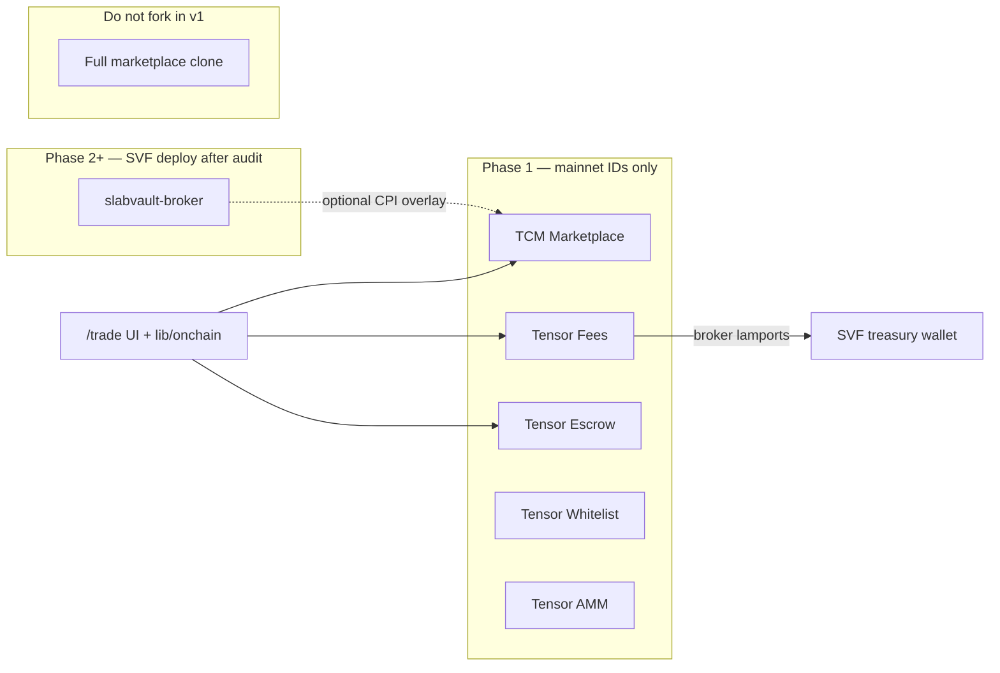
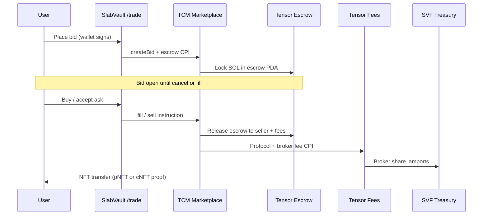
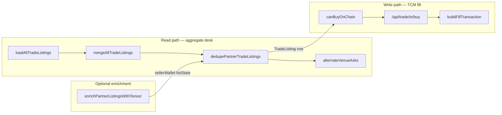

# On-Chain Trade Stack — SlabVault × Tensor Foundation

**Status:** Partial (M3, May 2026) — **BFF wired**; **broker PDA ops pending**  
**Scope:** Full on-chain package design for a Tensor-like graded-card aggregator — programs, PDAs, escrow, fees, whitelist, AMM integration. **No mainnet deploy** from this repo until audit + partner sign-off.

### M3 implementation status

| Area | State | Notes |
|------|-------|-------|
| **Trade tx BFF** | Done | `/api/trade/tx/buy`, `/list`, `/delist`, `/bid`, `/cancel-bid` — unsigned tx builders; `lib/onchain/tensor-tx-bff.ts` |
| **SDK list / fill** | Done (gated) | `buildListTransaction` / `buildFillTransaction` in `lib/onchain/clients/tensor-tcm.ts`; `TENSOR_TRADE_WRITE_ENABLED` default `false` |
| **Broker fee PDA** | **Pending (ops)** | Register SVF treasury on Tensor **Fees** (`TFEEgwDP…`); operator-blocked — see [trade-staging-checklist.md](../trade-staging-checklist.md) § broker PDA |
| **Fees accounts on fill** | Pending (eng) | TC-075 — attach `fees` program metas in fill tx after broker PDA confirmed |
| **Verified staging fill** | Pending | Manual steps 1–5 in staging checklist; exit criteria for Phase 1 |

**Related:**

- [partner-aggregation-quickest-path.md](./partner-aggregation-quickest-path.md) — aggregate ingest + enrichment vs settlement lanes
- [tensor-fork-feasibility.md](./tensor-fork-feasibility.md) — integrate vs fork strategy
- [rwa-trading-platform.md](./rwa-trading-platform.md) — `/trade` product spec
- [gacha-nft-metadata.md](./gacha-nft-metadata.md) — CC pNFT / Phygitals cNFT
- `programs/README.md` — Anchor workspace scaffold
- `lib/onchain/` — TypeScript program ID + client stubs

---

## Executive summary

| Layer | Phase 1 (ship first) | Phase 2 | Phase 3 |
|-------|----------------------|---------|---------|
| **Settlement** | Tensor **mainnet** programs (TCM, fees, escrow, whitelist, AMM) | Custom **SlabVault broker** CPI + fee PDA config | Optional program fork if branding requires new program IDs |
| **Read path** | Tensor REST API + DAS (Helius) | SVF **indexer** (fills, listings, cert↔mint) | Multichain read adapters (Base Beezie, etc.) |
| **Write path** | `tensorswap-sdk` + `tcomp-sdk` → TCM CPI (`TENSOR_TRADE_WRITE_ENABLED`, staging only) | Vault wallet list/bid; broker fee to treasury | Cross-chain bridge / deep-link only where no Tensor |

SlabVault does **not** rebuild Tensor’s marketplace from scratch in v1. We **compose** on `tensor-foundation` programs and add a thin **broker + policy** layer where fee capture and collection allowlists need SVF branding.

---

## Tensor Foundation — deploy vs use mainnet IDs

Official program IDs ([Tensor Foundation protocols](https://docs.tensor.foundation/protocols)):

| Program | Mainnet ID | Repo | SlabVault Phase 1 |
|---------|------------|------|-------------------|
| **Tensor Marketplace (TCM)** | `TCMPhJdwDryooaGtiocG1u3xcYbRpiJzb283XfCZsDp` | [marketplace](https://github.com/tensor-foundation/marketplace) | **Use mainnet** — list, bid, sell, edit |
| **Tensor Fees** | `TFEEgwDP6nn1s8mMX2tTNPPz8j2VomkphLUmyxKm17A` | [fees](https://github.com/tensor-foundation/fees) | **Use mainnet** — broker + collection fee PDAs |
| **Tensor Escrow** | `TSWAPaqyCSx2KABk68Shruf4rp7CxcNi8hAsbdwmHbN` | [escrow](https://github.com/tensor-foundation/escrow) | **Use mainnet** — bid escrow, shared settlement |
| **Tensor Whitelist** | `TL1ST2iRBzuGTqLn1KXnGdSnEow62BzPnGiqyRXhWtW` | [whitelist](https://github.com/tensor-foundation/whitelist) | **Use mainnet** — collection verification |
| **Tensor AMM v2** | `TAMM6ub33ij1mbetoMyVBLeKY5iP41i4UPUJQGkhfsg` | [amm](https://github.com/tensor-foundation/amm) | **Use mainnet** — pool sweep / instant sell (v2+) |
| **SlabVault Broker (custom)** | `SVFBxxxxxxxx…` (devnet only until audit) | `programs/slabvault-broker` | **Deploy devnet** in Phase 2; mainnet after audit |

### What to deploy vs reference



| Action | Programs | Rationale |
|--------|----------|-----------|
| **Use mainnet IDs** | TCM, TFEE, TSWAP escrow, TL1ST whitelist, TAMM | Audited, ME-aggregated index targets these; fastest `/trade` MVP |
| **Configure on mainnet (no redeploy)** | Fee PDAs via `fees` program | Point **broker share** at SVF treasury; collection-level bps |
| **Deploy devnet first** | `slabvault-broker` | Optional interface/referral fee or policy gate; safe iteration |
| **Do not deploy in v1** | Forked TCM / AMM | High audit cost; breaks Tensor API/SDK assumptions |

**IDL source of truth:** [tensor-foundation/IDLs](https://github.com/tensor-foundation/IDLs) — pin commit in `programs/idl-lock.json` when generating clients. Marketplace repo also ships generated clients under `clients/js`.

**Legacy SDK note:** `@tensor-oss/tensorswap-sdk` may target older TensorSwap instructions; for new work prefer **marketplace JS client** from `tensor-foundation/marketplace` + TCM IDL. Keep tensorswap for CC pNFT spikes until migrated.

---

## SlabVault custom layer — broker fees & PDAs

Tensor marketplace fees are split **protocol / broker** (see marketplace docs). SlabVault registers as **broker** so a share routes to the public treasury.

**Ops:** Registration is **operator-blocked** (not automatable from this repo). Use the checklist and verification steps in [trade-staging-checklist.md — Broker fee PDA ops](../trade-staging-checklist.md#broker-fee-pda--ops-checklist-operator-blocked) before the first staging mainnet fill.

### Broker fee PDA table (ops) {#broker-fee-pda-table-ops}

| PDA / account | Owner program | Purpose |
|---------------|---------------|---------|
| **Global fee config** | `TFEEgwDP…` | Protocol-wide defaults |
| **Collection fee account** | `TFEEgwDP…` | Per-collection bps + recipient shares |
| **Broker record** | `TFEEgwDP…` | SVF broker pubkey + share (treasury or hot wallet) |
| **List state / bid state** | `TCMPhJdw…` | Canonical ask/bid for a mint or asset id |
| **Escrow token account** | `TSWAPaqy…` | SOL held during open bids |
| **Whitelist proof** | `TL1ST2i…` | Collection allowed on Tensor desk |
| **`BrokerConfig` (SVF)** | `slabvault-broker` (devnet) | Optional cap on overlay bps, treasury pubkey, paused flag |

Treasury wallet (from `data/site.json`): `2oRZe7z9Jx3rpoUWuidjGhpX9mxxhtps2JqQtdxLfHwg` — use as **broker fee recipient** and **protocol share recipient** where Tensor fee program allows.

### Fee split (target economics)

| Sink | Typical bps (configurable) | Notes |
|------|----------------------------|-------|
| Tensor protocol | Per `fees` global config | Not controlled by SVF |
| **SVF broker (treasury)** | 50–150 bps on SVF-fronted fills | Register via `fees` broker PDA; validate on devnet |
| Seller proceeds | Remainder | Standard TCM settlement |
| Royalties | Creator / partner | Metaplex royalty enforcement in TCM CPI |

**Do not invent fee numbers in production** without partner review — table above is a **design target**, not a promise.

### TypeScript helpers (`lib/onchain/fees.ts`)

Staging ops map to these exports (re-exported from `lib/onchain/index.ts`):

| Export | Role |
|--------|------|
| `getSvfBrokerPubkey()` | Broker recipient for tx account metas: `SVF_BROKER_PUBKEY` → else `data/site.json` treasury |
| `getTargetBrokerFeeBps()` | Design-default bps from `SVF_BROKER_FEE_BPS` (default 100, clamp 0–500); **on-chain bps live in Fees program state** |
| `isSvfBrokerConfigured()` | Guard when pubkey string is long enough to build |
| `previewFeeSplit()` | Read-only `{ tensorFeesProgram, brokerPubkey, targetBrokerBps, note }` for admin/ops — **not** a chain quote |

**Checklist:** Step-by-step broker registration, env alignment, and how to use `previewFeeSplit()` before PDA verification — [trade-staging-checklist.md — Engineering preview](../trade-staging-checklist.md#engineering-preview-libonchainfeests).

**Consumers:** `tensor-tcm-sdk.ts`, `clients/tensor-fees.ts`, `/api/trade/tx/bid` call `getSvfBrokerPubkey()`; attach Fees program accounts on fill remains TC-075 (`tensor-fees.ts` stub).

---

## Collection whitelist — CC / Phygitals / Beezie

On-chain allowlist uses Tensor **whitelist** program; off-chain catalog lives in `lib/onchain/collections.ts`.

| Partner | Token standard | Tensor path | Whitelist status |
|---------|----------------|-------------|------------------|
| **Collector Crypt** | pNFT | TCM + `tensorswap-sdk`; ME depth via Tensor index | Register ME/CC collection mint when confirmed via DAS |
| **Phygitals** | cNFT (Bubblegum) | TCM + `tcomp-sdk` + DAS proofs | Register tree/collection after partner mint list |
| **Beezie** | Base-native (today) | **Not Tensor** — Phase 3 deep link or separate stack | N/A on Solana whitelist |
| **SlabVault treasury** | pNFT / selected slabs | Vault wallet lists on TCM | `slabvault-treasury` slug; fee PDA → treasury |

**Procedure:**

1. Resolve collection mint / tree id via Helius DAS (`gacha-nft-metadata.md`).
2. Submit whitelist tx via `TL1ST2i…` (operator wallet; multisig recommended).
3. Map slug → mint in `SLABVAULT_TRADE_COLLECTIONS` env + `lib/onchain/collections.ts`.
4. Surface “Whitelisted on Tensor” badge on `/trade/c/[slug]` when on-chain proof exists.

---

## Escrow flow (bid → fill)



| Step | Program | SlabVault responsibility |
|------|---------|---------------------------|
| List ask | TCM | Build tx via marketplace / tensorswap / tcomp SDK |
| Bid | TCM + Escrow | Ensure escrow rent + expiry UX |
| Cancel bid | TCM + Escrow | Refund path tested on devnet |
| Fill ask | TCM (+ venue CPI if ME-origin) | Tensor index supplies venue tag; SVF routes fill ix |
| Fee settlement | Fees | Attach broker PDA with treasury pubkey |

**ME-origin asks:** Settlement CPI targets Magic Eden (or other venue), not TCM list state — SlabVault must **not** assume all fills go through TCM only. Tensor REST/SDK returns `venue` for routing.

---

## AMM integration (Tensor AMM v2)

| Use case | Program | Phase |
|----------|---------|-------|
| Instant sell / sweep to pool | `TAMM6ub33ij1mbetoMyVBLeKY5iP41i4UPUJQGkhfsg` | P3 — after collection liquidity exists |
| Collection pool depth on `/trade` | AMM + index | Read pool state via SDK; show “Pool” badge |
| SVF custom pools | Fork `amm` repo | **Deferred** — use Tensor mainnet pools only |

AMM txs compose with **fees** program the same way as TCM fills — broker PDA still applies where configured.

---

## Phased delivery

### Phase 1 — List / buy on mainnet TCM + SlabVault broker fee account

**Goal:** Wallet-native buy on Tensor-indexed CC collection with broker fees flowing to SVF treasury when configured.

| # | Deliverable | Owner |
|---|-------------|-------|
| 1 | Pin Tensor mainnet program IDs in `lib/onchain/program-ids.ts` | Done (stub) |
| 2 | Request Tensor API key; configure `TENSOR_CC_COLLECTION_SLUGS` | Ops |
| 3 | Devnet spike: `SDK-examples` list + fill on CC collection | Eng |
| 4 | Configure **broker fee PDA** → `treasury` in `data/site.json` | Eng + ops |
| 5 | `/trade/c/[slug]` read grid from Tensor API (server BFF) | Eng |
| 6 | Buy tx builder: TCM fill + fees accounts in same tx | Eng (fill/list wired in `tensor-tcm.ts`; fees TC-075) |
| 7 | Tx verify hook (reuse `marketplace-payment-verify` patterns) | Eng |

**Exit criteria:** One mainnet-beta fill on CC or treasury-listed pNFT with treasury receiving broker lamports (or documented blocker). Record evidence via [staging-first-fill-record-template.md](./staging-first-fill-record-template.md).

### Phase 2 — Custom indexer + optional `slabvault-broker`

**Goal:** Reduce Tensor API dependency; own cert↔mint + activity feed.

| # | Deliverable |
|---|-------------|
| 1 | `CertMintLink` Prisma model + DAS backfill job |
| 2 | Geyser or Helius webhook → `TradeFill` / `TradeListing` cache tables |
| 3 | Parse TCM / escrow / fees accounts from IDL |
| 4 | Deploy `slabvault-broker` to **devnet**; CPI tests against TCM devnet |
| 5 | Admin: whitelist status + fee PDA viewer |

### Phase 3 — Multichain

| Chain | Approach |
|-------|----------|
| Solana | Production broker + monitored indexer |
| Base (Beezie) | Partner deep links; no Tensor CPI |
| Polygon (Courtyard) | Discover lane only until partner API |
| Unified UX | `/trade` shows chain badge; single cart **not** in v1 |

---

## Repository layout (this monorepo)

```
programs/                    # Anchor workspace (devnet-only SVF programs)
  Anchor.toml
  Cargo.toml
  README.md
  idl-lock.json              # Pin tensor-foundation/IDLs commit
  slabvault-broker/           # Optional broker overlay (Phase 2 deploy)

lib/onchain/
  program-ids.ts             # Mainnet + devnet Tensor IDs
  pdas.ts                    # PDA seed helpers (stubs)
  collections.ts             # CC / Phygitals / treasury catalog
  fees.ts                    # getSvfBrokerPubkey, getTargetBrokerFeeBps, previewFeeSplit (ops preview)
  index.ts
  clients/
    tensor-tcm.ts            # Read: Tensor REST; write: list/fill (gated)
    tensor-tcm-sdk.ts        # tensorswap-sdk + tcomp listState validation
    tensor-fees.ts
    tensor-escrow.ts
    tensor-whitelist.ts
    tensor-amm.ts
    slabvault-broker.ts
  idl/README.md              # How to sync IDLs from tensor-foundation
```

**Separate from** `contracts/` (vault checkout burn/escrow) — do not merge vault shop programs with `/trade` Tensor stack without explicit architecture review.

---

## Environment variables

See `.env.example` (Tensor + on-chain section):

| Variable | Purpose |
|----------|---------|
| `TENSOR_API_KEY` | Phase 1 read indexer |
| `TENSOR_CC_COLLECTION_SLUGS` | CC collections on `/trade` |
| `TENSOR_TRADE_WRITE_ENABLED` | Gate list/buy tx builders (**default `false` — do not enable in production**) |
| `SVF_BROKER_PUBKEY` | Broker fee recipient (defaults to treasury); see `getSvfBrokerPubkey()` |
| `SVF_BROKER_FEE_BPS` | Preview/design bps only (`getTargetBrokerFeeBps()`); on-chain bps in Fees program state |
| `SVF_ONCHAIN_CLUSTER` | `mainnet-beta` \| `devnet` |
| `SLABVAULT_BROKER_PROGRAM_ID` | Set when `slabvault-broker` deployed |

---

## Security & compliance

- **No mainnet deploy** of SVF programs without audit (P3-SEC-01).
- Treat broker hot wallet vs Squads treasury as separate roles when configuring fee PDAs.
- pNFT rule sets may block TCM fills — test per collection on devnet before marketing “buy on SlabVault.”
- Label Beezie / Courtyard rows as **off-chain partner** when not settlement-backed by Tensor.

### Trade tx BFF — CSRF handoff (security lane)

**Owner:** `grails-security-orchestrator` / `run-security-lane.md` — **not** the on-chain lane.

| Route | Method | CSRF today |
|-------|--------|------------|
| `/api/trade/tx/buy` | GET | None (`requireCsrfProtection` is POST-only in `lib/csrf.ts`) |
| `/api/trade/tx/list`, `/bid`, `/delist`, `/cancel-bid` | GET | Same |

These routes return **unsigned** Solana transactions for wallet signing; they are GET query builders, not browser form POSTs. Legacy marketplace writes use `requireCsrfProtection` + `requireWriteAuth` (`app/api/marketplace/checkout`, `reserve`, etc.).

**On-chain lane mitigations (keep):**

- `TENSOR_TRADE_WRITE_ENABLED` — server gate before any tx build (`assertTensorTradeWriteEnabled`).
- `TENSOR_API_KEY` server-only; never exposed to the client.
- Optional **origin gate**: `TENSOR_TX_REQUIRE_TRUSTED_ORIGIN=true` → `requireTrustedTensorTxOrigin` in `lib/onchain/tensor-tx-bff.ts` (wired on buy; extend to sibling routes per `SECURITY_CHECKLIST.md`).

**Security lane backlog (do not implement in on-chain fixes):**

- Confirm CSRF remains N/A while routes stay GET, or add POST + `requireCsrfProtection` if the API shape changes.
- Rate limits and wallet challenge parity with marketplace reserve.
- Guardrail tests (`tests/api-trade-tx-guardrails.test.ts` or extend `test:guardrails`).

See also `docs/integrations/grails-orchestrator-lanes.md` (security vs on-chain split) and `SECURITY_CHECKLIST.md` § GRAILS `/trade` tx BFF.

---

## Open questions

1. Can SVF register broker fees on **partner-owned** collections (CC, Phygitals) without their co-sign?
2. Does Phygitals cNFT tree version match current `tcomp-sdk` Bubblegum proofs?
3. Is `slabvault-broker` necessary if `fees` program supports all interface fee scenarios?
4. ME-origin fill account metas — stable via Tensor SDK or must we fork parsers?

---

## Aggregate ingest → buy-path enrichment (read → write bridge)

**Read-path aggregation** (display desk) and **write-path settlement** (TCM fill) share the same `TradeListing` row shape. Aggregate merge must preserve on-chain metadata before `/api/trade/tx/buy` can build a valid fill.

| Stage | Module | Role |
|-------|--------|------|
| Parallel venue load | `loadAllTradeListings()` in `lib/trade/all-listings.ts` | CC, Phygitals, treasury (+ ME depth when `TENSOR_API_KEY` set) |
| Flatten + dedupe | `mergeAllTradeListings()` → `dedupePartnerTradeListings()` in `lib/partner-listings.ts` | Cert/mint alias collapse; **lowest ask wins** for price + winning `collectionId` |
| Losing venue asks | `alternateVenueAsks` on the winning row | Other partner prices preserved for COMPARE strip / item detail — not used for fill ix |
| Seller metadata merge | Same dedupe pass | `sellerWallet` + `listState` taken from the **richest** colliding row (not always the price winner) so enrichment survives cross-venue dedupe |
| Per-venue enrichment (optional) | `enrichPartnerListingsWithTensor()` in `lib/partner-listings.ts` | Tensor REST merges `sellerWallet` + `listState` when `TENSOR_API_KEY` + slug resolve — see [partner-aggregation-quickest-path.md](./partner-aggregation-quickest-path.md) |

**Write-path prerequisites** (before TCM fill):

1. **UI gate** — `tradeListingHasOnChainBuyMetadata()` / `canBuyOnChain()` in `components/trade/tensor/` require `sellerWallet` **or** `listState` on the listing (plus write flags + on-chain settlement mode). Rows without either show partner deep link only.
2. **BFF fill** — `GET /api/trade/tx/buy` → `buildFillTransaction()` in `lib/onchain/clients/tensor-tcm.ts` passes `listState` (validated via `@tensor-oss/tcomp-sdk`) and seller `owner` into tensorswap `buySingleListing`; `takerBroker` = `getSvfBrokerPubkey()`.
3. **Staging verify** — Pre-flight enrichment check in [trade-staging-checklist.md](../trade-staging-checklist.md) (Tensor seller matches in logs / `tensorEnrichment` on partner responses) before enabling `TENSOR_TRADE_WRITE_ENABLED` on staging.



**Tests:** `tests/trade-all-listings.test.ts` — mint dedupe keeps lowest ask **and** preserves `sellerWallet` / `listState` from the enriched colliding row.

---

## Write path (Phase 2 — TC-073–078)

| Builder | SDK | Program | Gate |
|---------|-----|---------|------|
| `buildListTransaction` | `@tensor-oss/tensorswap-sdk` `list` (pNFT single listing) | TCM id pinned via `assertTcmProgramIdsAligned` / `TCOMP_ADDR` | `TENSOR_TRADE_WRITE_ENABLED` |
| `buildFillTransaction` | `@tensor-oss/tensorswap-sdk` `buySingleListing` | Same; optional `listState` validated with `@tensor-oss/tcomp-sdk`; `takerBroker` = `getSvfBrokerPubkey()` | Same |

Patterns follow [tensor-foundation/SDK-examples/marketplace](https://github.com/tensor-foundation/SDK-examples/tree/main/marketplace) (`list_legacy.ts`, `buy_legacy.ts`). Full TCM `listLegacy` / `buyLegacy` via `@tensor-foundation/marketplace` (web3.js v2) is deferred until SVF upgrades RPC.

**Production:** keep `TENSOR_TRADE_WRITE_ENABLED=false`. Staging-only wallet flows after devnet/mainnet-beta fill spike (TC-084).

---

## Changelog

| Date | Change |
|------|--------|
| 2026-05-23 | Aggregate ingest → buy-path enrichment: `mergeAllTradeListings`, `alternateVenueAsks`, `sellerWallet`/`listState` before TCM fill |
| 2026-05-22 | Linked `previewFeeSplit` / `fees.ts` helpers to staging checklist engineering preview |
| 2026-05-22 | Linked broker PDA ops checklist in `trade-staging-checklist.md` (operator-blocked verification) |
| 2026-05-21 | Phase 2: `buildListTransaction` / `buildFillTransaction` wired (tensorswap-sdk, env gate, unit tests) |
| 2026-05-21 | Initial on-chain trade stack architecture + program scaffold pointers |
