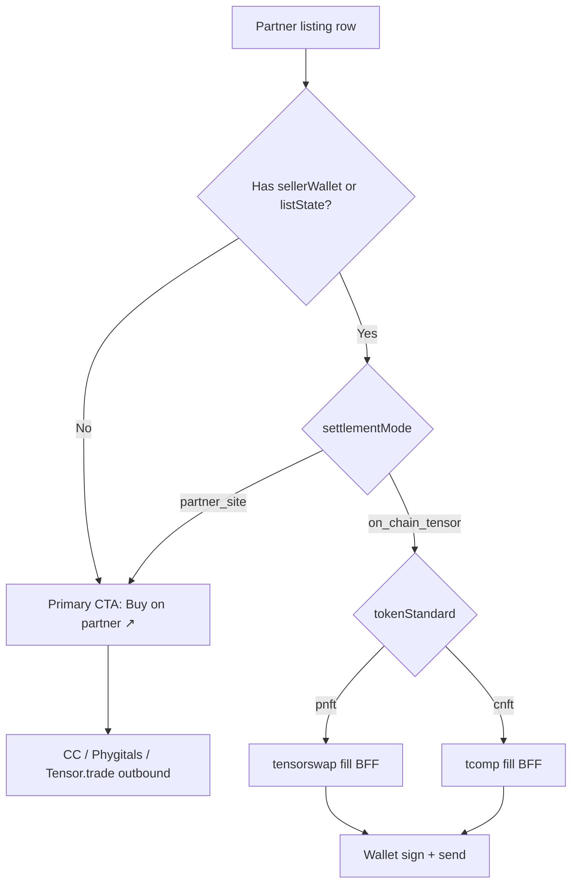

# Partner Aggregation — Quickest Smart Path

**Status:** Draft (May 2026)  
**Scope:** Two-worker plan for GRAILS partner aggregation — **display (data plane)** + **settlement (product plane)**.  
**Goal:** Fastest credible path to aggregated listings and at least one testable on-site buy, while honestly scoping Tensor API vs on-chain dependencies.

**Related:**

- [onchain-trade-stack.md](./onchain-trade-stack.md)
- [trade-staging-checklist.md](../trade-staging-checklist.md)
- [phygitals-collectorcrypt.md](./phygitals-collectorcrypt.md)
- [tensor-repo-vendoring.md](./tensor-repo-vendoring.md)
- [trade-architecture.md](../trade-architecture.md)
- [m3-recovery-status-2026-05-22.md](./m3-recovery-status-2026-05-22.md) — § Alignment update (ingest, buy gates, Prisma proxy dev)
- [staging-first-fill-record-template.md](./staging-first-fill-record-template.md) — M3 staging first-fill record

---

## Worker 1 — Data plane (partner ingest)

**Read priority on request paths** (`listPartnerTradeListings`, `/api/trade/partners/*`):

1. **Postgres `ExternalListing`** — rows upserted by `npm run sync:discover` when `DATABASE_URL` is set and reachable (skipped in `isPrismaProxyJsonSeedMode()` — see DB setup below)
2. **Partner API** — CC marketplace API candidates (`lib/collector-crypt-api-listings.ts`); Phygitals live API stub (`PHYGITALS_LIVE_INGEST_AVAILABLE=false`)
3. **JSON seed** — `data/external-listings.json` (dev/offline; also used when DB empty or Prisma proxy without `npx prisma dev`)
4. **Live CC scrape** — **fallback only** when `PARTNER_LIVE_SCRAPE_ENABLED=true` (or `?live=1`) **and** DB/API/JSON miss or all rows are stale
5. **Helius DAS merge** — when `collectionMint` + `HELIUS_API_KEY` (cert↔mint backfill; no ask prices)
6. **Tensor REST enrichment** — optional last merge when `TENSOR_API_KEY` is set (`sellerWallet` + `listState` for buy path)

**Locked in code:** `aggregatePartnerExternalListings()` in `lib/partner-listings.ts`. See [m3-recovery-status § Alignment update](./m3-recovery-status-2026-05-22.md#alignment-update--2026-05-23).

**Off request path:** `npm run sync:discover` batch job may scrape CC accounts — that is OK for cron/sync; it does not run on every SSR load.

**Aggregate desk (`/trade/all`):** `lib/trade/all-listings.ts` — `loadAllTradeListings()` parallel-loads CC, Phygitals, treasury, and preview venues; `mergeAllTradeListings()` flattens via `dedupePartnerTradeListings()` (lowest ask wins; losing partner ask preserved on `alternateVenueAsks`). Nav stats via `buildAllListingsAggregateStats`. Magic Eden depth requires `TENSOR_API_KEY`; Beezie/Courtyard preview collections stay empty by design.

| Concern | Tensor API required? | What actually powers it |
|---------|---------------------|-------------------------|
| Grid rows, cert badges, partner ask (USD/SOL) | **No** | `lib/partner-listings.ts` — Postgres → API → JSON → scrape fallback |
| Floor / listed count ribbon | **No** (partial) | `computeTradeCollectionStats()` over merged partner rows |
| 24h volume / Tensor-native stats ribbon | **Yes** (today) | `fetchTensorCollectionStats()` — optional polish |
| **On-site buy button enabled** | **Indirectly yes** (today) | Needs `sellerWallet` or `listState` — Tensor enrichment or ops seed |

**DB setup:** Use `postgresql://` for direct Postgres (recommended) or `prisma+postgres://` with `npx prisma dev`. When non-prod + `prisma+postgres://` without a running Prisma dev server, `isPrismaProxyJsonSeedMode()` skips DB probe/upsert and serves JSON with `dbStatus: unconfigured` (no false “unreachable”). Run `npm run db:preflight:warn` before `sync:discover` when `DATABASE_URL` is set. See [local-dev-database.md](../runbooks/local-dev-database.md).

**Verify:** `npm run db:preflight:warn` → `npm run sync:discover` (check `DB upsert count > 0`) → `npm run test` (partner-listings + all-listings).

---

> **Note:** Worker 1 and Worker 2 ingest order match `aggregatePartnerExternalListings()` in `lib/partner-listings.ts`. Buy gates below match `use-tensor-buy.ts`, `lib/trade/trade-modal.ts`, and `components/trade/tensor/map-listing.ts`.

---

## Worker 2 — Read vs write + revenue

Settlement and product strategist view. Assumes Worker 1’s partner ingest is the **primary display layer** (see ingest priority above). This section covers what happens **after** a row appears on `/trade/c/*` or the aggregate desk `/trade/all`.

**M3 staging gates:** [m3-recovery-status-2026-05-22.md § Alignment update](./m3-recovery-status-2026-05-22.md#alignment-update--2026-05-23) is code-truth for ingest, `/trade/all` merge, `alternateVenueAsks`, `canBuyOnChain`, and `isPrismaProxyJsonSeedMode()`. First verified fill → [staging-first-fill-record-template.md](./staging-first-fill-record-template.md) + [trade-staging-checklist.md](../trade-staging-checklist.md) steps 1–5.

### 1. Aggregation display vs settlement — Tensor API optional for grid?

**Yes — you can aggregate listings for display without Tensor API.** Capability split is in the **Worker 1** table above (grid/floor/buy gates).

**Display and settlement are different products:**

- **Display aggregation** = merge partner catalogs, dedupe by cert/mint, show best ask. Worker 1’s lane. No ME index required.
- **Settlement aggregation** = build a valid Solana fill tx against **mainnet TCM** (and venue CPI when ME-origin). That never goes through partner HTML scrape.

**When is TCM SDK still required for buy?**

Always, for wallet-native settlement on Solana — regardless of how the grid was populated.

| Path | Buy tx builder | Still hits TCM on-chain? |
|------|----------------|--------------------------|
| `GET /api/trade/tx/buy?writePath=sdk` | `@tensor-oss/tensorswap-sdk` (CC pNFT) / future `tcomp` fill | **Yes** — CPI to `TCMPhJdw…` |
| `GET /api/trade/tx/buy?writePath=rest` | Tensor REST `tx/buy` proxy | **Yes** — Tensor builds the same program ix server-side |
| Partner deep link | None in GRAILS | **No** — user completes purchase on partner or Tensor.trade |

Tensor **REST API** is a convenience for (a) seller/listState enrichment and (b) REST tx proxy. It is **not** the settlement layer. Removing the API key does **not** remove the need for **TCM + SDK** (or equivalent on-chain account parsing) to sign a fill.

**Practical split for quickest MVP:**

1. Worker 1 ships partner-first grid **without** `TENSOR_API_KEY`.
2. Worker 2 enables buy only on rows that have settlement metadata — from enrichment **or** ops-seeded `sellerWallet` / `listState` on known test mints.
3. Use **`writePath=sdk`** in the buy BFF (already the client default in `use-tensor-buy.ts`) so buy does not depend on Tensor REST once enrichment supplies accounts.

---

### 2. CC pNFT vs Phygitals cNFT — settlement lanes and UI routing

Both collections are configured `settlementMode: "on_chain_tensor"` in `lib/onchain/collections.ts`, but the **SDK lane differs**:

| Partner | Token | SDK lane | Fill builder (today) | Whitelist |
|---------|-------|----------|----------------------|-----------|
| **Collector Crypt** | pNFT (Token Metadata) | `tensorSdk: "tensorswap"` | `buildFillTransaction` → `buySingleListing` | Operator tx on `TL1ST2i…` when mint confirmed |
| **Phygitals** | cNFT (Bubblegum) | `tensorSdk: "tcomp"` | Same entrypoint; cNFT proofs + compressed transfer metas via `tcomp-sdk` | Tree/collection proof on whitelist |

**How aggregation UI should route fills:**

**UI rules (code truth — `use-tensor-buy.ts`, `trade-modal.ts`, `map-listing.ts`):**

1. **`resolvesOnChainSettlement(listing, slug)`** — `listing.settlementMode ?? getTradeCollectionBySlug(slug).settlementMode !== "partner_site"`. CC and Phygitals desks use `on_chain_tensor`; Beezie/Courtyard use `partner_site`.
2. **`canBuyOnChain(nft, listing, slug)`** — all of: `resolvesOnChainSettlement` + `isTradeWriteEnabledClient()` (`NEXT_PUBLIC_TENSOR_TRADE_WRITE_ENABLED` ?? `TENSOR_TRADE_WRITE_ENABLED` in `trade-modal.ts`) + connected wallet + listing price + mint + (`nft.listing.seller` **or** `nft.listing.listState`). Does **not** check broker PDA — that is a BFF/sim blocker after the button enables.
3. **`tradeListingHasOnChainBuyMetadata`** / **`resolveOnChainBuyBlockReason`** — grid/item copy when settlement is on-chain but `sellerWallet`/`listState` is missing (“Listing missing seller wallet or list state…”).
4. **`tradeListingShowsPartnerBuyLink`** — secondary **Buy on partner ↗** when on-chain settlement row lacks seller meta but has `vaultedUrl` (typical JSON seed). `partner_site` rows always deep-link when checkout URL resolves.
5. **`tradeWriteDisabledTooltip`** — when client write flag is off; browse + partner checkout still work.
6. **Venue badge** — CC/Phygitals partner badge for ingest-origin rows; show “Tensor indexed” when `tensorEnrichment.enrichedSeller > 0`.
7. **ME-origin asks** — When enrichment exposes `venue: magic_eden`, label it and route fill via Tensor SDK venue CPI (not a separate ME API). Do not assume TCM-only account layout.
8. **Phygitals-only listings** — If a Phygitals ask never appears on Tensor index, keep `settlementMode` honest: fall back to **`resolvePartnerDeepLink`** and badge “Phygitals checkout” until tree + whitelist + tcomp spike pass.

**What blocks on-site buy today** (aligned with [m3-recovery-status-2026-05-22.md](./m3-recovery-status-2026-05-22.md) § What you can test today):

| Layer | Ready today? | Gate / blocker | Code / ops |
|-------|--------------|----------------|------------|
| Browse grids + deep link | **Yes** | None for display | `listPartnerTradeListings`; partner ↗ via `tradeListingShowsPartnerBuyLink` / `resolvePartnerDeepLink` |
| On-site Buy button (`canBuyOnChain`) | **No** (default seed) | Missing `sellerWallet`/`listState` on most seed rows | `tradeListingHasOnChainBuyMetadata`; Tensor enrichment or ops seed |
| On-site Buy button | **No** (by design) | Client write flag off | `isTradeWriteEnabledClient()` — staging only until checklist |
| On-site Buy button | **No** until connected | Wallet not connected | `useTensorBuy` |
| On-site Buy button | **No** on Beezie/Courtyard | `settlementMode: partner_site` | `resolvesOnChainSettlement` false |
| Fill tx / simulation | **No** until ops | Server `TENSOR_TRADE_WRITE_ENABLED`, broker PDA, whitelist | BFF `/api/trade/tx/buy`; [trade-staging-checklist.md](../trade-staging-checklist.md) |
| Verified staging fill (M3 gate) | **No** | Documented tx + env snapshot | [staging-first-fill-record-template.md](./staging-first-fill-record-template.md) |

**Quickest test collection:** **Collector Crypt pNFT** — `buildFillTransaction` is wired and unit-tested; Phygitals cNFT is week-3 lane per [tensor-repo-vendoring.md](./tensor-repo-vendoring.md).

---

### 3. Broker fee / “tiny fee when routed through GRAILS” — minimum ops + eng steps

**Honest status:** Revenue capture is **ops-blocked** today. Engineering has wired the recipient; on-chain registration and fee account metas are not complete.

| Step | Owner | Status | Action |
|------|-------|--------|--------|
| Pick broker recipient | Ops | Ready | Treasury in `data/site.json` (`2oRZe7z9…`) or approved hot wallet → `SVF_BROKER_PUBKEY` |
| Register broker on Tensor **Fees** (`TFEEgwDP…`) | **Ops** | **Blocked** | Operator wallet / partner co-sign per collection — see [trade-staging-checklist.md § Broker fee PDA](../trade-staging-checklist.md#broker-fee-pda--ops-checklist-operator-blocked) |
| Confirm partner allows SVF broker on CC/Phygitals collections | Ops + legal | **Open** | Open question in [onchain-trade-stack.md](./onchain-trade-stack.md#open-questions) |
| Attach `takerBroker` on SDK fill | Eng | **Done** | `getSvfBrokerPubkey()` in `tensor-tcm-sdk.ts` |
| Attach Fees program accounts on fill | Eng | **Stub** | `attachBrokerFeeAccounts()` in `tensor-fees.ts` — TC-075 after PDA exists |
| Staging dry-run | Eng + ops | Pending | `/api/trade/tx/buy` sim must not fail with “maker broker not enabled” |
| Post-fill treasury credit | Ops | Pending | Optional lamport check after first fill |

**Minimum viable “GRAILS routed fee” narrative:**

- **Before PDA:** Ship on-site buy **without** claiming broker revenue — copy should say settlement is via Tensor TCM, not “GRAILS takes a fee” yet.
- **After PDA:** Same buy flow; broker lamports flow to treasury automatically on fill. Target 50–150 bps is a **design default** (`SVF_BROKER_FEE_BPS` preview only) — on-chain bps live in Fees program state.

**Do not** enable production write flags to “work around” a missing PDA. First fill can prove **settlement**; second milestone proves **revenue**.

---

### 4. Deep-link vs on-site buy per partner — quickest path to “user can complete a purchase”

| Partner | Fastest purchase path | On-site buy prerequisite | Fallback CTA |
|---------|----------------------|--------------------------|--------------|
| **Collector Crypt** | (A) Deep link ↗ — **works today** on seed rows (`on_chain_tensor`, no seller meta) | `canBuyOnChain`: enriched `sellerWallet` or `listState` + staging write flags + wallet | `tradeListingShowsPartnerBuyLink` → `resolvePartnerDeepLink()` |
| **Phygitals** | (A) Deep link ↗ — **works today** on seed rows | Same as CC + **tcomp** fill spike + Bubblegum proofs for on-chain path | Phygitals invite / item URL via partner ↗ |
| **SlabVault treasury** | On-site list/buy once vault wallet lists on TCM | Vault wallet + whitelist | N/A |
| **Beezie / Courtyard** | Deep link only (`partner_site`) | Multichain wallet v2 — deferred | Partner site |

**Recommended sequencing for “complete a purchase”:**

1. **Hour 0 — deep link always works.** Every partner row with `vaultedUrl` or platform CTA completes a purchase **off-site** — zero Tensor dependency, zero broker PDA.
2. **Week 1 — one on-site CC buy (staging).** Pick one CC pNFT with Tensor-indexed ask → enrichment → SDK buy dry-run → wallet sign. This is the GRAILS differentiator vs browse-only aggregators.
3. **Week 2+ — Phygitals on-site** only after tcomp path verified on a known cNFT mint.

**Product copy:** Primary CTA = on-site **Buy** when `canBuyOnChain`; secondary = **Buy on Collector Crypt ↗** (or Phygitals). Never hide the fallback when enrichment misses — that is the honest aggregation UX.

---

### 5. Reducing Tensor API dependency — what is actually replaceable?

| Capability | Replace Tensor API? | Replacement | Still need for Solana settlement |
|------------|--------------------|--------------|----------------------------------|
| Partner listing grid | **Yes — now** | Partner ingest (Worker 1) | — |
| Floor / count stats | **Mostly yes** | Partner stats over merged rows; Helius DAS (no ask prices) | — |
| 24h vol / Tensor ribbon | Partial | Defer or sum per-collection API until Helius webhook indexer | — |
| Seller + listState for buy | **Partial** | (1) Keep enrichment as optional shortcut; (2) Phase 2: read TCM list state PDAs via RPC + `tcomp-sdk.fetchListState`; (3) ops seed test mints | On-chain list state **must** exist somewhere |
| Buy tx bytes | **Yes** | Local SDK fill (`writePath=sdk`) instead of REST `tx/buy` | **tensorswap-sdk / tcomp-sdk** |
| ME-origin venue routing | **No** (short term) | Tensor SDK / index venue tag | Venue CPI account metas |
| Broker fee lamports | **No** | Tensor **Fees** program PDA (not API) | Fees program + registered broker |
| Whitelist proof | **No** | Tensor **Whitelist** program | Operator-signed whitelist tx |
| Escrow / bids | **No** | TCM + Escrow programs | SDK + IDL account metas |

**Bottom line:** Tensor **API** is replaceable for **display** and optionally for **tx proxy**. Tensor **on-chain programs + OSS SDKs** are not replaceable for wallet-native Solana settlement in v1. Magic Eden depth is consumed **through Tensor’s index**, not a separate ME API build.

---

### 6. Recommended stack — quickest path to a testable buy (one collection)

Target: **one CC pNFT fill on staging** with partner-first grid.

| Layer | Choice | Why |
|-------|--------|-----|
| **Display** | Worker 1 partner ingest (`npm run sync:discover`; CC scrape in batch only) | Grid works without API key; live scrape not on every page load |
| **Settlement metadata** | Tensor enrichment **or** manual seed of `sellerWallet` + `listState` on 1–3 test mints | Unblocks `canBuyOnChain` without full index |
| **Buy BFF** | `GET /api/trade/tx/buy?writePath=sdk` | Avoids REST tx dependency; uses wired `buildFillTransaction` |
| **SDK** | `@tensor-oss/tensorswap-sdk` (+ `@tensor-oss/tcomp-sdk` pinned for later Phygitals) | Already in repo; aligned to mainnet TCM id |
| **RPC** | `SOLANA_RPC_URL` + `NEXT_PUBLIC_SOLANA_RPC` (Helius recommended) | Simulation + blockhash |
| **Programs** | Mainnet TCM / Fees / Escrow / Whitelist IDs — **no deploy** | [onchain-trade-stack.md](./onchain-trade-stack.md) |
| **Gates** | Staging only: `TENSOR_TRADE_WRITE_ENABLED=true`, `NEXT_PUBLIC_TENSOR_TRADE_WRITE_ENABLED=true`, `TRADE_PLATFORM_ENABLED=true` | Production stays off per checklist; client flag drives `canBuyOnChain` |
| **Broker fee** | **Defer revenue** for first fill; parallel ops track on PDA | Fill proves product; PDA proves business model — BFF may fail sim until PDA registered |
| **Verify** | [trade-staging-checklist.md](../trade-staging-checklist.md) steps 1–5 | Buy dry-run before mainnet-beta send |
| **M3 record** | Copy [staging-first-fill-record-template.md](./staging-first-fill-record-template.md) → `docs/integrations/staging-fill-records/{YYYY-MM-DD}-first-fill.md` | Tx sig, mint, env snapshot (no secrets), broker PDA row, verification steps 1–5 |

**Optional accelerators:** `TENSOR_API_KEY` only for enrichment + footer vol — not for grid survival. `HELIUS_API_KEY` for cert↔mint when CC mint is confirmed.

**Exit criterion:** Staging wallet completes one buy dry-run (serialized tx from `/api/trade/tx/buy?writePath=sdk`) on an enriched CC listing; operator records outcome in `docs/integrations/staging-fill-records/{YYYY-MM-DD}-first-fill.md` per template (M3 gate **closed** when signed fill documented + prod write flags confirmed false).

---

## Synthesis — agreed quickest path

Merged plan across **Worker 1 (data plane)** and **Worker 2 (settlement/product)**. Worker 1’s section should align to these phases when appended; update this block if Worker 1 proposes different ordering.

### This week

- **Worker 1:** Ship partner-first aggregation for CC (+ Phygitals seed) — DB → API → JSON → scrape-fallback, cert dedupe, `/trade/c/collector-crypt` grid **without** requiring `TENSOR_API_KEY`. Optional Tensor enrichment when keyed.
- **Worker 2:** Treat every row as **display + settlement mode** — partner ↗ when `canBuyOnChain` false (seed rows today); enable on-site **Buy** only when `tradeListingHasOnChainBuyMetadata` + write flags + wallet. Staging SDK buy spike on **one CC pNFT** with `writePath=sdk`.
- **Shared exit:** User can **complete a purchase** off-site immediately; on-site buy dry-run on one enriched CC listing; fill recorded per [staging-first-fill-record-template.md](./staging-first-fill-record-template.md). Broker fee **not** promised in copy until PDA verified.

### Next week

- **Worker 1:** Harden cross-venue merge (`alternateVenueAsks` on cert/mint dedupe; item-page compare strip still open), `ExternalListing` Postgres in staging, enrichment metrics (`tensorEnrichment.enrichedSeller`) visible in BFF for ops tuning. Helius cert↔mint backfill for CC collection mint.
- **Worker 2:** Ops completes broker fee PDA checklist (or documents partner co-sign blocker); eng lands TC-075 fee account metas. Whitelist operator tx for CC mint. Phygitals **tcomp** fill spike on one cNFT — separate lane from CC.
- **Shared exit:** First staging **sent** fill on CC; treasury broker lamports **or** documented PDA blocker; Phygitals on-site buy scoped honestly (deep link + badge until tcomp passes).

### Defer

- Full Tensor API removal for settlement metadata (on-chain list-state indexer — Phase 2 in [onchain-trade-stack.md](./onchain-trade-stack.md)).
- Phygitals live API ingest (`PHYGITALS_LIVE_INGEST_AVAILABLE=false` today).
- Beezie / Courtyard on-chain settlement (`partner_site` deep links only).
- AMM sweep, collection bids at scale, custom `slabvault-broker` program deploy.
- Production write flags + `TENSOR_TX_REQUIRE_TRUSTED_ORIGIN=true` until staging first-fill sign-off.

---

## Changelog

| Date | Change |
|------|--------|
| 2026-05-23 | Master dev next steps — CC API-first sync, deep links, buy honesty, client/server splits |
| 2026-05-23 | Worker 2 — Read vs write + revenue; Synthesis (Worker 1 section pending append above) |
| 2026-05-23 | Segment 3 — `/trade/all` merge + `alternateVenueAsks`; honest `canBuyOnChain` gates; Worker 2 ingest order fix |
| 2026-05-23 | Segment 3/4 prep — dedupe Worker 2 Tensor table; M3 staging gate cross-ref; sync `isPrismaProxyJsonSeedMode` + full ingest chain with m3-recovery |
