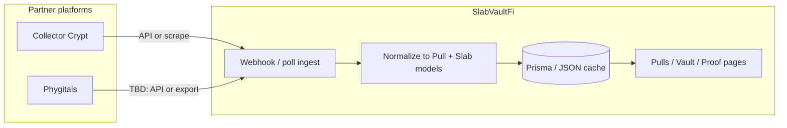

# Phygitals & Collector Crypt — Integration Plan (Stub)

**Status:** Partner ingest is the **primary** read path for `/trade/c/collector-crypt` and `/trade/c/phygitals`. Tensor REST is an optional shortcut for ME depth — not required for MVP grids. Phygitals has JSON seed rows only (no live API). Collector Crypt merges JSON/DB seed, optional live scrape, and Helius DAS when `collectionMint` + `HELIUS_API_KEY` are set.

## Purpose

SlabVaultFi routes community gacha activity through partner platforms. Two primary partners today:

| Partner | Role | Site config keys |
|---------|------|------------------|
| **Collector Crypt** | Primary pull partner; treasury/deployer accounts; slab + pull sync | `links.gachaCollectorCrypt`, `collectorCryptAccounts`, `gachaTiers[Collector Crypt]` |
| **Phygitals** | Secondary gacha tier; referral link only (no API yet) | `links.gachaPhygitals`, `gachaTiers[Phygitals]` |

Canonical links live in `data/site.json` and surface through `lib/site-config.ts`, community/vault pages, and pull history (`data/pulls.json` clip URLs).

## Current state

### Collector Crypt (partial)

- **Pull history:** `fetchCollectorCryptData()` tries public API paths, then HTML scrape for replay URLs (`gacha.collectorcrypt.com/?replay=…`).
- **Slabs:** `fetchCollectorCryptSlabs()` on treasury + deployer account URLs; Vollector-style embedded payload when present.
- **Sync:** `scripts/sync-data.ts` → `lib/data-sync.ts` writes slabs/pulls into JSON + Prisma when `DATABASE_URL` is set.
- **Images:** Remote hosts allowed in `next.config.ts` (`collectorcrypt.com`).

### Phygitals (link-only)

- Referral CTA: `https://phygitals.com/invite/slabvault`
- No scraper, webhook, or pull attribution pipeline.
- Product copy must not imply on-chain or vault proof for Phygitals pulls until ingestion exists.

## Target architecture (future)



### Phase 1 — Collector Crypt hardening

- [ ] Confirm stable API contract with Collector Crypt (account pulls, slab inventory).
- [ ] Replace fragile SPA scrape fallbacks where API is available.
- [ ] Map `clipUrl` → immutable replay ID for dedupe and admin audit.
- [ ] Add sync health metrics to admin/ops (stale age, last success — extend `tests/data-sync-guardrails.test.ts` patterns).
- [ ] Document rate limits and User-Agent policy in `docs/runbooks/operations-hardening.md`.

### Phase 2 — Phygitals discovery

- [ ] Obtain partner API docs or scheduled export (pull ID, cost, outcome, media URL, wallet).
- [ ] Define attribution model: referral code `slabvault` vs wallet allowlist vs manual CSV.
- [ ] Add `links.gachaPhygitals` env override if invite URL changes per campaign.
- [ ] Stub types in `types/content.ts` mirroring `CollectorCryptPull` (e.g. `PhygitalsPull`).

### Phase 3 — Unified ingest

- [ ] Single `PartnerSource` enum: `COLLECTOR_CRYPT | PHYGITALS | MANUAL`.
- [ ] Idempotent upsert by `(source, externalId)` to prevent duplicate pull rows.
- [ ] Admin UI: mark pull as verified / disputed before vault proof claims.
- [ ] Feature flag: show Phygitals pulls on `/pulls` only when `PHYGITALS_SYNC_ENABLED=true`.

### Phase 4 — Trust & transparency

- [ ] Vault proof page links per partner with clear “verified via sync” vs “community-reported”.
- [ ] Public runbook for sync failures and manual backfill.
- [ ] No inflated vault USD; experimental pulls labeled in UI.

## Trade partner BFF (partner-first)

Read path: `lib/partner-listings.ts` → `TradeListing` (`lib/trade-listings.ts`). No `TENSOR_API_KEY` required.

| Endpoint | Purpose |
|----------|---------|
| `GET /api/trade/partners/[platform]/listings` | Full grid payload + inline `stats` |
| `GET /api/trade/partners/[platform]/stats` | Floor, `listedCount`, FMV rollup only |
| `GET /api/trade/collections/[slug]/depth` | Slug-based depth; partner ingest first, Tensor fallback |

**Platforms:** `collector_crypt` or alias `collector-crypt`, `phygitals`.

**Query:** `?live=1` — force Collector Crypt live scrape (default: scrape when seed empty or `PARTNER_LIVE_SCRAPE_ENABLED=true`).

**Sources (response `sources[]`):** `external_db` \| `external_json` \| `cc_scraper` \| `helius_das`.

**Ingest refresh:** `npm run sync:discover` → `data/external-listings.json` (and Postgres when `DATABASE_URL` is set and Prisma accepts the URL — use `postgresql://` for direct Postgres or `prisma+postgres://` for Prisma dev/Accelerate). Phygitals rows get `indexedAt` refreshed each sync (`lib/phygitals-listings.ts`); live API ingest is **not** available (`PHYGITALS_LIVE_INGEST_AVAILABLE = false`).

See `tests/partner-listings.test.ts` and `tests/api-trade-partner-listings.test.ts`.

## Data contracts (draft)

```ts
// Planned — not implemented
type PartnerPull = {
  id: string;           // stable external id
  source: "collector_crypt" | "phygitals" | "manual";
  date: string;         // ISO
  summary: string;
  costUsd: number | null;
  outcomeUsd: number | null;
  clipUrl: string | null;
  wallet?: string;      // optional attribution
};
```

Align with existing `CollectorCryptPull` in `lib/scrapers/collector-crypt-scraper.ts` and Prisma pull models when schema is extended.

## Configuration

| Variable | Purpose |
|----------|---------|
| `COLLECTOR_CRYPT_TREASURY_URL` | Override treasury account (default in `lib/data-sync.ts`) |
| `COLLECTOR_CRYPT_DEPLOYER_URL` | Override deployer account |
| `PHYGITALS_SYNC_ENABLED` | **Future** — gate Phygitals ingest |
| `PHYGITALS_API_KEY` | **Future** — server-only, never `NEXT_PUBLIC_*` |

## Security & compliance

- Treat partner APIs like untrusted input: validate URLs, cap response size, timeout (`SCRAPER_TIMEOUT_MS`).
- Do not store partner session cookies or user credentials.
- Referral links are outbound only; no wallet signing on partner domains from SVF embeds.
- Review `SECURITY_CHECKLIST.md` before enabling webhooks (auth, replay, rate limits).

## Testing checklist (when implemented)

- [ ] Unit tests for normalizers (sample fixtures per partner).
- [ ] Guardrail test: Phygitals disabled by default in production env contract.
- [ ] Sync integration test with mocked HTTP (see `tests/data-sync-guardrails.test.ts`).
- [ ] `npm run perf:check` unchanged — ingest stays off critical path for LCP routes.

## Open questions

1. Does Phygitals expose pull history by wallet, invite code, or neither?
2. Should Phygitals slabs enter the same vault inventory table as Collector Crypt / Vollector?
3. Who owns dispute resolution when sync and on-chain treasury diverge?

## Related docs

- [gacha-nft-metadata.md](./gacha-nft-metadata.md) — NFT standards (CC pNFT, Phygitals cNFT), cert↔mint, Tensor feasibility

## Related files

- `lib/partner-listings.ts` — merge CC + Phygitals → `TradeListing`
- `app/api/trade/partners/[platform]/listings/route.ts` — partner listings BFF
- `app/api/trade/partners/[platform]/stats/route.ts` — floor + count BFF
- `lib/scrapers/collector-crypt-scraper.ts` — Collector Crypt fetch/scrape
- `lib/data-sync.ts` — scheduled sync orchestration
- `data/site.json` — partner URLs and gacha tiers
- `data/pulls.json` — static pull examples (clip URLs)
- `docs/runbooks/performance-hygiene.md` — keep list pages server-first during new UI

## Changelog

| Date | Note |
|------|------|
| 2026-05-21 | Partner BFF documented; ingest primary over Tensor API |
| 2026-05-21 | Initial stub integration plan for recovery lane |
