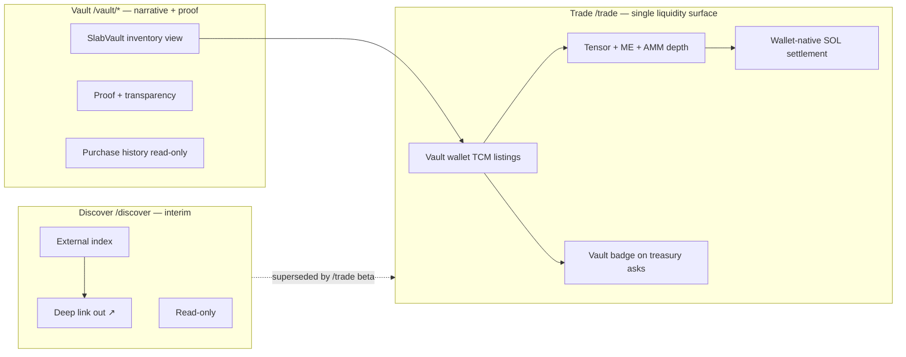
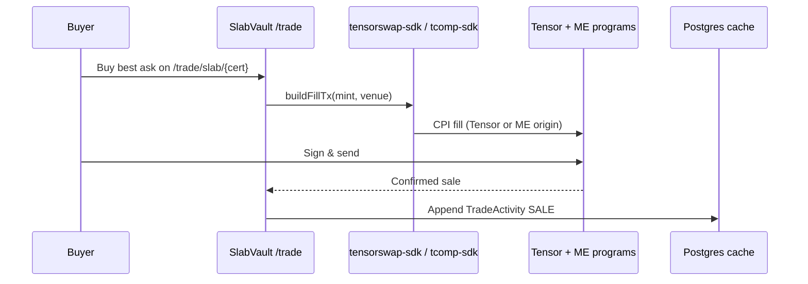
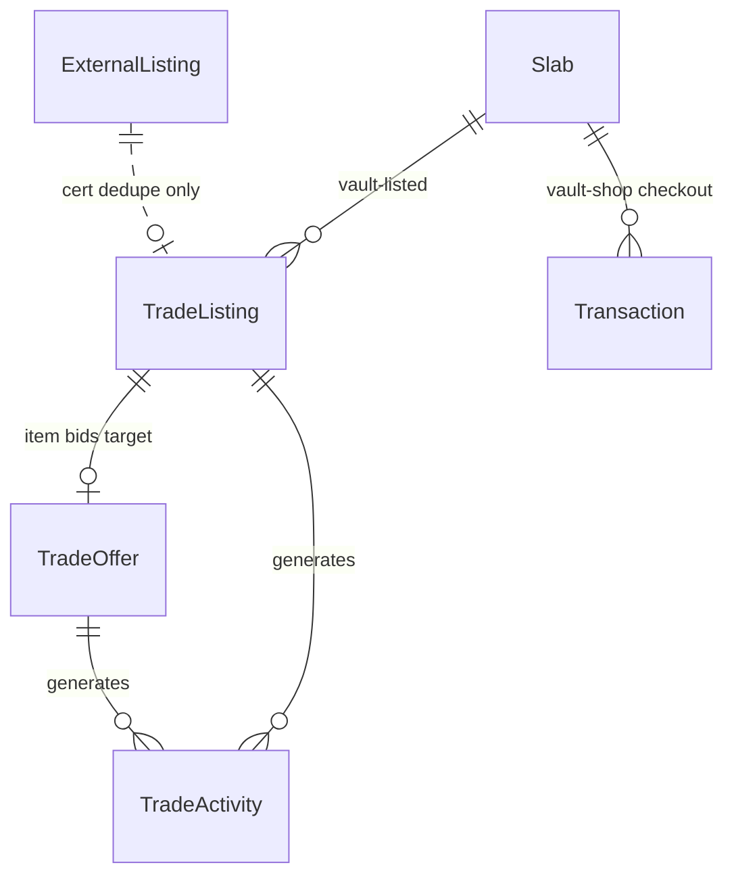
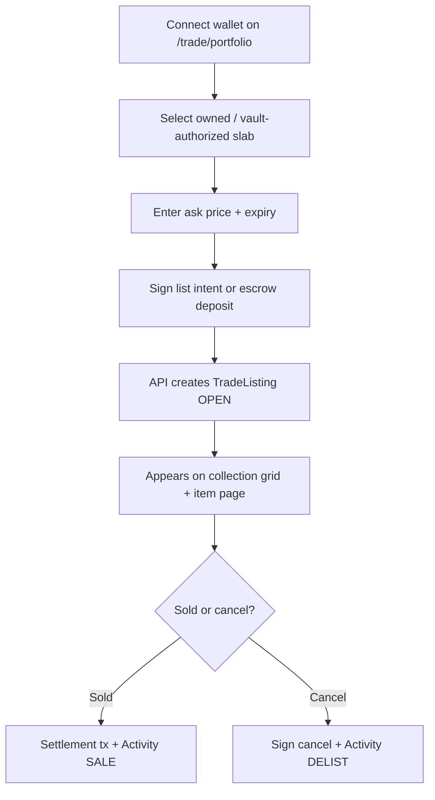

# RWA Trading Platform — Product Vision & Technical Plan

**Status:** Planning / research (May 2026)  
**Route:** `/trade` (feature flag `RWA_TRADE_ENABLED`)  
**Inspiration:** [Tensor.trade](https://www.tensor.trade/) — Solana-native order book UX for graded slabs (RWA collectibles), not generic NFT sniping.

**Related docs:**

- [vault-to-trade-listings.md](./vault-to-trade-listings.md) — **Treasury slabs sell only on `/trade`** (vault shop archived; TCM list/buy + Vault badge)
- [tensor-fork-feasibility.md](./tensor-fork-feasibility.md) — **Tensor-first `/trade` strategy**, ME aggregation, fork vs integrate, fee model
- [gacha-nft-metadata.md](./gacha-nft-metadata.md) — CC pNFT / Phygitals cNFT, cert↔mint, DAS indexing
- [solana-marketplace-aggregator.md](./solana-marketplace-aggregator.md) — `/discover` interim deep-link aggregator
- [onchain-trade-stack.md](./onchain-trade-stack.md) — TCM programs, fee PDAs, vault wallet listing
- [phygitals-collectorcrypt.md](./phygitals-collectorcrypt.md) — partner ingest for vault pulls

---

## Executive summary

| Question | Answer |
|----------|--------|
| What is `/trade`? | A **Tensor-based aggregator desk** for graded slabs — collection pages, trait filters, cross-venue depth (Tensor + **Magic Eden** + AMM), wallet-native buy/sell **inside SlabVaultFi**. |
| How is it different from `/vault/*`? | **`/vault/*`** = inventory overview, proof, purchase history (read-only). **Treasury sales** = vault wallet lists on TCM → buyers fill on **`/trade/*`** with SOL (see [vault-to-trade-listings.md](./vault-to-trade-listings.md)). Legacy `/vault/shop` checkout is **archived**. |
| How is it different from `/discover`? | **Discover** = interim read-only index with **outbound deep links**. **Trade** = **SlabVault-hosted** settlement via Tensor/ME programs; users complete trades without leaving the site. |
| Tensor parity target? | Collection pages, trait filters, live listings grid, item-level bid/ask, activity feed, wallet connect + sign. Aggregated ME liquidity included. **Not** v1: full AMM market-making, collection-wide bid ladders. |
| Recommended MVP architecture | **Tensor-first integrate** — fork [marketplace-nextjs-template](https://github.com/tensor-foundation/marketplace-nextjs-template) + `tensorswap-sdk` (CC pNFT) + `tcomp-sdk` (Phygitals cNFT) against **Tensor mainnet programs**; Postgres as cache only. See [tensor-fork-feasibility.md](./tensor-fork-feasibility.md). |
| First build slice | Template spike + `/trade/c/collector-crypt` read-only depth from Tensor API/SDK (no custom order book). |

---

## Product vision

SlabVaultFi’s flywheel is **crypto activity → live pulls → graded slabs → public vault → community ownership**. Today:

- The **vault** proves inventory and narrative (`/vault`, `/pulls`).
- **Treasury slabs** sell on **`/trade`** via Tensor listings from the vault wallet — not a parallel shop checkout (see [vault-to-trade-listings.md](./vault-to-trade-listings.md)).
- **Discover** (`/discover`) is an **interim** read-only deep-link index until `/trade` beta ships.

**`/trade` completes the loop** by making SlabVault the **primary trading desk** for graded slabs — a Tensor-powered aggregator (including **Magic Eden** venue liquidity) where collectors browse CC, Phygitals, and vault collections, filter by grade/set/cert, see cross-venue asks and bids, and execute wallet-native trades without hopping to partner sites.

### Design principles (Tensor-inspired, RWA-adapted)

| Tensor pattern | SlabVault RWA adaptation |
|----------------|--------------------------|
| Collection page with floor, volume, listed % | **Set / vault collection** pages — e.g. “SlabVault treasury”, “Pokémon 151 PSA 10”, partner drops |
| Trait sidebar filters | **Slab traits:** grader, numeric grade, set, card name, language, cert #, FMV band |
| BUY tab: Quick Buy, sweep, collection bid | **Buy:** instant buy at ask; v2 collection bid with price delta |
| SELL tab: Quick sell to bid, list with curve | **Sell:** accept best bid; list at fixed price (v1); bonding curve (v2) |
| Activity feed (list / sale / bid / cancel) | **Activity** scoped to collection + global strip; link to tx + cert |
| Lite vs Pro | **Lite** = browse + one-click buy; **Pro** = depth, spread, bid ladder (v2) |
| Wallet-native | Phantom Connect; sign list/bid/buy; show portfolio of listed + owned slabs |
| Real-time UI | SSE or polling on listing/offer tables; optimistic updates after signature |

### RWA-specific constraints (not on Tensor)

Graded cards are **physical assets** tokenized or attested on-chain. Trade UX must surface:

- **Cert # + grader** as first-class identity (dedupe key across platforms).
- **Provenance** — vault pull link, `vaultedUrl`, stream clip when applicable.
- **Fulfillment state** — trade settlement ≠ shipping; post-trade fulfillment is a separate workflow (reuse patterns from `lib/marketplace-fulfillment.ts` where vault is counterparty).
- **Regulatory copy** — no investment promises; experimental label on P2P until policies reviewed.

---

## Commerce lanes (treasury sales on `/trade` only)

> **Decision (May 2026):** SlabVault treasury slabs sell **only** via `/trade` Tensor listings — no parallel `/vault/shop` checkout. Full rationale and migration: [vault-to-trade-listings.md](./vault-to-trade-listings.md).



| Dimension | `/vault/*` (Overview + history) | `/discover` (Interim index) | `/trade/*` (Tensor desk — **includes treasury sales**) |
|-----------|--------------------------------|----------------------------|--------------------------------------------------------|
| **Inventory** | SlabVault-owned `Slab` rows (display) | Third-party `ExternalListing` | Tensor-indexed asks/bids (CC, Phygitals, **vault-listed**) |
| **Checkout** | **None** (shop archived) | None — outbound URL | Wallet sign + Tensor/ME program fill |
| **Payment** | N/A | N/A | SOL primary; protocol fee via Tensor `fees` program (v2) |
| **Counterparty** | N/A for sales | CC, Phygitals, ME, etc. | Any wallet; **vault wallet lists treasury slabs** |
| **Data model** | `Slab`; legacy `Transaction` (read-only) | `ExternalListing` | `TradeActivity` cache + Tensor on-chain state |
| **Settlement** | N/A | N/A | **Tensor mainnet programs** (integrate v1) |
| **User goal** | See vault inventory + proof | Find best price elsewhere ↗ | Buy treasury slabs + trade CC/Phygitals — Tensor depth incl. ME |
| **Nav label** | Vault | Discover | Trade |
| **Feature flag** | Always on | `DISCOVER_AGGREGATOR_ENABLED` | `RWA_TRADE_ENABLED` |

**Cross-lane UX (allowed):**

- Treasury asks on `/trade` show **Vault badge** when seller is deployer wallet (see `lib/trade/vault-listings.ts`).
- Discover card may show **Trade on SlabVault** when a matching active ask exists (cert dedupe).
- Legacy `/vault/shop` and `/marketplace/*` checkout redirect to `/trade` — no SVF-burn checkout for treasury sales.

---

## Tensor core UX — research notes

Sources: [Tensor docs](https://docs.tensor.trade/), [TensorSwap AMM guide](https://docs.tensor.trade/trade/get-started-with-tensors-amm), collection UX guides (Solyzer, community).

### Collection pages

- Header metrics: **floor**, **top offer**, **24h volume**, **listed count / supply**, **owners**.
- **Price chart** (floor over time) — Pro mode.
- **Tabs:** Items | Activity | Analytics (Pro).
- **View modes:** grid / list; Lite vs Pro toggle.

### Trait filters

- Left rail: price range, rarity/trait groups, multi-select attributes.
- Filters update URL query params for shareable views.
- For slabs: map traits to **grader**, **grade numeric**, **set**, **edition**, **language**, **parallel**, **cert prefix**.

### Live listings & bid/ask

- **Ask side:** fixed listings; TensorSwap also supports listing curves (price increases per fill).
- **Bid side:** item bids + **collection bids** (deposit SOL, max quantity, start price, delta decrement per fill).
- **Quick actions:** hover BUY / SELL on grid tiles.
- **Sweep:** multi-select buy in one transaction.

### Activity feed

- Stream of `list`, `delist`, `sale`, `bid`, `cancel`, `transfer`.
- Filter by event type; link to explorer + item page.

### Wallet-native trading

- Connect wallet → portfolio of owned assets → list or accept bid.
- Every order type ends in **sign transaction**; protocol holds escrow or uses program-owned vault.

### What we defer from Tensor (v2+)

- Concentrated liquidity AMM / market-making orders with custom 0–25% fees.
- Collection-wide bid ladders with bonding-curve deltas.
- Bulk sweep in single tx across 50+ items.
- Tensor-style rewards points.
- Full Pro depth charts and order-book heatmaps.

---

## MVP vs v2 feature matrix

| Feature | MVP (v1) | v2 |
|---------|----------|-----|
| Collection index `/trade` | ✅ Grid + floor + filters | Charts, volume stats |
| Collection detail `/trade/c/[slug]` | ✅ Trait filters + sort | Pro mode, analytics tab |
| Item page `/trade/slab/[id]` | ✅ Image, cert, ask/bid, activity | Price history, compare |
| List for sale (ask) | ✅ Fixed price, expiry | Listing curves |
| Buy now | ✅ Fill best ask | Sweep multi-buy |
| Item bid | ✅ Single-item offer | Collection bid, trait bid |
| Cancel list / bid | ✅ | Bulk cancel |
| Activity feed | ✅ Collection + global | WebSocket live |
| Wallet connect | ✅ Phantom (existing stack) | Social login via Phantom Connect |
| Settlement | ✅ SOL transfer + escrow stub | Full Anchor escrow program |
| Slab identity | ✅ Link to `Slab` or ingest cert | cNFT mint verification |
| SVF integration | ❌ SOL-only | Optional fee discount / rebates |
| Physical fulfillment | ✅ Manual admin queue for vault sales | Automated shipping API |
| External inventory | ❌ | Import CC/Phygitals as read-only “external” collection |
| Mobile | ✅ Responsive grid | Native swipe actions |

---

## Architecture: Tensor-first (replaces custom order book)

**Decision (May 2026):** Do **not** build a bespoke Postgres matching engine. Use Tensor’s on-chain programs + SDKs + aggregated index (including **Magic Eden** listings). Full rationale: [tensor-fork-feasibility.md](./tensor-fork-feasibility.md).

### Recommended stack

| Layer | Responsibility |
|-------|----------------|
| **UI** | Fork/adapt [marketplace-nextjs-template](https://github.com/tensor-foundation/marketplace-nextjs-template) under `/trade/*` |
| **Wallet** | [Unified-Wallet-Kit](https://github.com/tensor-foundation/Unified-Wallet-Kit) on trade routes |
| **SDK** | `tensorswap-sdk` (CC pNFT) + `tcomp-sdk` (Phygitals cNFT) |
| **Programs** | Tensor **mainnet** marketplace + escrow + fees (integrate v1; fork v2 if needed) |
| **Index** | Tensor REST API (optional) or SDK on-chain reads; Helius DAS for cert↔mint |
| **Postgres** | **Cache only** — `TradeActivity`, trait facets, cross-lane cert badges |

### Deprecated options (pre-Tensor research)

| Option | Status | Notes |
|--------|--------|-------|
| Off-chain book + custom fill API | **Deprecated** | Superseded by Tensor programs |
| Custom Anchor order book | **Deprecated** | Use `tensor-foundation/marketplace` instead |
| Hybrid signed intents | **Optional v2** | Only if Tensor SDK gap requires thin API wrapper |



### Settlement comparison

| Model | MVP fit | Notes |
|-------|---------|-------|
| Tensor program fill | ✅ | Primary path — includes aggregated ME asks |
| Tensor AMM pool swap | v2 | `tensor-foundation/amm` |
| Direct SOL transfer | ❌ | Not used on `/trade` |
| Outbound deep link only | `/discover` | Interim until `/trade` beta |

**Recommendation:** **Integrate** Tensor mainnet programs in v1. Configure **fee PDAs** via `tensor-foundation/fees` in v2. Fork programs only when audit budget allows.

---

## Schema sketch

New Prisma models — **do not** overload `Slab` (vault shop) or `ExternalListing` (discover).

### Enums

```ts
type TradeListingStatus = "open" | "reserved" | "filled" | "cancelled" | "expired";
type TradeOfferStatus = "open" | "accepted" | "cancelled" | "expired";
type TradeOfferScope = "item" | "collection" | "trait"; // MVP: item only
type TradeActivityType =
  | "list"
  | "delist"
  | "sale"
  | "bid"
  | "bid_cancel"
  | "offer_accept"
  | "price_update";
```

### `TradeListing` (ask)

```ts
type TradeListing = {
  id: string;
  /** SlabVault slab id when vault-listed; null for P2P-only assets */
  slabId?: string | null;
  /** Universal identity for RWA dedupe */
  certNumber: string;
  grader: "PSA" | "BGS" | "CGC" | "SGC";
  collectionSlug: string; // e.g. "slabvault-treasury", "pokemon-151"
  sellerWallet: string;
  priceLamports: bigint;
  currency: "SOL"; // USDC in v2
  status: TradeListingStatus;
  reservedBy?: string | null;
  reservedExpiresAt?: string | null;
  settlementTx?: string | null;
  listedAt: string;
  expiresAt?: string | null;
  cancelledAt?: string | null;
  filledAt?: string | null;
  // Denormalized for filters (sync from Slab or ingest)
  title: string;
  grade: string;
  setName?: string;
  cardName?: string;
  imageUrl: string;
  traitsJson?: Record<string, string>; // filter facets
};
```

### `TradeOffer` (bid)

```ts
type TradeOffer = {
  id: string;
  scope: TradeOfferScope;
  /** Item bid */
  listingId?: string | null;
  certNumber?: string | null;
  /** Collection bid (v2) */
  collectionSlug?: string | null;
  traitFilterJson?: Record<string, string[]> | null;
  buyerWallet: string;
  priceLamports: bigint;
  maxQuantity: number; // 1 for item bid
  remainingQuantity: number;
  /** v2: price delta per fill (collection bids) */
  priceDeltaLamports?: bigint | null;
  status: TradeOfferStatus;
  escrowTx?: string | null;
  createdAt: string;
  expiresAt?: string | null;
};
```

### `TradeActivity`

```ts
type TradeActivity = {
  id: string;
  type: TradeActivityType;
  collectionSlug: string;
  certNumber?: string | null;
  listingId?: string | null;
  offerId?: string | null;
  actorWallet: string;
  counterpartyWallet?: string | null;
  priceLamports?: bigint | null;
  txSignature?: string | null;
  occurredAt: string;
  metadataJson?: Record<string, unknown>; // e.g. { previousPrice, source: "vault" }
};
```

### Indexes (query patterns)

- `(collectionSlug, status, priceLamports)` — floor / sort asks.
- `(certNumber, grader, status)` — item page depth.
- `(collectionSlug, occurredAt DESC)` — activity feed.
- `(sellerWallet, status)` / `(buyerWallet, status)` — portfolio.

### Relation to existing models



---

## Navigation placement

Target IA (see [tensor-fork-feasibility.md](./tensor-fork-feasibility.md)). Today `lib/nav.ts` still points `/marketplace/*`; migrate to `/vault/marketplace/*` with redirects.

| Nav structure | Entry | Flag |
|---------------|-------|------|
| **Vault** (group) | `/vault`, `/vault/marketplace`, `/pulls`, `/vault/marketplace/orders` | always |
| **Trade** (link, badge `soon` → `beta`) | `/trade` | `RWA_TRADE_ENABLED` |
| **Discover** (link, interim) | `/discover` | `DISCOVER_AGGREGATOR_ENABLED` |
| Secondary | Home, Streams, $SVF, FAQ, … | always |

**Legacy aliases:** `/marketplace/*` → redirect to `/vault/marketplace/*` during IA migration.

### Route map — `/trade/*` (Tensor aggregator)

| Route | Purpose |
|-------|---------|
| `/trade` | Landing — featured RWA collections, global activity, connect wallet CTA |
| `/trade/c/[slug]` | Collection page — CC, Phygitals, SVF treasury; cross-venue floor + filters |
| `/trade/slab/[certOrMint]` | Item market — best ask across Tensor + ME, bids, cert proof |
| `/trade/portfolio` | My listings, bids, owned slabs (wallet-scoped) |
| `/trade/activity` | Global feed (optional; can be tab on `/trade`) |

### Route map — `/vault/*` (overview — shop archived)

| Route | Purpose |
|-------|---------|
| `/vault` | Public inventory overview |
| `/vault/proof` | Treasury transparency |
| `/vault/purchases` | Legacy buyer order history (read-only) |
| `/vault/shop/*` | **Archived** → redirect to `/trade/c/slabvault-treasury` |

Treasury **sales** live on `/trade` — see [vault-to-trade-listings.md](./vault-to-trade-listings.md).

### Copy guidelines (avoid lane confusion)

- **Vault:** SlabVault inventory · proof · history
- **Trade (treasury):** Buy from SlabVault · Vault badge · SOL · Tensor settlement
- **Trade (market):** Trade slabs on SlabVault · Tensor depth incl. Magic Eden · SOL
- **Discover:** Browse partner marketplaces ↗ (interim)

Stub today: `app/trade/page.tsx` (coming soon). Replace with Tensor template spike when slice 1 ships.

---

## User flows (mermaid)

### Browse collection → buy now

```mermaid
flowchart TD
  A[Land on /trade/c/pokemon-151] --> B[Apply filters: PSA 10, price band]
  B --> C[Grid shows live listings + floor]
  C --> D[Click slab tile]
  D --> E[/trade/slab/{cert}]
  E --> F{Wallet connected?}
  F -->|No| G[Connect Phantom]
  F -->|Yes| H[Review ask price + fees]
  G --> H
  H --> I[Sign fill transaction]
  I --> J{Settlement OK?}
  J -->|Yes| K[Activity: SALE + order receipt]
  J -->|No| L[Show error + release reserve]
  K --> M[Fulfillment queue if physical transfer needed]
```

### List slab for sale



### Place item bid

```mermaid
flowchart TD
  A[Item page /trade/slab/{cert}] --> B[Enter bid price + expiry]
  B --> C[Connect wallet]
  C --> D[Sign bid + optional escrow lock]
  D --> E[TradeOffer OPEN]
  E --> F[Seller sees bid on item + portfolio]
  F --> G{Seller accepts?}
  G -->|Yes| H[Match engine fills + settlement]
  G -->|No| I[Bid expires or buyer cancels]
  H --> J[Activity OFFER_ACCEPT]
```

### Lane routing (user intent)

```mermaid
flowchart TD
  U[User wants a slab] --> Q1{SlabVault treasury listing?}
  Q1 -->|Yes| TR[/trade/c/slabvault-treasury Vault badge]
  Q1 -->|No| Q2{Trade here with SOL?}
  Q2 -->|Yes| TR2[/trade Tensor aggregator]
  Q2 -->|No| DIS[/discover deep link out ↗]
```

---

## System architecture

```mermaid
flowchart TB
  subgraph ui [Trade UI]
    TC[/trade/c/slug]
    TS[/trade/slab/id]
    TP[/trade/portfolio]
  end

  subgraph api [API layer]
    LAPI[POST/GET /api/trade/listings]
    OAPI[POST/GET /api/trade/offers]
    FAPI[POST /api/trade/fill]
    AAPI[GET /api/trade/activity]
  end

  subgraph data [Postgres]
    TL[(TradeListing)]
    TO[(TradeOffer)]
    TA[(TradeActivity)]
    SL[(Slab — vault shop only)]
  end

  subgraph chain [Solana]
    ESC[Escrow / settlement]
    WAL[Phantom wallet]
  end

  TC --> LAPI
  TS --> LAPI
  TS --> OAPI
  TP --> LAPI
  TP --> OAPI
  LAPI --> TL
  OAPI --> TO
  FAPI --> TL
  FAPI --> ESC
  AAPI --> TA
  SL -.->|vault-listed asks| TL
  WAL --> FAPI
  ESC --> TA
```

### Code reuse from vault marketplace

| Existing module | Trade reuse |
|-----------------|-------------|
| `lib/marketplace-reservations.ts` | Listing reserve TTL during fill |
| `lib/marketplace-payment-verify.ts` | Tx confirmation polling |
| `lib/marketplace-fulfillment.ts` | Post-sale vault fulfillment |
| `lib/csrf.ts` + wallet challenge | Write API auth |
| `components/marketplace-filters.tsx` | Filter/sort patterns for trade grid |
| `components/slab-image.tsx`, card shells | Visual parity |

**Do not reuse** `lib/marketplace-split.ts` / SVF burn in trade v1 — keeps lanes distinct.

---

## Top 5 MVP slices (Tensor-first build order)

Aligned with [tensor-fork-feasibility.md](./tensor-fork-feasibility.md). Each slice is independently demoable.

### 1. Template spike + read-only CC collection

**Goal:** Prove Tensor-like browse UX with real aggregated depth.

- Fork/adapt `marketplace-nextjs-template` under `app/trade/*`.
- Wire read-only collection page `/trade/c/collector-crypt` via Tensor API or SDK.
- Show **venue badges** (Tensor / Magic Eden) on asks.
- Add `TradeActivity` cache model (optional migration) for UI feed hydration.
- Feature flag `RWA_TRADE_ENABLED`; badge → `beta` on staging.

**Exit criteria:** Live floor from Tensor index; ME-origin asks visible; no wallet required to browse.

---

### 2. Unified Wallet Kit + Phygitals cNFT collection

**Goal:** Dual SDK path — pNFT + cNFT.

- Integrate `Unified-Wallet-Kit` on `/trade/*` route group.
- Add `/trade/c/phygitals` via `tcomp-sdk` + DAS ([gacha-nft-metadata.md](./gacha-nft-metadata.md)).
- Trait filters: grader, grade, set, price (URL query params).
- Cert dedupe badges → `/vault/marketplace/[id]` when treasury match.

**Exit criteria:** Connect wallet on staging; both collections render; cNFT compression fields resolved.

---

### 3. Item page + cross-venue depth

**Goal:** Tensor **Lite** item market parity.

- `/trade/slab/[certOrMint]` — cert hero, provenance, asks by venue, top bids, activity tab.
- Helius DAS cert↔mint linking per gacha-nft-metadata procedure.

**Exit criteria:** Shareable filtered URLs; item page shows best ask regardless of ME vs Tensor origin.

---

### 4. List + cancel via Tensor programs

**Goal:** First seller write path on-chain.

- Use `SDK-examples` patterns for list/delist on Tensor mainnet programs.
- `/trade/portfolio` — open listings, cancel tx.
- Whitelist SVF treasury collection via `tensor-foundation/whitelist` spike.

**Exit criteria:** Connect wallet → list → appears in Tensor index → cancel removes ask.

---

### 5. Buy now fill (Tensor + ME routes)

**Goal:** First value transfer through aggregated fill.

- Build fill tx via SDK (routes to ME or Tensor program per listing origin).
- On confirm: append `TradeActivity` `sale`; receipt + Solscan link.
- Optional: configure fee PDA → SVF treasury on vault collection.

**Exit criteria:** End-to-end mainnet-beta — buy ME-origin or Tensor-origin ask from `/trade`; activity logged.

---

### After MVP — next slices (not in top 5)

- Tensor AMM instant sell (`tensor-foundation/amm`).
- Collection-wide bids + price delta.
- Fee overlay via `fees` program (0.5–1.5% to treasury).
- `/vault/*` IA migration + `/marketplace` redirects.
- Retire `/discover` as primary external CTA.

---

## Open questions

1. **Fee PDA config** — Can SVF treasury be fee recipient on CC/Phygitals collections without partner co-sign?
2. **pNFT rule sets** — Which CC collections allow Tensor/ME fill without delegate errors?
3. **Bubblegum v2** — Does `tcomp-sdk` support Phygitals tree version at integrate time?
4. **Tensor API key** — Approved for production websockets, or SDK-only?
5. **Program fork timing** — At what volume does custom `marketplace` deploy justify audit?
6. **Legal** — Aggregator disclaimers, royalty pass-through copy, geo restrictions?
7. **`/vault/*` migration** — Redirect map and nav cutover date?

---

## Related files

| File | Notes |
|------|-------|
| `app/trade/page.tsx` | Stub — replace in slice 1 |
| `lib/trade-config.ts` | `RWA_TRADE_ENABLED` flag |
| `lib/nav.ts` | `TRADE_PLATFORM` nav entry |
| `app/vault/shop/*` | Archived — redirect to `/trade` |
| `lib/trade/vault-listings.ts` | Vault seller detection + TCM list/delist stubs |
| `app/marketplace/*` | Legacy aliases — redirect during IA migration |
| `app/discover/page.tsx` | Aggregator — separate lane |
| `lib/marketplace-reservations.ts` | Reserve TTL pattern for fills |
| `prisma/schema.prisma` | Add trade models alongside `Slab`, `ExternalListing` |
| `docs/integrations/solana-marketplace-aggregator.md` | Discover lane spec |

---

## Changelog

| Date | Note |
|------|------|
| 2026-05-21 | Initial vision doc: Tensor UX research, three-lane model, schema sketch, on/off-chain options, nav/routes, mermaid flows, top 5 MVP slices |
| 2026-05-21 | **Tensor-first revision:** `/vault/*` vs `/trade/*` IA, ME aggregation, deprecated custom order book, new MVP slices — see [tensor-fork-feasibility.md](./tensor-fork-feasibility.md) |
| 2026-05-21 | **Treasury sales on `/trade` only** — vault shop archived; see [vault-to-trade-listings.md](./vault-to-trade-listings.md) |
