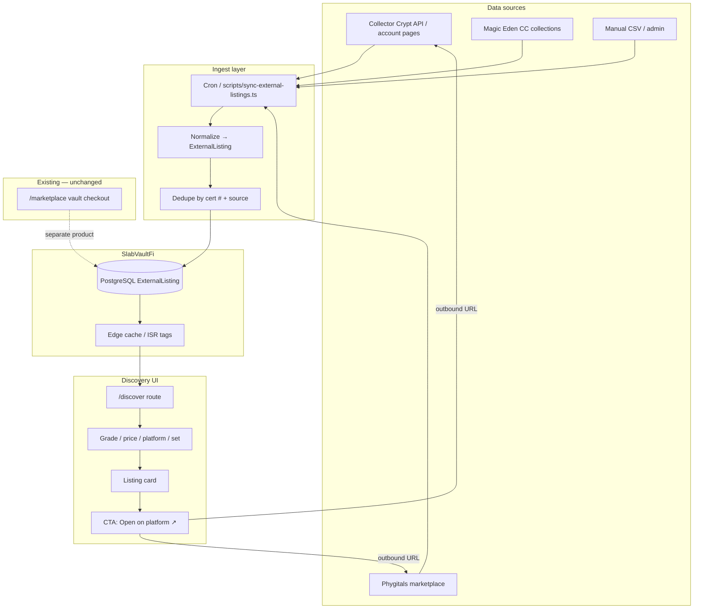

# Solana Graded-Card Marketplace Aggregator — Research & MVP Plan

> **Status: ARCHIVED / DEFERRED (May 2026)**  
> SlabVault pivoted to a **Tensor-fork aggregator on `/trade`**. This custom deep-link `/discover` MVP is **ARCHIVED** — `/discover` redirects to `/trade` and `DISCOVER_AGGREGATOR_ENABLED` no longer affects public UI. See [rwa-trading-platform.md](./rwa-trading-platform.md) and [tensor-fork-feasibility.md](./tensor-fork-feasibility.md).

**Original status:** Planning / research (May 2026)  
**Scope:** Solana-only discovery layer — **no unified checkout**. Users browse listings on SlabVaultFi and deep-link out to the platform where each card is listed (Collector Crypt, Phygitals, Magic Eden, etc.).

**Related docs:** [phygitals-collectorcrypt.md](./phygitals-collectorcrypt.md) (partner ingest for vault pulls), [gacha-nft-metadata.md](./gacha-nft-metadata.md) (on-chain NFT metadata, cert↔mint, Tensor), [tensor-fork-feasibility.md](./tensor-fork-feasibility.md) (Tensor-first `/trade` strategy), [rwa-trading-platform.md](./rwa-trading-platform.md) (Tensor `/trade` lane spec), [VAULT_MARKETPLACE_ROADMAP.md](../../VAULT_MARKETPLACE_ROADMAP.md) (SlabVault-owned checkout — `/vault/*` lane).

---

## Executive summary

| Question | Answer |
|----------|--------|
| Does a cross-platform graded-card aggregator already exist? | **Yes, partially** — [Caggy](https://caggy.io/) aggregates Courtyard, Beezie, Collector Crypt, and Phygitals for portfolio + price comparison. It is **multi-chain** (Polygon, Base, Solana), not Solana-only, and is not built around SlabVault’s vault narrative or deep-link-first UX. |
| Is a **Solana-only, discovery + deep-link** aggregator novel? | **Moderately novel.** Solana RWA trackers ([solanarwa.app](https://solanarwa.app/)) and NFT aggregators ([SolRarity](https://solrarity.app/)) exist, but none combine graded-card FMV comparison, gacha partner deep links, and SlabVault treasury context in one community-owned surface. |
| How hard? | **MVP: medium** (2–4 weeks). Read-only ingest + normalized index + outbound CTAs. **Full parity with Caggy on Solana: hard** (ongoing scrape/API maintenance, dedupe by cert #, stale listing hygiene). |
| First MVP step | **Manual + CC API seed:** normalize ~50–200 listings from Collector Crypt (public account/API paths already used in `lib/scrapers/collector-crypt-scraper.ts`) into a new `ExternalListing` table and render a read-only `/discover` grid with “Buy on Collector Crypt →” deep links. |

---

## User vision (confirmed)

1. **NOT unified checkout** — SlabVault does not custody payments for third-party listings. Each card links to the listing URL on the source platform; wallet connect happens there.
2. **Solana-only** — Index Collector Crypt, Phygitals, Magic Eden (CC collections), and future Solana RWA partners. Exclude Courtyard (Polygon) and Beezie (Base) unless later expanded.
3. **Inspired by poke6900.gg** — Analytics, discovery, and community engagement patterns (see breakdown below), not a clone of their memecoin gacha stack.
4. **SlabVault-owned marketplace stays separate** — Current `/marketplace` is vault inventory with SOL + SVF split checkout (`lib/marketplace-*`). The aggregator is a **discovery lane**, not a replacement.

---

## Competitive landscape

### Aggregators that already exist

| Product | Solana graded cards? | Model | Gap vs SlabVault vision |
|---------|---------------------|-------|-------------------------|
| **[Caggy](https://caggy.io/marketplace)** | Partial (CC + Phygitals among 4 chains) | Portfolio + cross-platform price comparison | Multi-chain; not vault/treasury-aware; no SlabVault community CTAs |
| **[Solana RWA Portfolio Tracker](https://solanarwa.app/)** | Yes (18 protocols) | Holdings dashboard | Protocol-level, not listing-level discovery or deep links |
| **[SolRarity](https://solrarity.app/)** | NFT collections broadly | 18 Solana NFT marketplaces | General NFT sniping, not graded-card FMV / cert dedupe |
| **[Magic Eden](https://magiceden.io/solana)** | CC collections | Primary marketplace | Single venue, not cross-platform |
| **PriceCharting / Collectr / TCGPlayer** | N/A (tradfi indexes) | FMV reference | Not on-chain listing aggregation |

**Verdict:** An aggregator **exists at the category level** (Caggy is the closest direct comp). A **Solana-only, deep-link-first, vault-community-branded discovery index** does not appear to exist as a dedicated product.

### Primary Solana platforms (index targets)

| Platform | Chain | Mechanic | Est. inventory | Seller fee | Buyback | Listing deep link |
|----------|-------|----------|----------------|------------|---------|-------------------|
| **Collector Crypt** | Solana | Gacha + marketplace; Magic Eden distribution | ~51K certs | ~4% (0.5% w/ $COLL) | 85–90% index | `collectorcrypt.com` / Magic Eden |
| **Phygitals** | Solana | Virtual claw + P2P marketplace | ~36K certs | 2% | ~85% FMV | `phygitals.com` |
| **Beezie** | Base (not in scope) | Claw + SWAP | — | — | — | — |
| **Courtyard** | Polygon (not in scope) | Packs + marketplace | — | — | — | — |

Volume/revenue figures from [Caggy platform comparison](https://caggy.io/blog/courtyard-vs-collectorcrypt-vs-beezie) and Dune (Feb 2026). Treat as order-of-magnitude only.

### poke6900.gg — feature breakdown

[poke6900.gg](https://poke6900.gg/) is **not** a cross-platform RWA aggregator. It is a **Pokémon Memetic Index** — analytics + community product tied to the POKE6900 Solana memecoin.

| Feature | What it does | Relevance to SlabVault aggregator |
|---------|--------------|-----------------------------------|
| **Memetic Index** | Ranks 1,027 Pokémon using meme + trading + cultural scores across 52K+ TCG cards | Inspiration for “trending slabs” / hot pulls surfacing |
| **Pokémarkets** | Prediction markets on TCG outcomes (e.g. highest sale price in a month) | Community engagement pattern; optional future SVF poll markets |
| **Marketplace** | First-party P2P TCG listings (condition, price, ships-from filters) | UI/filter patterns — not third-party aggregation |
| **Movers** | Biggest gainers/losers in memetic score (24h) | “Biggest FMV movers” widget candidate |
| **Pokémon Compare** | Side-by-side compare up to 5 Pokémon | Compare slabs across platforms by cert # / name |
| **Gacha** | Wallet + Google login; POKE6900 token gacha machine | Parallel to SVF partner gacha CTAs — different token economics |
| **Grading** | AI grading + submission tracking (login-gated) | Out of scope unless SVF partners on grading later |
| **Games / XP Rankings / Pokéchat** | Engagement loops | Community retention patterns, not ingest |
| **Live token ticker** | POKE6900 price on Dexscreener | Analog: SVF price strip on discover page |

**Takeaway:** Borrow **discovery UX** (filters, movers, compare, market sentiment) — do **not** conflate poke6900’s first-party marketplace or memecoin gacha with indexing CC/Phygitals listings.

---

## Existing SlabVault codebase (marketplace lane)

The repo today implements **two distinct concepts** that must stay separated:

### 1. Vault marketplace (unified checkout) — built

| Area | Path | Role |
|------|------|------|
| Listings | `app/marketplace/page.tsx`, `components/marketplace-listing-card.tsx` | SlabVault-owned inventory; “Purchase” → `/marketplace/[id]` checkout |
| Checkout | `app/marketplace/checkout/[id]/page.tsx` | SOL + SVF split payment to treasury/deployer |
| Pricing / split | `lib/marketplace-pricing.ts`, `lib/marketplace-split.ts` | FMV-derived SOL/SVF split |
| Persistence | `lib/marketplace-slabs.ts`, Prisma `Slab` model | DB with `data/slabs.json` fallback |
| Fulfillment | `lib/marketplace-fulfillment.ts` | Post-payment slab transfer |

### 2. Partner data ingest (read-only) — partial

| Area | Path | Role |
|------|------|------|
| Collector Crypt | `lib/scrapers/collector-crypt-scraper.ts` | API candidates + HTML scrape for pulls/slabs |
| Sync orchestration | `lib/data-sync.ts` | CC → treasury/deployer slabs & pulls; Vollector/Vaulted/Collectr fallbacks |
| Phygitals | `data/site.json` → `links.gachaPhygitals` | Referral link only; **no listing ingest** |
| Partner stub doc | `docs/integrations/phygitals-collectorcrypt.md` | Pull/slab sync plan |

**Implication:** Aggregator MVP should **reuse CC scraper patterns** but write to a **new `ExternalListing` model**, not overload `Slab` (which powers vault checkout).

---

## SlabVault “discovery + deep link” MVP architecture

### Principles

- **Read-only index** — cache normalized listings; never sign transactions for third-party sales.
- **Source of truth = origin platform** — show “Listed on Phygitals · verified 12m ago”; stale badges after TTL.
- **Deep link only** — primary CTA: `Open on {platform}` (new tab). Optional secondary: “View cert on PSA” if metadata present.
- **Solana scope** — filter `chain = solana` at ingest; reject Polygon/Base rows.
- **Dedupe key** — prefer `(grader, certNumber)` when available; fallback `(source, externalId)`.

### System diagram



### Normalized listing schema (draft)

```ts
type ExternalListingSource =
  | "collector_crypt"
  | "phygitals"
  | "magic_eden"
  | "manual";

type ExternalListing = {
  id: string;                    // uuid
  source: ExternalListingSource;
  externalId: string;            // platform listing id
  deepLinkUrl: string;           // required — outbound purchase URL
  title: string;
  grade: string;                 // e.g. "PSA 10"
  grader?: "PSA" | "BGS" | "CGC" | "SGC";
  certNumber?: string;
  priceUsd: number | null;
  priceSol: number | null;
  currency: "USD" | "SOL" | "USDC";
  imageUrl: string;
  setName?: string;
  cardName?: string;
  fmvUsd?: number | null;
  status: "active" | "sold" | "unknown";
  indexedAt: string;             // ISO
  staleAfter: string;            // ISO — UI badge threshold
};
```

### UI routes (proposed)

| Route | Purpose |
|-------|---------|
| `/discover` | Aggregated grid (default landing for external listings) |
| `/discover?platform=phygitals` | Platform filter |
| `/discover/[id]` | Detail sheet with FMV, cert, platform fee note, deep link CTA |
| `/marketplace` | **Unchanged** — SlabVault vault inventory + checkout |

Nav copy should distinguish **“Vault shop”** vs **“Discover Solana listings”** to avoid checkout confusion.

---

## Data sources

### Collector Crypt (CC)

| Method | Status in repo | Aggregator use |
|--------|----------------|----------------|
| `GET api.collectorcrypt.com/.../pulls` | Tried in `fetchCollectorCryptData()` | Pull history only today |
| Account page embedded payload | `scrapeCollectorCryptSlabs()` | Slab images/metadata for treasury wallets |
| Magic Eden CC collections | Not implemented | High-value listing source for secondary market |
| Partner API contract | **Open** — confirm listing search endpoint with CC | Preferred for scale |

**MVP:** Extend scraper to map CC marketplace/account listings → `ExternalListing`. Reuse `SCRAPER_TIMEOUT_MS`, `SCRAPER_USER_AGENT` from `lib/scrapers/scraper-utils.ts`.

### Phygitals

| Method | Status | Aggregator use |
|--------|--------|----------------|
| Public docs | [docs.phygitals.com](https://docs.phygitals.com/) — no public listing API documented | Partner outreach required |
| Referral link | `links.gachaPhygitals` in `data/site.json` | Gacha CTA only |
| Marketplace browse | Public web UI with filters (collection, grade, price) | Scrape or partner feed (TOS review) |

**MVP:** Manual CSV seed (50–100 rows) + admin upload until partner API exists. Feature-flag ingest with `PHYGITALS_SYNC_ENABLED` (see partner stub doc).

### Manual / admin

- Admin form or CSV import for high-value listings, stream highlights, or partner co-marketing slots.
- Idempotent upsert on `(source, externalId)`.
- Required fields: `deepLinkUrl`, `title`, `source`, `imageUrl`.

### On-chain (future)

- Solana compressed NFT (cNFT) metadata from CC/Phygitals mints for ownership verification — **not required for MVP**.

---

## Phased roadmap

### Phase 0 — Research & schema (Week 1)

- [x] Document competitive landscape (this file).
- [x] Add Prisma `ExternalListing` model + migration.
- [x] Feature flag `DISCOVER_AGGREGATOR_ENABLED` (default off in prod).
- [ ] Legal review: outbound links, no implied custody; platform trademarks in UI.

### Phase 1 — MVP: CC + manual (Weeks 2–3)

- [x] `scripts/sync-external-listings.ts` — CC account/API → JSON seed (`npm run sync:discover`).
- [ ] Admin CSV import for manual rows.
- [x] `/discover` page: grid, platform badge, price, “Open on Collector Crypt ↗”.
- [x] Stale listing badge (>24h since `indexedAt`).
- [x] Analytics: `cta_discover_deep_link` with `source` + `listingId`.
- [x] **Do not** add wallet checkout on `/discover`.

### Phase 2 — Phygitals + dedupe (Weeks 4–6)

- [ ] Partner conversation for listing feed or scoped API key.
- [ ] Cert-number dedupe across CC + Phygitals (show “Also listed on…”).
- [ ] Filters: grade, price band, platform, set.
- [ ] FMV column when available from partner or Collectr cross-ref.

### Phase 3 — Engagement layer (poke6900-inspired)

- [ ] “Movers” widget — largest FMV or index score changes (24h/7d).
- [ ] Compare up to 3 slabs side-by-side (price, platform fee, buyback %).
- [ ] Link discover cards to `/pulls` when listing came from a verified treasury pull.
- [ ] Optional: community prediction poll (separate from commerce).

### Phase 4 — Scale & ops

- [ ] Magic Eden CC collection ingest.
- [ ] Sync health dashboard (extend `lib/data-sync.ts` diagnostics pattern).
- [ ] Rate limits, response size caps, robots/TOS compliance per source.
- [ ] Webhook ingest if partners offer it.

### Explicit non-goals

- Unified cart or cross-platform checkout.
- Custody of third-party NFTs or escrow.
- Non-Solana chains in v1.
- Replacing SlabVault `/marketplace` vault shop.

---

## Differentiation vs Caggy

| Dimension | Caggy | SlabVault discover |
|-----------|-------|-------------------|
| Chain scope | Polygon + Base + Solana | **Solana only** (v1) |
| Checkout | Platform-centric comparison | **Deep link out** — no SVF payment for external listings |
| Narrative | Generic collector portfolio | **Vault community** — treasury pulls, streams, proof of reserves |
| Token | None | SVF coordination layer; partner referral links |
| Data | Proprietary aggregated index | CC API + Phygitals partner + manual; reuse existing sync |

---

## Open questions

1. Does Collector Crypt expose a **public marketplace search API**, or only account-scoped endpoints?
2. Will Phygitals provide a **partner listing export** for referral partners?
3. Should `/discover` listings that match vault inventory (`Slab`) show a **“Also in SlabVault shop”** badge linking to `/marketplace/[id]`?
4. Magic Eden: index all CC collections or only above a floor FMV threshold?

---

## Related files

| File | Notes |
|------|-------|
| `lib/scrapers/collector-crypt-scraper.ts` | CC API + scrape — extend for listings |
| `lib/data-sync.ts` | Sync diagnostics pattern to reuse |
| `lib/marketplace-slabs.ts` | Vault shop — do not merge with external listings |
| `app/marketplace/page.tsx` | Vault checkout marketplace |
| `docs/integrations/phygitals-collectorcrypt.md` | Partner pull ingest stub |
| `data/site.json` | Partner referral URLs |

---

## Changelog

| Date | Note |
|------|------|
| 2026-05-21 | Initial research doc: competitive landscape, poke6900 breakdown, MVP architecture, phased roadmap |
| 2026-05-21 | Phase 0–1 checklist reconciled; added [discover-setup.md](../discover-setup.md) operator guide |
