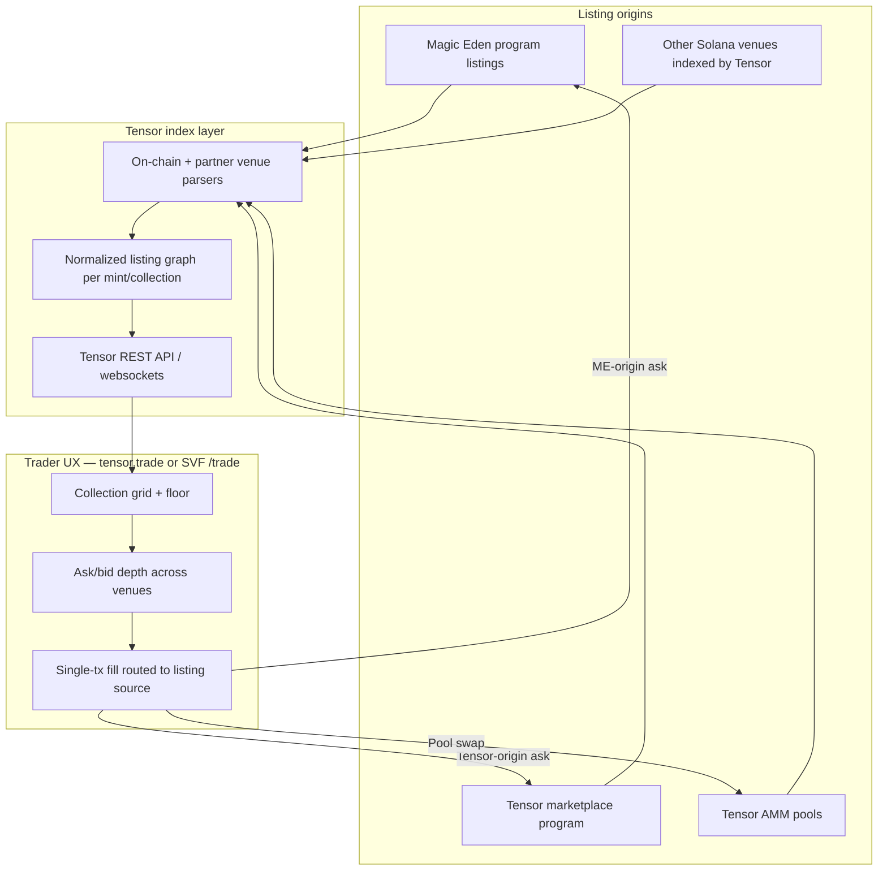
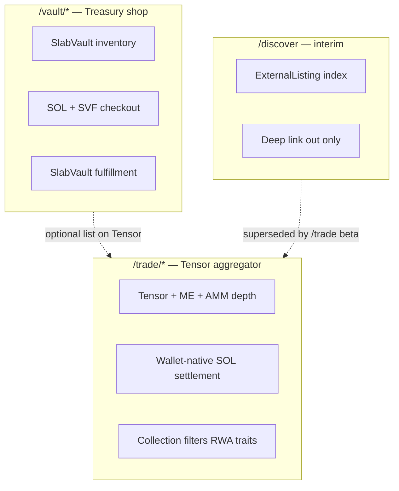

# Tensor Fork Feasibility — SlabVault `/trade` Strategy

**Status:** Planning / research (May 2026)  
**Decision:** Tensor-first aggregator for `/trade/*`; treasury shop stays on `/vault/*`  
**License baseline:** Apache-2.0 across core `tensor-foundation` repos (verify per-repo before ship)

**Related docs:**

- [rwa-trading-platform.md](./rwa-trading-platform.md) — `/trade` product spec (Tensor-first revision)
- [onchain-trade-stack.md](./onchain-trade-stack.md) — programs, PDAs, escrow, fees, phases
- [gacha-nft-metadata.md](./gacha-nft-metadata.md) — CC pNFT, Phygitals cNFT, cert↔mint indexing
- [solana-marketplace-aggregator.md](./solana-marketplace-aggregator.md) — `/discover` deep-link lane (interim)
- [phygitals-collectorcrypt.md](./phygitals-collectorcrypt.md) — partner ingest for vault pulls

---

## Executive summary

| Question | Answer |
|----------|--------|
| Does Tensor only show Tensor-native listings? | **No.** Tensor aggregates **cross-venue liquidity** — including **Magic Eden** and other Solana marketplaces — in addition to listings on Tensor’s own on-chain programs. |
| Is a Tensor fork viable for SlabVault? | **Yes, as a fork-and-integrate strategy** — not a full clone of tensor.trade infra. Use `tensor-foundation` on-chain programs + SDKs; fork **UI/UX** from [tensor-hq/marketplace-nextjs-template](https://github.com/tensor-hq/marketplace-nextjs-template). **Do not depend on Tensor REST API for MVP reads** — aggregate Phygitals, Collector Crypt, Beezie (Solana) via partner ingest + Helius DAS cert↔mint. |
| Where does it live on SlabVault? | **`/trade/*`** — wallet-native aggregator desk. **`/vault/*`** — first-party treasury shop (SOL + SVF checkout). |
| Recommended strategy | **Phase 1:** Partner ingest (CC scraper, Phygitals rows) + Tensor **on-chain programs** for settlement + template UI fork. **Phase 2:** Optional `TENSOR_API_KEY` for enriched ME depth experiments. **Phase 3:** Multichain expansion after Solana CC + Phygitals paths are proven. |

---

## Corrected model: Tensor + Magic Eden aggregation

Tensor is both a **native marketplace** (list/bid/fill via Tensor programs) and a **liquidity aggregator** that surfaces listings originating on **external venues**.

### How cross-venue liquidity appears on Tensor



| Layer | Responsibility |
|-------|----------------|
| **Venue programs** | ME, Tensor marketplace, Tensor AMM, etc. hold the canonical listing/escrow state for each ask. |
| **Tensor index** | Ingests active listings across venues; attaches **venue tag** (`magic_eden`, `tensor`, `tensorswap`, …) per ask. |
| **Tensor UI / API** | Presents **best price** regardless of venue; constructs fill transactions that **CPI into the listing’s origin program**. |
| **SlabVault `/trade`** | Branded front-end over the same stack — filtered to graded-card collections (CC, Phygitals, vault treasury). |

### Implications for graded-card partners

| Partner asset | Typical listing venues | Tensor visibility |
|---------------|------------------------|-------------------|
| **Collector Crypt (pNFT)** | CC marketplace, **Magic Eden** (`collector_crypt`), Tensor if user-listed | ME listings **do appear** in Tensor aggregation when indexed; CC-native listings depend on CC/ME program compatibility |
| **Phygitals (cNFT)** | Phygitals marketplace, Tensor **tcomp** (compressed) if user-listed | Requires **tcomp-sdk** path + Bubblegum proofs; not all Phygitals internal listings auto-mirror |
| **SlabVault vault inventory** | `/vault/*` shop (off Tensor) | Optional: vault wallet lists selected slabs on Tensor programs → surfaces in `/trade` depth |

**Correction vs prior docs:** SlabVault previously treated Tensor as “only what users list on Tensor.” For `/trade`, assume **ME + Tensor + AMM depth** wherever Tensor’s index covers the collection — same as tensor.trade — then **filter** to RWA collections SlabVault cares about.

---

## `tensor-foundation` repo map

Repos at [github.com/tensor-foundation](https://github.com/tensor-foundation). SlabVault-relevant set:

| Repo | Language | Role | SlabVault use |
|------|----------|------|---------------|
| [marketplace](https://github.com/tensor-foundation/marketplace) | TypeScript / Anchor | Core **marketplace program** (list, bid, sell, edit) | Primary on-chain settlement for `/trade` |
| [amm](https://github.com/tensor-foundation/amm) | TypeScript | **Tensor AMM v2** — pool-based NFT liquidity | v2 sweep / instant sell-to-pool for high-volume collections |
| [escrow](https://github.com/tensor-foundation/escrow) | TypeScript | **Shared escrow** across Tensor protocols | Bid escrow, shared settlement accounts |
| [whitelist](https://github.com/tensor-foundation/whitelist) | TypeScript | On-chain **collection verification** | Register CC / Phygitals / SVF treasury collections |
| [fees](https://github.com/tensor-foundation/fees) | Rust | **Fee PDA + collection fee program** | SVF treasury fee capture (see below) |
| [tensorswap-sdk](https://github.com/tensor-foundation/tensorswap-sdk) | TypeScript | Legacy / **pNFT** trading SDK | Collector Crypt pNFT list/bid/fill |
| [tcomp-sdk](https://github.com/tensor-foundation/tcomp-sdk) | TypeScript | **Compressed NFT** marketplace SDK | Phygitals cNFT path |
| [tensor-common](https://github.com/tensor-foundation/tensor-common) | TypeScript | Shared FE/BE helpers | Normalization, shared types in SVF API layer |
| [toolkit](https://github.com/tensor-foundation/toolkit) | TypeScript | Solana JS utilities | Tx building, account parsing |
| [toolbox](https://github.com/tensor-foundation/toolbox) | Rust | Solana Rust utilities | Program tests, CPI helpers |
| [SDK-examples](https://github.com/tensor-foundation/SDK-examples) | TypeScript | **Example scripts** for new JS SDKs | Spike list/bid/fill flows per token standard |
| [marketplace-nextjs-template](https://github.com/tensor-hq/marketplace-nextjs-template) | TypeScript | **Next.js marketplace demo** | Bootstrap `/trade` **UI layout** (collection page, grid, wallet) — **not** REST API dependency |
| [Unified-Wallet-Kit](https://github.com/tensor-foundation/Unified-Wallet-Kit) | TypeScript | Wallet adapter UX | Replace/augment current Phantom adapter on `/trade` |
| [smart-rpc](https://github.com/tensor-foundation/smart-rpc) | TypeScript | RPC transport | Optional: resilient RPC for fill confirmation |
| [IDLs](https://github.com/tensor-foundation/IDLs) | — | Program IDLs | Anchor client generation |

**Also reference (not in user list but useful):** [tcomp-sdk](https://github.com/tensor-foundation/tcomp-sdk), [IDLs](https://github.com/tensor-foundation/IDLs), Tensor [REST API](https://dev.tensor.trade/) (aggregated marketplace data + websockets).

---

## Strategy: fork vs integrate vs deploy on mainnet

### Three deployment modes

| Mode | When | Pros | Cons |
|------|------|------|------|
| **Integrate (mainnet programs)** | **Phase 1 — default** | Fastest time-to-market; inherits ME aggregation via Tensor index; no program audit | Fee PDAs point to Tensor defaults unless configured; brand is “Powered by Tensor” |
| **Fork (custom deploy)** | Phase 2 — fee/branding control | Custom fee recipients, program IDs in UI, collection whitelist under SVF org | Audit + deploy cost; must keep IDL/SDK in sync with upstream |
| **Hybrid** | **Recommended long-term** | UI + API fork; **use Tensor mainnet programs** for settlement; custom **fee PDAs** via `fees` program where allowed | Depends on Tensor fee program extensibility — validate on devnet |

```mermaid
flowchart LR
  subgraph phase1 [Phase 1 — Integrate]
    T1[tensor-hq/marketplace-nextjs-template UI]
    T2[tensorswap-sdk + tcomp-sdk]
    T3[Tensor mainnet programs]
    T4[Partner ingest + Helius DAS]
  end

  subgraph phase2 [Phase 2 — Fork UI + config]
    F1[SVF-branded /trade/*]
    F2[whitelist CC + Phygitals collections]
    F3[fee PDAs → SVF treasury]
    F4[TENSOR_API_KEY optional shortcut]
  end

  subgraph phase3 [Phase 3 — Program fork if needed]
    P1[fork marketplace/amm/fees]
    P2[devnet → audit → mainnet]
  end

  phase1 --> phase2 --> phase3
```



### Decision matrix

| Requirement | Integrate | Fork programs |
|-------------|-----------|---------------|
| Show ME + Tensor depth for CC on Solana | ✅ via Tensor index | ✅ if indexer replicated (hard) |
| Trade Phygitals cNFTs | ✅ tcomp + mainnet | ✅ same SDK, custom program only if rules require |
| Capture protocol fee to SVF treasury | ⚠️ via `fees` program config | ✅ full control |
| Ship in ≤8 weeks | ✅ | ❌ |
| Avoid Tensor API key dependency | ✅ partner ingest + on-chain SDK | ✅ |
| Multichain later | ❌ Solana-only | ⚠️ per-chain program family |

**SlabVault recommendation:** Start **integrate** (mainnet programs + forked Next.js template UI + partner ingest). `TENSOR_API_KEY` is **optional/deprecated for MVP reads**. Parallel spike on **fee PDA** configuration. Defer **program fork** until volume justifies audit spend.

---

## SlabVault information architecture

### Route split (target)

| Prefix | Purpose | Checkout | Data source |
|--------|---------|----------|-------------|
| **`/vault/*`** | **Treasury shop** — SlabVault-owned inventory, pulls, proof | SOL + **SVF burn split**; SlabVault fulfillment | Prisma `Slab`, `Transaction` |
| **`/trade/*`** | **Tensor-based aggregator desk** — browse/filter/buy/sell graded slabs | Wallet-native **SOL** (USDC v2) via Tensor/ME programs | **Partner ingest** (`lib/partner-listings.ts`, `ExternalListing`) + Helius DAS + optional Tensor REST shortcut |
| **`/discover`** | **Interim read-only** deep-link index | Outbound only ↗ | `ExternalListing` — until `/trade` beta |

### Route map (`/trade`)

| Route | Purpose |
|-------|---------|
| `/trade` | Landing — featured RWA collections, global activity, connect wallet |
| `/trade/c/[slug]` | Collection page — CC, Phygitals, SVF treasury; trait filters; cross-venue floor |
| `/trade/slab/[certOrMint]` | Item market — best ask across venues, bids, activity |
| `/trade/portfolio` | Wallet listings, bids, owned slabs |
| `/trade/activity` | Feed — list / sale / bid / cancel |

### Route map (`/vault`)

| Route | Purpose |
|-------|---------|
| `/vault` | Public inventory overview (existing) |
| `/vault/marketplace` | Treasury shop grid (migrate from `/marketplace` or alias) |
| `/vault/marketplace/[id]` | Slab detail + SVF checkout |
| `/vault/marketplace/checkout/[id]` | SOL + SVF split payment |
| `/vault/marketplace/orders` | Buyer order history |
| `/pulls` | Pull history (unchanged; linked from vault narrative) |

**Migration note:** Today `/marketplace/*` is live. Phase IA rename: add `/vault/marketplace/*` aliases → redirect `/marketplace/*` → preserve SEO and bookmarks.

### Lane diagram



**Cross-lane UX:**

- Cert dedupe: item on `/trade` shows **“Buy from vault (SVF)”** → `/vault/marketplace/[id]` when same cert in treasury.
- `/discover` cards gain **“Trade on SlabVault”** when `/trade` has active depth (cert match).

---

## Multichain phased roadmap

### Phase 0 — Solana foundation (weeks 1–8)

| Track | Asset | SDK / program | Exit criteria |
|-------|-------|---------------|---------------|
| **CC** | pNFT | `tensorswap-sdk` + ME aggregation via Tensor index | CC collection page on `/trade/c/collector-crypt` with live asks |
| **Phygitals** | cNFT | `tcomp-sdk` + DAS `compressed: true` | Phygitals collection whitelisted; list/bid/fill on devnet/mainnet-beta |
| **SVF vault** | Selected treasury slabs | Vault wallet lists via Tensor programs | ≥1 vault slab fillable on `/trade` |
| **Index** | Cert ↔ mint | Helius DAS + [gacha-nft-metadata.md](./gacha-nft-metadata.md) | `CertMintLink` table; dedupe across lanes |

### Phase 1 — Solana production (weeks 9–16)

- Optional `TENSOR_API_KEY` for enriched cross-venue stats (not required for MVP).
- `whitelist` program: CC + Phygitals + SVF collection addresses.
- Fee PDAs configured (see below).
- Retire `/discover` as primary CTA; keep for outbound-only edge cases.
- `/vault/*` IA migration complete.

### Phase 2 — Solana depth features

- Tensor AMM (`amm` repo) for instant sell / sweep on high-liquidity sets.
- Collection-wide bids (Tensor native).
- FMV overlays from Collectr / partner APIs.

### Phase 3 — Multichain (experimental)

| Chain | Partner | Notes |
|-------|---------|-------|
| **Solana** | CC, Phygitals, SVF | Production path |
| **Base** | Beezie | Beezie is **Base-native today** — requires separate marketplace stack or partner deep links; not Tensor SDK |
| **Polygon** | Courtyard | Out of Tensor ecosystem; `/discover`-style deep link or future partner API |
| **Other** | TBD | Re-evaluate Tensor multichain roadmap before committing |

**Label Phase 3 experimental** until partner agreements and chain-specific program audits exist.

---

## Fee capture when routing through Tensor programs

### Fee surfaces

| Fee type | Typical recipient | SlabVault lever |
|----------|-------------------|-----------------|
| **Marketplace protocol fee** | Tensor fee PDA (configurable per collection via `fees` program) | Register SVF treasury wallet as **share recipient** on whitelisted collections |
| **Royalty** | Creator / partner update authority | Cannot redirect without partner consent — display pass-through |
| **AMM pool fee** | Pool owner / LP | SVF-owned pools only if SVF operates AMM (v2) |
| **Magic Eden venue fee** | ME fee accounts on ME-origin fills | Paid when fill routes to ME listing — SVF does not capture unless ME partner deal |
| **SlabVault overlay fee** | Optional SVF treasury | **Referral / interface fee** if Tensor fee program supports additional basis points on SVF-fronted txs |

### Recommended fee model (phased)

**Phase 1 — Integrate (0 bps SVF overlay)**

- Zero SlabVault overlay fee; focus on liquidity and trust.
- Revenue = indirect (SVF awareness, vault shop conversion, stream engagement).

**Phase 2 — Collection whitelist + fee PDA**

- Use [fees](https://github.com/tensor-foundation/fees) to attach **SVF treasury** as fee recipient on:
  - `slabvault-treasury` collection (vault-listed slabs on Tensor)
  - Co-marketing collections with partner approval
- Target **0.5–1.5%** protocol fee on Tensor-native fills where competitive with CC (4%) / Phygitals (2%).

**Phase 3 — SVF holder rebate (optional)**

- Portion of SVF-captured fees rebated to SVF stakers — **experimental**; legal review required.

### Fill routing and fee accounting

```mermaid
sequenceDiagram
  participant User
  participant SVF as SlabVault /trade UI
  participant SDK as tensorswap-sdk / tcomp-sdk
  participant Tensor as Tensor programs
  participant ME as Magic Eden program
  participant Treasury as SVF fee PDA

  User->>SVF: Buy at best ask
  SVF->>SDK: getBestListing(mint)
  SDK-->>SVF: ask venue=tensor | magic_eden
  alt Tensor-origin listing
    SVF->>Tensor: fill + fee CPI
    Tensor->>Treasury: protocol fee lamports
  else ME-origin listing
    SVF->>ME: fill via aggregated route
    Note over SVF,Treasury: ME fee to ME; SVF overlay only if configured in Tensor fee program
  end
  SVF->>User: Receipt + activity row
```

**Accounting:** Persist `venue`, `protocolFeeLamports`, `royaltyLamports`, `svfFeeLamports` on `TradeActivity` for treasury transparency (`/vault` narrative).

---

## Token-standard split (CC vs Phygitals)

| Standard | Partner | SDK | Aggregation notes |
|----------|---------|-----|-------------------|
| **pNFT** | Collector Crypt | `tensorswap-sdk` | ME listings aggregated in Tensor index; watch pNFT rule sets |
| **cNFT** | Phygitals | `tcomp-sdk` | Bubblegum proofs required; verify Bubblegum v2 support at integrate time |
| **Legacy NFT** | Misc | `tensorswap-sdk` | Lower priority |

See [gacha-nft-metadata.md](./gacha-nft-metadata.md) for cert↔mint indexing and DAS workflow.

---

## Risks and mitigations

| Risk | Mitigation |
|------|------------|
| pNFT rule set blocks Tensor fill | Test per collection on devnet; fall back to `/discover` deep link |
| Phygitals listings not on Tensor | Index Phygitals API + show “Phygitals-only” badge; deep link when no Tensor route |
| Tensor API key denial | Partner ingest + on-chain SDK + Helius DAS (primary MVP path) |
| Program fork audit delay | Stay on mainnet Tensor programs for v1 |
| Lane confusion (vault vs trade) | Strict nav copy; SVF burn **only** on `/vault/*` |
| Beezie / multichain scope creep | Phase 3 experimental; Solana first |

---

## Implementation spikes (ordered)

1. Adapt [marketplace-nextjs-template](https://github.com/tensor-hq/marketplace-nextjs-template) layout under `app/trade/*` (UI only — wire `lib/partner-listings.ts` for reads).
2. Wire [Unified-Wallet-Kit](https://github.com/tensor-foundation/Unified-Wallet-Kit) alongside existing checkout wallet stack (isolate providers per route group).
3. Run [SDK-examples](https://github.com/tensor-foundation/SDK-examples) against CC collection mint on mainnet-beta (read-only).
4. Spike `tcomp-sdk` fill on Phygitals devnet asset.
5. Document fee PDA addresses from `fees` program for SVF treasury wallet.
6. Add `RWA_TRADE_ENABLED` staging flag; beta badge in nav.

---

## Key architecture decisions

1. **`/trade/*` is Tensor-first** — not a custom Postgres order book. Off-chain DB is **cache/index only**; settlement always via Tensor/ME programs.
2. **`/vault/*` is treasury shop** — sole lane for SOL + SVF burn checkout and SlabVault fulfillment.
3. **Integrate before fork** — mainnet Tensor programs + forked UI; program fork only for fee/branding at scale.
4. **Aggregation includes Magic Eden** — `/trade` floor/depth reflects ME-origin asks where Tensor index covers the collection.
5. **Two SDKs on Solana** — `tensorswap-sdk` (CC pNFT) + `tcomp-sdk` (Phygitals cNFT).
6. **Fee capture via `fees` program** — SVF treasury as protocol fee recipient on whitelisted collections; ME-origin fills may not yield SVF fee without overlay config.
7. **`/discover` is interim** — deep-link fallback until `/trade` beta ships.
8. **Multichain is Phase 3 experimental** — Solana CC + Phygitals first; Beezie (Base) not Tensor-compatible today.

---

## GTM: "Tensor for Slabs"

**Positioning:** SlabVault is the brand. **Tensor for Slabs** is the product hook — the first graded slab aggregator on Solana, copying the Tensor vs Magic Eden playbook for RWA slabs.

### The playbook (Tensor vs Magic Eden → SlabVault vs CC/Phygitals)

| Layer | NFT market (2019–2024) | SlabVault `/trade` (2026+) |
|-------|------------------------|----------------------------|
| **Incumbent venue** | Magic Eden — broad Solana NFT liquidity | CC marketplace, Phygitals — graded-card native venues |
| **Aggregator** | Tensor — ME + native depth, pro trader UX | **Tensor for Slabs** — ME + Tensor depth, slab-only filter |
| **Wedge** | Lower fees, faster fills, collection bids | Lower effective fees vs CC (4%) / Phygitals (2%) on aggregated routes |
| **Vertical focus** | All NFTs → Tensor wins on power users | **Graded slabs only** — cert, grade, FMV traits; no PFP noise |
| **Brand split** | tensor.trade product · Tensor Foundation infra | **SlabVault** brand · `/trade` desk product |

### ME aggregation as the core GTM claim

Lead with **cross-venue depth**, not "another marketplace":

1. **Homepage hero:** "First graded slab aggregator on Solana" — CTA → `/trade`.
2. **Trade desk headline:** "Tensor for Slabs" — subcopy names Magic Eden + Tensor liquidity explicitly.
3. **Collection pages:** CC (pNFT), Phygitals (cNFT), SlabVault treasury — each shows floor/ask with **venue tag** (ME, Tensor, AMM).
4. **Proof point:** Same mint, best ask across venues — one wallet, one tx, routed to listing origin.

Do not over-promise Phygitals-only listings; badge and deep-link when Tensor index lacks a route (see risks table).

### Fee wedge

| Phase | SVF overlay | Message |
|-------|-------------|---------|
| **Launch (0 bps)** | Free to trade; liquidity first | "Best price across ME + Tensor — no SlabVault desk fee" |
| **Scale (0.5–1.5%)** | Fee PDA via `fees` program on whitelisted collections | "Pro desk fee below CC/Phygitals native checkout" |
| **ME-origin fills** | ME fee still applies; SVF overlay only if Tensor fee program allows | Transparent receipt: venue + protocol + royalty breakdown |

Competitive framing: CC charges ~4% on native checkout; Phygitals ~2%. Aggregated `/trade` fills target **meaningfully lower all-in cost** at scale while preserving partner royalties.

### SVF rewards (coordination, not the product)

$SVF is the coordination layer — not the trade desk itself:

| Mechanism | Tie to `/trade` |
|-----------|-----------------|
| **Treasury growth** | Trading volume → awareness → vault shop conversion on `/vault/*` |
| **Holder rebate (experimental)** | Portion of SVF-captured desk fees rebated to stakers — Phase 3; legal review |
| **Pull → list flywheel** | Gacha pulls land in vault → optional Tensor list → surfaces in `/trade` depth |
| **Stream / community** | Live pulls drive collection activity; `/trade` is the settlement layer |

Copy rule: lead with **Tensor for Slabs** and aggregation; mention $SVF as community upside, not price hype.

### Vertical focus (why slabs, why now)

- **Filter, don't clone:** Index only RWA graded-card collections (CC, Phygitals, SVF treasury) — not all of Solana NFTs.
- **Trait-native UX:** Grade, cert number, FMV, set/year filters — desk built for slabs, not repurposed PFP grid.
- **Two-lane clarity:** `/trade` = wallet-native aggregator (SOL); `/vault/*` = treasury shop (SOL + SVF burn). Never blur checkout lanes in nav or hero.
- **Interim `/discover`:** Deep-link fallback until `/trade` beta covers a collection; retire as primary CTA once depth ships.

### GTM sequence

```mermaid
flowchart LR
  A[Hero: first slab aggregator] --> B[/trade beta]
  B --> C[CC + Phygitals collection pages]
  C --> D[ME + Tensor depth live]
  D --> E[Fee wedge + SVF rebate experimental]
  E --> F[Vault list → trade depth flywheel]
```

1. **Weeks 1–4:** Ship `/trade` beta with CC collection + ME aggregation story in all copy.
2. **Weeks 5–8:** Add Phygitals cNFT path; venue tags on every ask.
3. **Weeks 9+:** Enable fee PDA; A/B hero between "Tensor for Slabs" and "First graded slab aggregator" — both valid; desk CTA always `/trade`.

---

## Changelog

| Date | Note |
|------|------|
| 2026-05-21 | MVP read path: partner ingest primary; TENSOR_API_KEY optional; UI ref tensor-hq/marketplace-nextjs-template |
| 2026-05-21 | Initial doc: ME+Tensor aggregation correction, repo map, fork/integrate strategy, IA split, fee model, multichain roadmap |
