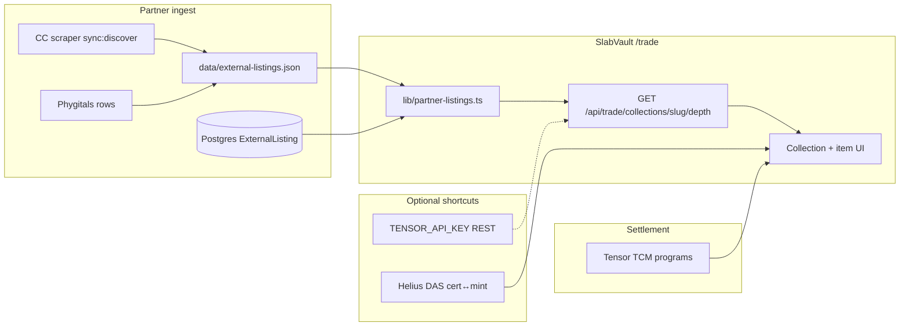

# Tensor.trade UX Audit → Tensor for Slabs

**Status:** Research / spec (May 2026)  
**Audience:** UI clone lane (`marketplace-nextjs-template`), on-chain lane (week 1–4 vendoring), product  
**Scope:** UX patterns only — **not** implementation of template port, BFF routes, or SDK tx builders (delegated elsewhere)

**Related:**

- [tensor-repo-vendoring.md](./tensor-repo-vendoring.md) — week 1–4 integration order
- [rwa-trading-platform.md](./rwa-trading-platform.md) — `/trade` product spec
- [tensor-fork-feasibility.md](./tensor-fork-feasibility.md) — fork vs integrate
- [gacha-nft-metadata.md](./gacha-nft-metadata.md) — CC pNFT / Phygitals cNFT

**Live reference:** [tensor.trade](https://www.tensor.trade/) (browser audit 2026-05-21)

---

## Executive summary

Tensor.trade is a **high-density pro-trading desk**: global search, collection index table, three-column collection pages (filters · grid · activity), mint-based item pages with buy/offer CTAs, and wallet-native settlement. SlabVault’s `/trade` today has the **correct information architecture skeleton** (landing, `/trade/c/[slug]`, portfolio, 3-column desk preview for treasury) but is **marketing-first and read-only** — no Tensor-indexed grids, no item route, no buy/list modals, no live activity.

**Tensor for Slabs** should adopt Tensor’s **layout and action hierarchy**, not its visual skin (cyan terminal) or PFP-specific traits. SlabVault keeps the premium vault aesthetic; Tensor supplies the **interaction model**.

---

## 1. Tensor.trade UI patterns (observed)

### 1.1 Global shell

| Pattern | Tensor behavior | Slab relevance |
|--------|-----------------|----------------|
| **Top nav** | Logo · COLLECTIONS · TRADE · REWARDS · centered search (`⌘K`) · CONNECT WALLET | Trade routes need persistent search + wallet; skip REWARDS |
| **Footer ticker** | 24h platform vol · SOL/USD · TPS · **Lite / Pro** toggle | Optional desk ticker; defer Pro |
| **Density** | Table-first homepage; cards optional | Collectors compare sets — table + card toggle both apply |
| **Wallet** | Modal: “Connect a wallet on Solana to continue” — Phantom, Solflare, WalletConnect, TipLink Google, etc. | Align with Unified-Wallet-Kit patterns (UI clone lane) |

### 1.2 Homepage (`/`)

- **Hero:** Featured collection banner — BUY NOW / SELL NOW headline prices, LISTED/SUPPLY, 24H VOL, single **TRADE {COLLECTION}** CTA.
- **Collection index:** **CARDS | TABLE** toggle.
- **Tabs:** TRENDING · NEW MINTS · timeframe chips (1h / 24h / 7d).
- **Toolbar:** Filter by collection · FILTERS · FAVORITES · INVENTORY.
- **Table columns:** Rank · Collection (thumb + supply) · Floor · Sell Now · 24H Volume · 24H Δ (color) · Market Cap · Total Vol · **Listed %** (count).

**Slab mapping:** Homepage = **graded-set index** (CC, Phygitals, treasury, future sets) with floor + listed % + venue depth — not PFP trending mints.

### 1.3 Collection page (`/trade/{slug}`)

**Header ribbon:** Collection name · BUY NOW · SELL NOW · LISTED/SUPPLY · VOLUME (24H / ALL) · SALES (24H) · PRICE Δ (24H) · social links.

**Layout modes:**

| Mode | Layout |
|------|--------|
| **Pro (desktop)** | Left: BUY/SELL panel (SWEEP · BID · CANCEL tabs, slider, count/SOL radio). Center-left: filter accordion (PRICE, RARITY, TRAIT COUNT, TRAITS). Center: item grid. Right: Recent Activity / Trollbox. |
| **Lite (desktop)** | Simpler tabs; less chrome. |
| **Mobile** | Collection tabs scroll horizontally; filter/search icons; 2-col grid; **bottom BUY | SELL toggle**; bottom app nav. |

**Collection tabs:** ITEMS · BIDS · ORDERS · TRAITS · HODLERS (+ INFO in Lite).

**Grid tile anatomy:** Image · rarity rank · token # · SOL price · per-tile **BUY** + **BID** · overflow menu. Top-of-grid **Instant sell** card (best bid + SELL NOW / ALL BIDS).

**Controls:** Search NFTs by name · grid density (s/m/l) · sort dropdown (price, rarity, last sale, recently listed) · refresh · COLLECTION BID.

**Slab mapping:** Replace RARITY/TRAIT COUNT with **grader · numeric grade · set · parallel · language · cert prefix**. Instant sell = accept best collection/item bid (week 4). HODLERS → optional “vaulted inventory” link-out.

### 1.4 Item page (`/item/{mint}`)

- **Breadcrumb:** Collection link · item name · rank badge.
- **Tabs:** OVERVIEW · ACTIVITY · OFFERS.
- **Left:** Image viewer (view selector: still / animation), hi-res link, prev/next in collection.
- **Right — commerce stack:**
  - **Listed for** {SOL} ({USD}) · enforced royalty % · **BUY NOW** · Pay with Crossmint (fiat).
  - **PLACE OFFER** · current top offer · all offers link.
  - **SALE HISTORY** mini chart (Pro).
  - **DETAILS:** Mint · Owner · Metadata updated · Token Standard · Royalties.
  - **ATTRIBUTES (N):** trait type · value · rarity score grid.
- **Footer stats:** Collection LISTED/SUPPLY, 24H floor Δ, vol, sales.

**Slab mapping:** Route **`/trade/slab/[certOrMint]`** — hero = slab scan + **cert #**; attributes = grader/grade/set/card; add **provenance** (vault pull, vaulted URL) and **venue badges** (Tensor / ME / SlabVault treasury).

### 1.5 Filters & URL state

- Accordion groups with counts, e.g. `background (11)`.
- Multi-select traits; price range in filter rail.
- Filters drive grid live; shareable query params (Tensor convention — preserve for slab sets).

### 1.6 Activity feed

- Side panel on collection page: list / sale / bid / cancel / transfer with timestamps.
- Item page ACTIVITY tab: per-mint history.
- Live refresh (WebSocket/poll) — platform ticker shows “Live”.

**Slab mapping:** Event types unchanged; rows link to cert + Solscan; show **venue** on fill.

### 1.7 Buy / list UX

| Action | Tensor flow | Wallet required |
|--------|-------------|-----------------|
| **Buy now** | Click BUY → connect if needed → confirm modal → sign fill tx | Yes |
| **Place offer** | PLACE OFFER → price + expiry → sign bid tx | Yes |
| **List** | SELL mode → list at price (curves in Pro) | Yes |
| **Instant sell** | SELL NOW at best bid | Yes |
| **Sweep** | Multi-select + SWEEP N NFTs | Yes (defer v2) |
| **Collection bid** | COLLECTION BID — deposit, max qty, delta | Yes (defer v2) |

Unconnected users can browse; CTAs gate on wallet modal.

### 1.8 Mobile layout

- Reduced nav; hamburger; collection tabs horizontal scroll.
- Filters in drawer (filters icon), not persistent left rail.
- 2-column grid default; BUY/SELL mode switch fixed above bottom nav.
- Item page stacks image → price → CTAs vertically (observed on 390×844).

---

## 2. SlabVault `/trade` today vs gaps

### 2.1 What exists (May 2026)

| Area | Implementation | Maturity |
|------|----------------|----------|
| **Routes** | `/trade`, `/trade/c/[slug]`, `/trade/portfolio` | ✅ Shell |
| **Landing** | Hero, stats placeholders, collection preview cards, treasury desk preview | ⚠️ Marketing + JSON/DB treasury only |
| **Treasury collection** | `TradeClient` — 3-col layout, filters, grid/table, stub activity | ⚠️ Local slabs, no Tensor |
| **Partner collections** | `TradePartnerCollectionDesk` — partner ingest grid (CC, Phygitals) | ✅ Live from JSON/DB seed |
| **Portfolio** | Wallet gate, empty listings, archived shop purchases | ⚠️ Stub |
| **Components** | `trade-sub-nav`, `trade-trait-filters`, `trade-listing-card`, `trade-listings-table`, `trade-activity-feed` | ⚠️ Partial |
| **Item page** | — | ❌ Not routed |
| **Buy / list** | “Buy soon” / “Connect wallet to trade” → collection link | ❌ No modals / txs |
| **Search** | Filter sidebar search only | ❌ No global / collection search |
| **Nav** | Desk + Portfolio sub-nav; site header elsewhere | ⚠️ No trade-scoped shell |
| **Mobile** | Responsive CSS only | ⚠️ No bottom bar / filter drawer |

**Key files:** `app/trade/*`, `components/trade-*.tsx`, `lib/trade-listings.ts`, `lib/integrations/tensor.ts`, `lib/onchain/collections.ts`.

### 2.2 Gap matrix (severity)

| Gap | Severity | Notes |
|-----|----------|-------|
| No on-chain buy/list modals + tx pipeline | **P0** | Week 2–4 on-chain lane |
| Collection header stats (floor, sell now, listed %) from partner ingest | **P0** | `lib/partner-listings.ts` |
| Live activity feed (not stub) | **P1** | Week 2 cache + week 4 polish |
| Accordion trait filters (grader, set, grade) + URL sync | **P1** | Slab-specific |
| Homepage collection index **table** (trending sets) | **P1** | Tensor homepage pattern |
| Inline grid BUY/BID buttons | **P1** | Template clone |
| Trade-scoped wallet shell (Unified-Wallet-Kit) | **P0** | Week 1 — UI clone lane |
| Venue + vault badges on every ask | **P0** | Trust / cross-lane |
| Sort + grid density controls | **P2** | Nice parity |
| BUY/SELL mode + sweep panel | **P2** | Defer sweep / collection bid |
| Lite vs Pro / sale history charts | **P2** | Defer Pro |
| Mobile bottom BUY/SELL + filter drawer | **P1** | After desktop desk stable |
| Global ⌘K search (collection / cert / wallet) | **P2** | v2 |

---

## 3. Tensor for Slabs — feature mapping

### 3.1 By partner lane

| Tensor feature | Collector Crypt (pNFT) | Phygitals (cNFT) | Magic Eden (via index) | SlabVault treasury |
|----------------|------------------------|------------------|------------------------|-------------------|
| Collection page + floor stats | ✅ Week 1 read | ✅ Week 3 | ✅ Venue tag only | ✅ `TradeClient` + vault list |
| Trait filters | Grader, grade, set, cert | Same + tree proof UX | Same | Grade + FMV band |
| Grid / table listings | Partner ingest + on-chain TCM | Partner ingest + DAS | Tensor API optional (ME depth) | Postgres slabs → TCM list |
| Item page | Cert ↔ mint via DAS | Compressed asset proof | Cross-venue best ask | Vault badge + pull provenance |
| Buy now (fill ask) | TCM fill week 2 | Week 3 spike | Fill when ME-origin | Week 2–4 vault wallet |
| Item bid | Week 4 escrow | Week 4 | Same | Week 4 |
| List fixed price | Week 4 | Week 3–4 | N/A (external) | Week 4 vault wallet |
| Collection bid / sweep | ❌ v2 | ❌ v2 | ❌ v2 | ❌ v2 |
| AMM instant sell badge | P2 read-only depth | P2 | P2 | Optional |
| Whitelist badge | Week 3 on-chain | Week 3 | N/A | Week 3 treasury collection |

### 3.2 Slab-specific additions (not on Tensor)

- **Cert # as primary identity** in grid, table, item hero, activity rows.
- **Provenance block:** vault pull link, stream clip, `vaultedUrl`.
- **FMV / comp band** (display-only until pricing API).
- **Fulfillment disclaimer** for physical vaulted slabs (post-trade ≠ shipped).
- **Experimental badge** on P2P until policy review (already on `TradeClient`).

### 3.3 Data flow (read path)

---

## 4. Priority build list (aligned with in-flight work)

**Legend:** 🔵 = UI clone lane (`marketplace-nextjs-template`) · 🟢 = on-chain / API lane · ⚪ = spec-only here

### Week 1 (read + wallet)

| # | Deliverable | Lane | Gap |
|---|-------------|------|-----|
| 1 | Trade desk shell: nav, search placeholder, wallet CTA on all `/trade/*` | 🔵 | P0 |
| 2 | Port collection grid + listing tile from template (read-only) | 🔵 | P0 |
| 3 | CC collection page: header stats + grid from partner ingest | 🔵 + 🟢 | P0 |
| 4 | BFF route: partner depth + optional Tensor fallback | 🟢 | P0 |
| 5 | Venue badge component on tiles (Tensor / ME) | 🔵 | P0 |
| 6 | Unified-Wallet-Kit (or adapted) on trade route group | 🔵 | P0 |

### Week 2 (buy path)

| # | Deliverable | Lane | Gap |
|---|-------------|------|-----|
| 7 | **`/trade/slab/[certOrMint]`** item page (layout only → wired buy) | 🔵 | P0 |
| 8 | BuyNowModal: price breakdown, royalty, sign flow hook | 🔵 + 🟢 | P0 |
| 9 | Item ACTIVITY tab (cached events) | 🔵 + 🟢 | P1 |
| 10 | Cert ↔ mint resolver in item loader | 🟢 | P0 |

### Week 3 (Phygitals + whitelist)

| # | Deliverable | Lane | Gap |
|---|-------------|------|-----|
| 11 | Phygitals collection page (cNFT grid) | 🔵 + 🟢 | P0 |
| 12 | Filter rail v2: grader, set, grade accordions + URL params | 🔵 | P1 |
| 13 | Whitelist / partner badges when on-chain proof exists | 🟢 | P1 |

### Week 4 (bid + list + polish)

| # | Deliverable | Lane | Gap |
|---|-------------|------|-----|
| 14 | ListModal + PlaceOfferModal | 🔵 + 🟢 | P1 |
| 15 | Portfolio: synced wallet listings | 🔵 + 🟢 | P1 |
| 16 | Live activity feed (replace stub) | 🔵 + 🟢 | P1 |
| 17 | Mobile filter drawer + sticky buy CTA | 🔵 | P1 |
| 18 | AMM pool badge read-only on high-liq collections | 🟢 | P2 |

---

## 5. What NOT to copy

| Tensor feature | Reason to defer / skip |
|----------------|------------------------|
| **Lite / Pro split** + sale history charts, order depth heatmaps | Pro trader UX; confuses slab collectors in v1 |
| **Trollbox / social chat** | Off-brand; moderation cost |
| **Rewards / points economy** | Not SVF product |
| **SWEEP multi-buy panel** | v2; tx size + UX complexity |
| **Collection bid ladders** + bonding curves | v2; escrow + liquidity education burden |
| **RARITY / TRAIT COUNT filters** as primary | PFP-specific; use grader/grade/set/pop |
| **PFP trait grids** (background, eyes, …) | Replace with card attributes + cert |
| **Crossmint fiat checkout** | Optional later; SOL-first + regulatory review |
| **NEW MINTS / meme trending tab** | Slab sets are curated partner collections |
| **Tensor cyan terminal visual system** | Keep SlabVault premium dark / amber / violet |
| **Full AMM market-making UI** | Read-only pool badge max in MVP |
| **HODLERS tab** | Low value vs vault transparency pages |
| **Favorites / inventory on homepage** | Portfolio covers inventory; favorites v2 |

---

## 6. Top 15 UI components to build

Prioritized for the UI clone lane. **Severity** = gap impact if missing at beta.

| # | Component | Purpose | Severity | Owner lane | Week |
|---|-----------|---------|----------|------------|------|
| 1 | **`TradeDeskShell`** | Trade-scoped header: sub-nav, search slot, wallet, experimental badge | **P0** | 🔵 | 1 |
| 2 | **`CollectionStatsRibbon`** | Floor, sell now, listed/supply, 24h vol on `/trade/c/*` | **P0** | 🔵 | 1 |
| 3 | **`TradeListingGrid` + `TradeListingTile`** | Indexer-backed grid; inline BUY/BID; rank/cert overlay | **P0** | 🔵 | 1 |
| 4 | **`TradeFilterRail`** | Accordion: price, grader, grade, set; URL-synced state | **P0** | 🔵 | 1–3 |
| 5 | **`TradeItemPage`** | `/trade/slab/[certOrMint]` — image, cert hero, commerce column | **P0** | 🔵 | 2 |
| 6 | **`BuyNowModal`** | Ask price, USD, royalty, venue, connect → sign | **P0** | 🔵 | 2 |
| 7 | **`VenueBadge` / `VaultBadge`** | Tensor · ME · CC · Phygitals · SlabVault treasury | **P0** | 🔵 | 1 |
| 8 | **`CollectionIndexTable`** | Homepage / desk trending table (floor, sell now, listed %) | **P1** | 🔵 | 1–2 |
| 9 | **`TradeActivityPanel`** | Live list/sale/bid/cancel stream; item + collection variants | **P1** | 🔵 | 2–4 |
| 10 | **`PlaceOfferModal`** | Item bid price + expiry | **P1** | 🔵 | 4 |
| 11 | **`ListForSaleModal`** | Fixed-price list for owned slab | **P1** | 🔵 | 4 |
| 12 | **`TradeSortBar`** | Sort dropdown + grid/table + density (s/m/l) | **P1** | 🔵 | 2 |
| 13 | **`TradePortfolioListings`** | Wallet-owned + active asks with cancel | **P1** | 🔵 | 4 |
| 14 | **`TradeMobileActionBar`** | Bottom BUY focus + filter drawer trigger | **P1** | 🔵 | 4 |
| 15 | **`InstantSellCard`** | Best bid + sell now at top of grid | **P2** | 🔵 | 4+ |

### Reuse vs replace (existing SlabVault components)

| Existing | Action |
|----------|--------|
| `trade-sub-nav` | Keep; fold into `TradeDeskShell` |
| `trade-trait-filters` | Extend → `TradeFilterRail` (enable grader/set; URL sync) |
| `trade-listing-card` | Evolve → `TradeListingTile` (link to item page; real BUY) |
| `trade-listings-table` | Keep for treasury / power users |
| `trade-activity-feed` | Replace data source → `TradeActivityPanel` |
| `trade-landing-client` | Keep hero; add `CollectionIndexTable` below stats |
| `trade-collection-browse-client` | Replace placeholder with `TradeListingGrid` when API ready |

---

## 7. Delegation boundary (this doc vs UI clone lane)

| This audit (spec) | UI clone lane (implementation) |
|-----------------|----------------------------------|
| Pattern inventory + slab mapping | Port `marketplace-nextjs-template` components |
| Gap severity + component list | File-level PRs under `app/trade/*`, `components/trade-*` |
| Week alignment | Wallet kit wiring, Storybook/visual QA |
| Do-not-copy list | Avoid Pro/social scope creep |

| On-chain lane (separate) |
|--------------------------|
| `lib/onchain/clients/tensor-tcm.ts`, Tensor BFF, SDK fill/list/bid, `TENSOR_TRADE_WRITE_ENABLED` |

---

## 8. Acceptance cues (UX beta)

- [ ] `/trade/c/collector-crypt` shows **live** floor + ≥1 listing from **partner ingest** (no Tensor key required)
- [ ] `/trade/c/phygitals` shows partner ingest listings
- [ ] Clicking a tile opens **`/trade/slab/{certOrMint}`** with cert, grader, venue
- [ ] **BUY NOW** opens modal; connected wallet reaches simulate (week 2) / sign (week 2+)
- [ ] Treasury asks show **Vault badge**; ME-origin asks show **ME badge**
- [ ] Activity panel updates on fill (cached ok for beta)
- [ ] Mobile: filter drawer + single primary CTA visible without horizontal scroll on item page
- [ ] No Tensor Pro charts, sweep, or rewards surfaces shipped

---

## Changelog

| Date | Note |
|------|------|
| 2026-05-21 | MVP read path: partner ingest primary; Tensor API optional; UI ref tensor-hq/marketplace-nextjs-template |
