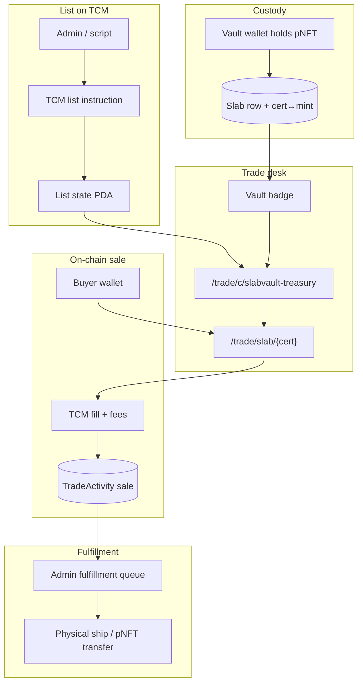
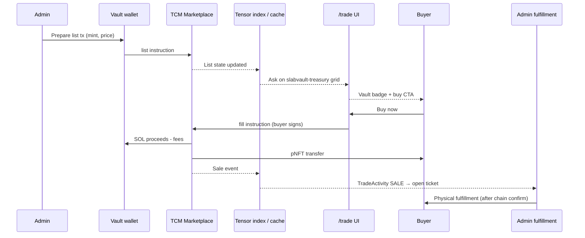

# Vault Treasury → `/trade` Tensor Listings

**Status:** Architecture decision (May 2026)  
**Scope:** SlabVault treasury slabs sell **only** via `/trade` Tensor listings. The separate vault shop checkout lane is **archived** — no parallel SOL+SVF `Transaction` checkout for treasury inventory.

**Related:**

- [rwa-trading-platform.md](./rwa-trading-platform.md) — `/trade` product spec and lane model
- [onchain-trade-stack.md](./onchain-trade-stack.md) — TCM programs, fee PDAs, vault wallet listing
- [tensor-fork-feasibility.md](./tensor-fork-feasibility.md) — Tensor-first integrate strategy
- [gacha-nft-metadata.md](./gacha-nft-metadata.md) — pNFT cert↔mint linking for vault slabs

---

## Executive summary

| Question | Answer |
|----------|--------|
| Where do treasury slabs sell? | **`/trade` only** — listed on-chain via `@tensor-foundation/marketplace` (TCM) from the vault wallet. |
| What happens to `/vault/shop`? | **Archived** — routes redirect to `/trade`; no new `Transaction` checkout rows for treasury inventory. |
| How are vault listings distinguished? | **"Vault" badge** on `/trade` grid and item pages when `sellerWallet === deployer wallet` and `slabId` is linked. |
| Payment | **SOL only** — wallet sign + TCM fill (same as any `/trade` ask). SVF burn is **not** part of vault slab sales. |
| Physical fulfillment | **After on-chain sale** — admin queue opens only when a TCM fill tx confirms; never ship on reservation alone. |

---

## Why archive the separate vault shop

### Single liquidity surface

Two checkout paths for the same cert create **split liquidity** and user confusion:

| Problem with dual lanes | Single `/trade` surface |
|-------------------------|-------------------------|
| Same slab may appear at different prices on `/vault/shop` vs `/trade` | One ask, one floor, one fill path |
| Buyers must learn SOL+SVF split vs SOL-only Tensor fill | One wallet-native SOL settlement UX |
| `Transaction` reservations compete with Tensor list state | On-chain TCM list state is canonical |
| Admin must sync `Slab.status`, shop price, and Tensor ask separately | List/delist on TCM; Postgres cache follows chain |
| Discover/Trade badges pointed at shop while shop had its own checkout | **"Vault" badge** on `/trade` replaces "Also in Vault shop" cross-links |

### Strategic alignment

- `/trade` is the **Tensor for Slabs** desk — treasury inventory should participate in the same aggregated depth as CC and Phygitals, not sit in a siloed checkout.
- Fee capture via Tensor **broker PDAs** (`onchain-trade-stack.md`) applies uniformly when the vault wallet lists on TCM.
- SVF remains the **coordination token** (pulls, governance, rewards) — not a parallel payment rail for treasury sales.

### What we keep from `/vault/*`

| Route / feature | Fate |
|-----------------|------|
| `/vault` | **Keep** — public inventory overview, proof, narrative |
| `/vault/proof` | **Keep** — treasury transparency |
| `/vault/shop/*` | **Archive** → redirect to `/trade/c/slabvault-treasury` |
| `/vault/purchases/*` | **Keep (read-only)** — historical `Transaction` orders until sunset |
| Admin fulfillment queue | **Repurpose** — trigger on TCM `sale` events, not `Transaction` payment |

---

## End-to-end flow

### 1. Custody — vault wallet holds pNFT

Treasury slabs are **pNFTs** in the deployer vault wallet (`slabvault.sol` / `CWqc6DQh…` per `lib/marketplace-config.ts`). Each sellable slab must have:

- On-chain mint address linked to Prisma `Slab` (via `CertMintLink` or equivalent — see [gacha-nft-metadata.md](./gacha-nft-metadata.md))
- pNFT rule set that **allows TCM** program delegates (test per collection on devnet)
- `Slab.status = AVAILABLE` in Postgres (admin gate before listing)

### 2. List — admin or scripted TCM ask

Operator uses `@tensor-foundation/marketplace` JS client (or `tensorswap-sdk` during migration) to create a **fixed-price ask**:

```
vault wallet (seller) → TCM list instruction → list state PDA on-chain
```

Implementation stub: `lib/trade/vault-listings.ts` — `buildVaultListTx`, `buildVaultDelistTx`, `isVaultSellerWallet`.

List parameters:

| Field | Source |
|-------|--------|
| `seller` | Deployer / vault wallet pubkey |
| `mint` | Linked pNFT mint from cert↔mint table |
| `priceLamports` | Admin-set ask (may differ from legacy `Slab.solPrice`) |
| `collectionSlug` | `slabvault-treasury` |
| `expiresAt` | Optional; default 30d with renew reminder |

On confirm: append `TradeActivity` type `list`; set `Slab.status = LISTED` (new enum value or map to existing).

### 3. Discover — appears on `/trade` with "Vault" badge

Indexer path (Phase 1: Tensor API; Phase 2: custom webhook):

1. Tensor REST / SDK returns active ask for mint
2. SlabVault BFF joins ask → `Slab` row by `certNumber` or mint
3. UI renders tile on `/trade/c/slabvault-treasury` with **Vault** badge when `sellerWallet === getDeployerWalletAddress()`

Badge rules:

- **Vault** — seller is deployer wallet; SlabVault fulfills physical
- **Community** — any other wallet (future P2P on same collection)
- Venue tag (Tensor / ME) still shown when index supplies origin

### 4. Buy — buyer fills via `/trade`

Standard `/trade` buy-now flow — no SVF burn, no custom checkout page:

```
Buyer → /trade/slab/{certOrMint} → SDK buildFillTx → sign → TCM (+ fees) settlement → NFT to buyer wallet
```

On confirmed `sale`:

- Append `TradeActivity` type `sale`
- Set `Slab.status = SOLD`
- Enqueue **fulfillment job** (physical slab / pNFT transfer policy per item)
- Optional: broker fee lamports → SVF treasury per fee PDA config

### 5. Fulfill — physical only after on-chain sale

**Hard rule:** SlabVault does **not** ship, transfer custody, or mark fulfilled until the TCM fill transaction is confirmed on-chain.

| Stage | Trigger | Admin action |
|-------|---------|--------------|
| Listed | TCM list tx confirmed | Verify images, cert, vault proof link |
| Sold | TCM fill tx confirmed | Open fulfillment ticket; verify buyer wallet |
| Fulfilled | Manual or auto pNFT transfer + shipping | Record `fulfillmentSignature`; update `Slab.status = FULFILLED` |

Reuse patterns from `lib/marketplace-fulfillment.ts` and admin `/admin/transactions` — but wire triggers to **Tensor sale events**, not `Transaction.status = PAID`.



---

## Admin operations

### Listing workflow

1. **Ingest** — slab synced to `Slab` with cert, grade, images (`lib/data-sync.ts`)
2. **Link mint** — DAS / partner API → store mint on `Slab` or `CertMintLink`
3. **Price** — set ask in SOL (lamports); no `svfPrice` on trade lane
4. **List tx** — sign from vault wallet; confirm on-chain
5. **Verify** — ask visible on Tensor index + `/trade` within poll window

### Delist / price update

- Cancel: TCM delist instruction from vault wallet
- Reprice: delist + re-list (or TCM edit if supported for collection)
- Postgres `Slab.status` returns to `AVAILABLE` on delist

### Fulfillment queue (post-sale)

| Check | Requirement |
|-------|-------------|
| Sale proof | `TradeActivity.txSignature` + mint transfer to buyer |
| Buyer identity | `buyerWallet` from fill event |
| Shipping | Only after sale confirmed; reuse admin fulfill UI |
| Disputes | No fulfillment without on-chain sale — refunds are wallet-to-wallet off-site |

### Wallets

| Role | Default pubkey | Purpose |
|------|--------------|---------|
| Treasury | `2oRZe7z9…` | Broker fee recipient (not seller for vault listings) |
| Deployer / vault | `CWqc6DQh…` | **Seller** on TCM asks; pNFT custodian |

---

## Migration checklist: `Transaction` checkout → Tensor list/buy

Use this when cutting over from `/vault/shop` SOL+SVF checkout to `/trade`-only sales.

### Pre-cutover

- [ ] **Feature flag** — `RWA_TRADE_ENABLED` / `TRADE_PLATFORM_ENABLED` on staging with vault collection whitelisted
- [ ] **Cert↔mint backfill** — every sellable `Slab` has linked mint; block list if missing
- [ ] **TCM devnet spike** — list + fill one test pNFT from vault wallet
- [ ] **pNFT rule set audit** — confirm TCM delegate allowed per vault collection
- [ ] **Fee PDA** — broker config points to SVF treasury (`onchain-trade-stack.md`)
- [ ] **Admin runbook** — listing script or admin UI for vault asks documented

### Drain legacy shop

- [ ] Set all `Slab.status = AVAILABLE` shop listings to **not checkout-able** (disable reserve API)
- [ ] Cancel open `Transaction` rows in `PENDING` / `RESERVED` — notify buyers
- [ ] Complete in-flight checkouts or honor until `reservedExpiresAt` (pick one policy; document)
- [ ] Remove "Buy with SOL + SVF" CTAs from `/vault/shop` pages

### Redirects & nav

- [ ] `/vault/shop` → `/trade/c/slabvault-treasury` (301)
- [ ] `/vault/shop/[id]` → `/trade/slab/[certOrMint]` when mint linked; else `/trade/c/slabvault-treasury`
- [ ] `/vault/shop/checkout/[id]` → `/trade` with banner "Checkout moved to Trade desk"
- [ ] Update `lib/nav.ts` — Vault group: remove Shop or relabel "Treasury listings → Trade"
- [ ] Update `components/vault-sub-nav.tsx` — drop shop tab or link to `/trade`

### Data model

- [ ] Add / use `TradeListing` + `TradeActivity` cache (see [rwa-trading-platform.md](./rwa-trading-platform.md))
- [ ] Add `Slab.mintAddress` (or `CertMintLink`) if not present
- [ ] Add `Slab.listedAt`, `Slab.tensorListState` optional cache fields
- [ ] Stop creating new `Transaction` rows for treasury sales
- [ ] Keep `Transaction` table for historical `/vault/purchases` read-only

### Code removal / archive (post-cutover)

- [ ] Archive `app/vault/shop/checkout/*` (or redirect-only stubs)
- [ ] Disable `POST /api/marketplace/reserve` for treasury slabs
- [ ] Gate SVF burn split (`lib/marketplace-split.ts`) — vault shop only; confirm no trade path calls it
- [ ] Repoint admin fulfillment from `Transaction` paid events → `TradeActivity` sale events

### Verification

- [ ] E2E: admin list → appears on `/trade` with Vault badge → buyer fill → fulfillment queue entry
- [ ] No cert appears with active ask on `/trade` **and** checkout on `/vault/shop`
- [ ] Nav copy: no "SOL + SVF" for treasury sales; Trade desk says "SOL · Tensor settlement"
- [ ] Analytics: treasury sales attributed to `/trade` lane only

### Rollback plan

- Re-enable shop checkout only if TCM blocked by rule set **and** no alternative fill path
- Rollback requires delist all vault TCM asks before re-opening `Transaction` checkout to avoid double-sell

---

## Sequence: list → buy → fulfill



---

## Implementation pointers

| Module | Role |
|--------|------|
| `lib/trade/vault-listings.ts` | Vault seller detection, list/delist tx builders (stub) |
| `lib/marketplace-config.ts` | `getDeployerWalletAddress()` — Vault badge + seller checks |
| `lib/marketplace-fulfillment.ts` | Post-sale fulfillment patterns (adapt triggers) |
| `lib/onchain/collections.ts` | `slabvault-treasury` slug + collection mint |
| `lib/trade-config.ts` | `isRwaTradeEnabled()` gate |

**Do not merge** vault shop checkout programs (`contracts/`) with TCM settlement — different lanes, different lifecycle. Treasury sales after cutover use **TCM only**.

---

## Open questions

1. **SVF utility after shop archive** — burns move to pulls/rewards only, or future `/trade` fee discounts?
2. **Historical `Transaction` orders** — how long to keep `/vault/purchases` active?
3. **Auto-list on ingest** — should sync pipeline list new slabs automatically or always require admin approve?
4. **Partial treasury** — some slabs physical-only without pNFT: exclude from `/trade` or list as "physical claim" SKU?

---

## Changelog

| Date | Change |
|------|--------|
| 2026-05-21 | Initial doc: archive vault shop, single `/trade` liquidity surface, admin ops, migration checklist |
