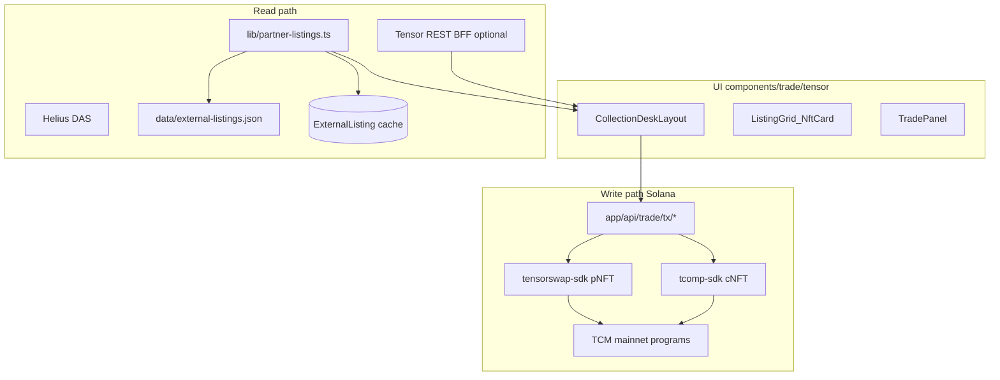

# GRAILS trade architecture

**Product:** Tensor for RWA graded cards — full aggregator desk at `/trade`, not a browse-only index.

**Related:** [rwa-trading-platform.md](./integrations/rwa-trading-platform.md) · [onchain-trade-stack.md](./integrations/onchain-trade-stack.md) · [tensor-fork-feasibility.md](./integrations/tensor-fork-feasibility.md) · [partner-aggregation-quickest-path.md](./integrations/partner-aggregation-quickest-path.md) · [m3-recovery-status-2026-05-22.md](./integrations/m3-recovery-status-2026-05-22.md)

---

## Layers

---

## Partner ingest (primary read path)

| Partner | Chain | Ingest | Settlement |
|---------|-------|--------|--------------|
| Collector Crypt | Solana | Scraper + JSON + optional DB | TCM / tensorswap when indexed; else partner site |
| Phygitals | Solana | JSON seed + future API | tcomp when indexed; else partner site |
| Magic Eden | Solana | Tensor index when keyed | TCM fill via Tensor API/SDK |
| SlabVault treasury | Solana | Slab / marketplace-slabs | Vault wallet TCM listings |
| Beezie | Base | Future adapter | Deep link v1; Base wallet v2 |
| Courtyard | Polygon | Future adapter | Deep link v1 |

Single module: [`lib/partner-listings.ts`](../lib/partner-listings.ts)  
Adapter contract: [`lib/partner-ingest-adapter.ts`](../lib/partner-ingest-adapter.ts)

Merge order (`aggregatePartnerExternalListings` in [`lib/partner-listings.ts`](../lib/partner-listings.ts), request path): **Postgres** `ExternalListing` → **partner API** (CC candidates; Phygitals stub) → **JSON seed** → **CC scrape fallback** (only when `PARTNER_LIVE_SCRAPE_ENABLED=true` or `?live=1` and upstream miss/stale) → **Helius DAS** → **Tensor enrichment** (seller/listState when keyed). Batch `sync:discover` may scrape off the request path.

---

## Aggregate desk (`/trade/all`)

Module: [`lib/trade/all-listings.ts`](../lib/trade/all-listings.ts) · SSR [`app/trade/all/page.tsx`](../app/trade/all/page.tsx) · BFF `GET /api/trade/all/listings`

| Function | Role |
|----------|------|
| `loadAllTradeListings()` | Parallel-loads `AGGREGATE_COLLECTION_SLUGS` (CC, Phygitals, ME, treasury, Beezie/Courtyard preview) via partner ingest or Tensor depth |
| `mergeAllTradeListings()` | Flattens venue batches, filters zero asks, delegates cert/mint dedupe, sorts price asc |
| `dedupePartnerTradeListings()` | Alias dedupe by cert/mint; lowest ask wins; richer seller metadata retained |
| `alternateVenueAsks` | Losing partner ask preserved on the winning row when same cert/mint lists on multiple venues |
| `buildAllListingsAggregateStats()` | Deduped nav/footer stats (`listedCount`, floor, venue count) — not per-venue preview sum |

Magic Eden depth requires `TENSOR_API_KEY`; Beezie/Courtyard preview slugs stay empty by design. Landing `/trade` reuses `mergeAllTradeListings` + `buildAllListingsAggregateStats` over a subset of venue batches. M3 prep: [partner-aggregation-quickest-path.md](./integrations/partner-aggregation-quickest-path.md) · [m3-recovery-status-2026-05-22.md](./integrations/m3-recovery-status-2026-05-22.md) § Alignment update.

---

## Tensor Foundation usage

| Repo / package | Role in GRAILS |
|----------------|----------------|
| [marketplace](https://github.com/tensor-foundation/marketplace) | TCM program — list, bid, sell (mainnet IDs in `lib/onchain/program-ids.ts`) |
| [tensorswap-sdk](https://www.npmjs.com/package/@tensor-oss/tensorswap-sdk) | CC pNFT list/fill |
| [tcomp-sdk](https://www.npmjs.com/package/@tensor-oss/tcomp-sdk) | Phygitals cNFT |
| [fees](https://github.com/tensor-foundation/fees) | Broker fee PDAs → SVF treasury |
| [escrow](https://github.com/tensor-foundation/escrow) | Bid escrow |
| [whitelist](https://github.com/tensor-foundation/whitelist) | Collection verification |
| [amm](https://github.com/tensor-foundation/amm) | Pool sweep (v2+) |
| [IDLs](https://github.com/tensor-foundation/IDLs) | Pinned in `lib/onchain/idl/` |
| [marketplace-nextjs-template](https://github.com/tensor-hq/marketplace-nextjs-template) | BFF tx route patterns + UI port in `components/trade/tensor/` |

**BFF routes (server holds `TENSOR_API_KEY`):**

- `GET /api/trade/tx/buy` — Tensor REST `tx/buy` or SDK fill when write enabled
- `GET /api/trade/tx/list` — Tensor REST `tx/list` or SDK list when write enabled
- `GET /api/trade/tx/delist` — Tensor REST `tx/delist`
- `GET /api/trade/tx/bid` — collection bid create
- `GET /api/trade/tx/cancel-bid` — cancel open bid
- `GET /api/trade/collection-bids` — Tensor collection bids (BIDS tab)
- `GET /api/trade/collection-stats` — Tensor `collections` stats
- `GET /api/trade/collection-listings` — Tensor `mint/collection`

Client never sees the API key.

---

## Database

| Data | Required when |
|------|----------------|
| Browse CC/Phygitals | **No** — JSON + scrape sufficient for dev |
| Cron sync / multi-instance cache | **Yes** — `POST /api/sync` (30m) and `npm run sync:discover` upsert `ExternalListing` |
| Portfolio, orders, reservations | **Yes** — Phase M3+ on-chain writes |
| Treasury shop legacy | **Yes** — `Slab`, `Transaction` (admin fulfill) |

Local dev without Postgres: omit `DATABASE_URL`, run `npm run sync:discover`, `npm run dev:clean`.

If using `prisma+postgres://`, run `npx prisma dev` in a separate terminal.

---

## Routes

| Route | Purpose |
|-------|---------|
| `/trade` | Collection index table + cross-venue stats |
| `/trade/all` | Aggregate desk — merged listings across partner + treasury venues |
| `/trade/c/[slug]` | Pro collection desk |
| `/trade/slab/[certOrMint]` | Item commerce stack |
| `/trade/portfolio` | Wallet inventory + listings |

---

## Milestones (delivery order)

| Milestone | Outcome |
|-----------|---------|
| M0 | Registry, adapter contract, docs, one workstream |
| M1 | Live ingest stats, activity, landing credibility |
| M2 | tensor.trade UX parity (pro layout, tabs, filters) |
| M3 | On-chain Solana fill/list/bid |
| M4 | Cross-venue ME + Tensor index |
| M5 | Cert-unified compare index |
| M6 | Multichain Beezie + Courtyard |

See [grails-step-by-step-plan.md](./integrations/grails-step-by-step-plan.md) for segment walkthrough.

---

## Production hostname (planned)

GRAILS trade desk is intended to live at **`grails.slabvault.xyz`** (subdomain of SlabVaultFi). DNS: add a CNAME from `grails` to the Vercel project hostname (or A/ALIAS per registrar). In Vercel: Project → Settings → Domains → add `grails.slabvault.xyz` and assign to the production deployment that serves `/trade`. No deploy is required for this doc note — routing already works at `/trade` on the main app; the subdomain is branding and cookie isolation when ops is ready.
